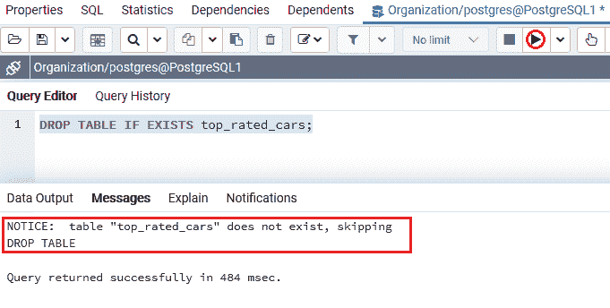
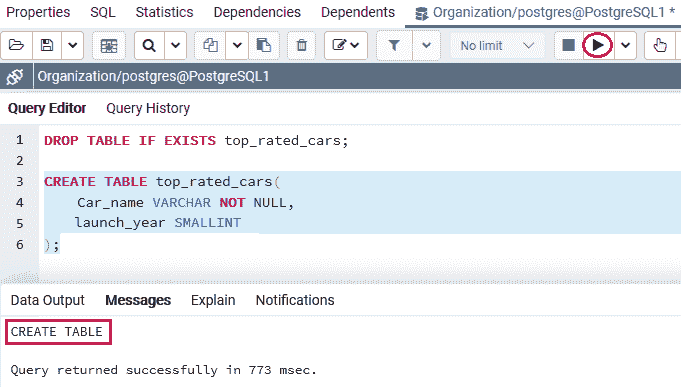
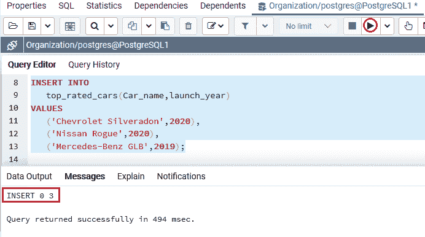
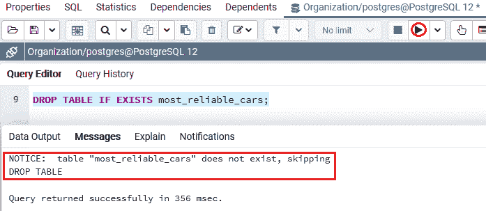
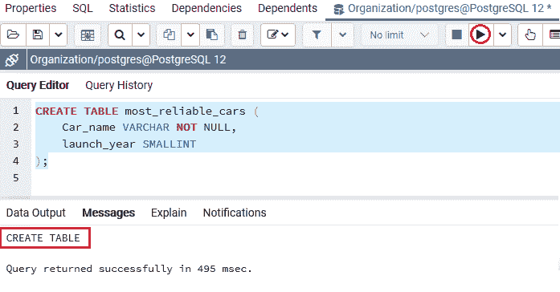
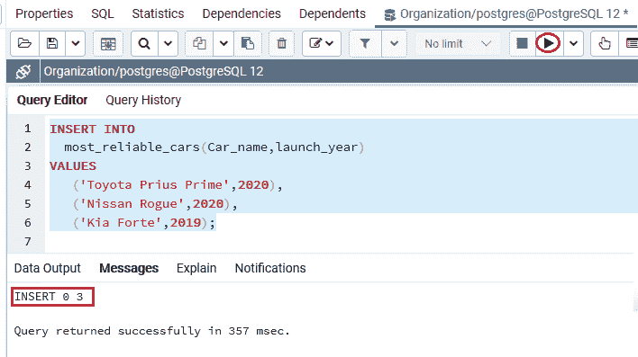
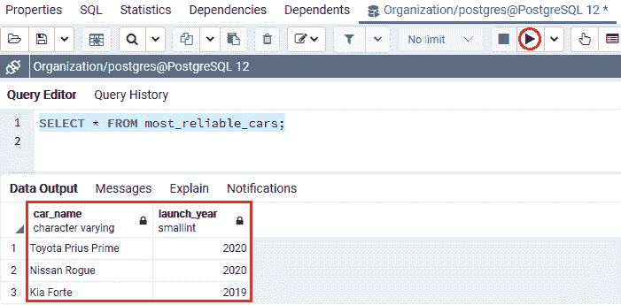
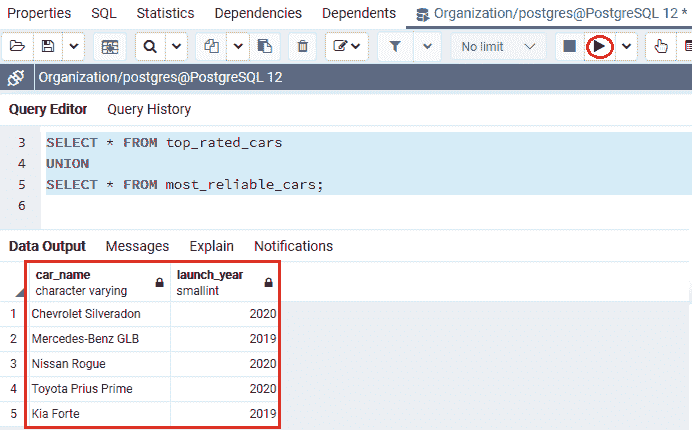
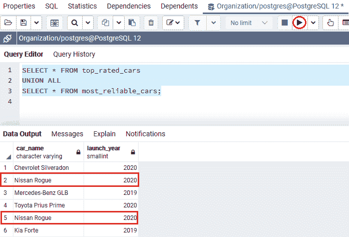
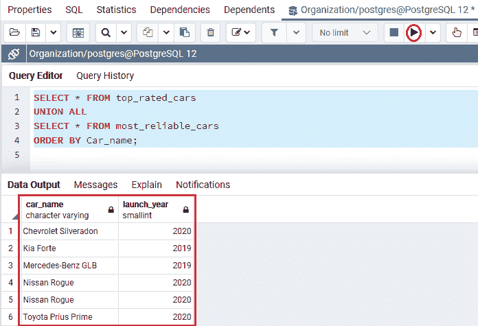

# PostgreSQL 联合

> 原文：<https://www.javatpoint.com/postgresql-union>

在本节中，我们将了解 **PostgreSQL UNION 运算符**的工作原理，该运算符用于将各种命令的输出组合成单个输出。

而 **PostgreSQL 联合命令**与 PostgreSQL **联合所有**的**示例使用 **order by 子句。****

## PostgreSQL UNION 运算符是什么？

在 [PostgreSQL](https://www.javatpoint.com/postgresql-tutorial) 中，UNION 运算符将一个或多个 SELECT 命令组合成一个输出。

### PostgreSQL 联合运算符的语法

PostgreSQL 联合运算符的语法如下，它帮助我们关联两个命令的输出:

```sql

SELECT select_list_1
FROM table_expresssion_1
UNION
SELECT select_list_2
FROM table_expression_2

```

如果我们想在 UNION 运算符的帮助下组合两个命令的输出，那么这些命令必须遵循以下说明:

*   指定的数据类型必须兼容。
*   两个命令的**选择列表**中的列和数字的顺序必须相似。

#### 注意:UNION 运算符也用于从组合数据集中删除所有匹配的行。我们可以使用 UNION ALL 来代替 UNION 来重新收集重复的行。

在下图中，我们可以了解 **UNION 操作员**的工作情况:


## 带有 ORDER BY 子句的 PostgreSQL 联合

如上所述， **UNION 运算符**可以将初始命令**输出的行放在附加命令输出的行之前、之后或之间。**

我们可以使用第二个命令中的 [ORDER BY 子句](https://www.javatpoint.com/postgresql-order-by-clause)对最终输出中的行进行排序。

**UNION** 运算符通常用于组合来自相同表的数据，这些表并不容易标准化。

要了解 **PostgreSQL Union 运算符**的工作原理，首先我们将借助以下命令建立示例表:

在下面的命令中，我们将在 **CREATE** 命令的帮助下创建两个表作为**顶级汽车**和**最可靠汽车**，并使用 [**INSERT** 命令](https://www.javatpoint.com/postgresql-insert)插入一些值。

要将**顶级汽车**创建到**组织数据库**中，我们使用 **CREATE** 命令。

但是，在创建 **top_rated_cars** 表之前，如果**组织**数据库中已经存在类似的表，我们将使用 [**DROP TABLE** 命令](https://www.javatpoint.com/postgresql-drop-table)。

```sql

DROP TABLE IF EXISTS top_rated_cars;

```

**输出**

执行上述命令后，我们会得到如下窗口消息: ***top_rated_cars*** 表不存在。



***top_rated_cars*** 表包含 **Car_name、【推出 _ 年份】**列等各种列。

```sql

CREATE TABLE top_rated_cars(
	Car_name VARCHAR NOT NULL,
	launch_year SMALLINT
);

```

**输出**

在执行上述命令时，我们将获得以下消息: ***top_rated_cars*** 表已成功创建到**组织**数据库中。



成功创建 ***top_rated_cars*** 表后，我们将在 **INSERT** 命令的帮助下输入一些值。

```sql

INSERT INTO 
  top_rated_cars(Car_name,launch_year)
VALUES
   ('Chevrolet Silveradon',2020),
   ('Nissan Rogue',2020),
   ('Mercedes-Benz GLB',2019);

```

**输出**

执行上述命令后，我们会得到如下消息窗口:**三个值**已经成功插入到 ***top_rated_cars*** 表中。



要将**最可靠的汽车**创建到**组织数据库**中，我们使用 **CREATE** 命令。

但是，在创建**最可靠汽车**表之前，如果在**组织**数据库中已经存在类似的表，我们将使用 **DROP TABLE** 命令。

```sql

DROP TABLE IF EXISTS most_reliable_cars;

```

**输出**

执行以上命令后，我们会得到如下窗口消息: ***最可靠 _ 车*** 表不存在。



表 ***最 _ 可靠 _ 车*** 包含**车 _ 名、推出 _ 年**列等各种栏目。

```sql

CREATE TABLE most_reliable_cars (
	Car_name VARCHAR NOT NULL,
	launch_year SMALLINT
);

```

**输出**

在执行上述命令时，我们将获得以下消息，该消息显示 ***最可靠 _ 汽车*** 表已成功创建到**组织**数据库中。



成功创建**最可靠汽车**表后，我们将在 **INSERT** 命令的帮助下输入一些值。

```sql

INSERT INTO 
  most_reliable_cars(Car_name,launch_year)
VALUES
   ('Toyota Prius Prime',2020),
   ('Nissan Rogue',2020),
   ('Kia Forte',2019);

```

**输出**

执行上述命令后，我们会得到如下消息窗口，显示**三个值**已成功插入**最可靠汽车**表。



如果我们想查看来自**顶级汽车**表的数据，我们使用下面命令中的**选择**命令。

```sql

SELECT * FROM top_rated_cars;

```

**输出**

执行上述命令后，我们将得到以下结果:


以下语句返回来自**最可靠汽车**表的数据:

```sql

SELECT * FROM most_reliable_cars;

```

**输出**

在执行上述命令时，我们将获得以下输出:



## PostgreSQL UNION 示例

让我们看一个示例来理解 **PostgreSQL Union** 命令的工作原理。

### 简单 PostgreSQL UNION 示例

**UNION 运算符**用于消除匹配的行。

在下面的例子中，我们使用 **UNION 运算符**来合并两个表( ***top_rated_cars*** 和 ***最可靠 _cars* )** 的数据。

```sql

SELECT * FROM top_rated_cars
UNION
SELECT * FROM most_reliable_cars;

```

**输出**

执行上述命令后，我们将得到下面的输出，其中包含输出中的**五行**，因为 **UNION 运算符**消除了一个匹配行。



## PostgreSQL UNION ALL

**联合所有**操作符联合多个**选择**命令的输出，而不消除重复的行。

UNION ALL 运算符涉及每个 [SELECT 命令](https://www.javatpoint.com/postgresql-select)，以便在相同数据类型的输出中具有相同数量的字段。

### PostgreSQL UNION ALL 的语法

PostgreSQL UNION ALL 的语法如下:

```sql

SELECT expression_1, expression_2, ... expression_n
FROM tables
[WHERE condition(s)]
UNION ALL
SELECT expression_1, expression_2, ... expression_n
FROM tables
[WHERE condition(s)];

```

在上图中，我们使用了以下参数:

| 因素 | 说明 |
| 表达式 1，表达式 2，...表达式 _n | 这些是我们想要检索的计算或列。 |
| 桌子 | table 参数用于从各种表中检索记录。 |
| 哪里条件 | 这些是保存值必须满足的条件。 |

#### 注意:在上面的语法中，两个表达式必须有相等数量的表达式。

### PostgreSQL UNION ALL 示例

在下面的例子中，我们将使用 **UNION ALL** 操作符来组合来自 ***top_rated_cars*** 和 ***最可靠 _cars*** 表的输出。

```sql

SELECT * FROM top_rated_cars
UNION ALL
SELECT * FROM most_reliable_cars;

```

**输出**

执行上述命令后，我们将获得以下输出，其中保留了匹配的行。



### 带有 ORDER BY 子句的 PostgreSQL UNION ALL

**PostgreSQL UNION** 运算符可以与 ORDER BY 子句一起使用来对命令输出进行排序。

**带有 ORDER BY 子句的 PostgreSQL 联合示例**

在下面的命令中，我们使用带有 ORDER 子句的 **PostgreSQL UNION ALL** 对输出进行排序，该输出由 UNION 运算符返回。

我们在最后一个命令的末尾使用 ORDER BY 子句，如下例所示:

```sql

SELECT * FROM top_rated_cars
UNION ALL
SELECT * FROM most_reliable_cars
ORDER BY Car_name;

```

**输出**

执行上述命令后，我们将获得以下结果，显示两个表中的所有数据。



#### 注意:如果我们在每个命令的末尾使用 ORDER BY 子句，组合输出将不会像我们预期的那样排序。

因为当 UNION 运算符合并来自所有命令的排序结果集时，它不能保证行在最终输出中的顺序。

### 概观

在 PostgreSQL UNION 部分，我们学习了以下主题:

*   我们使用了 **PostgreSQL UNION 和 UNION ALL** 将各种命令的输出合并成一个输出。
*   我们还使用了**PostgreSQL UNION ALL with ORDER By**子句来对命令输出进行排序。

* * *