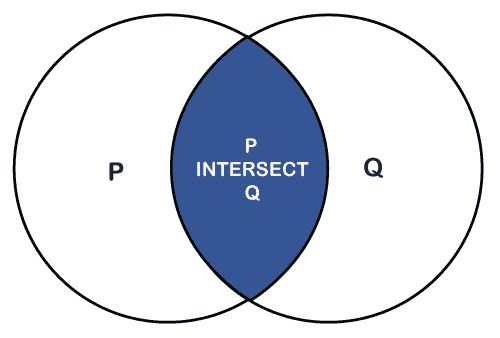
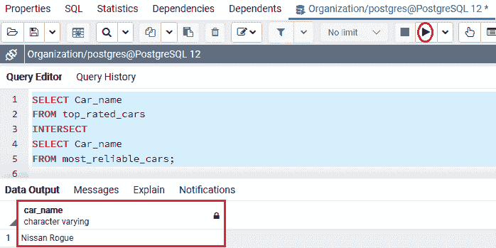
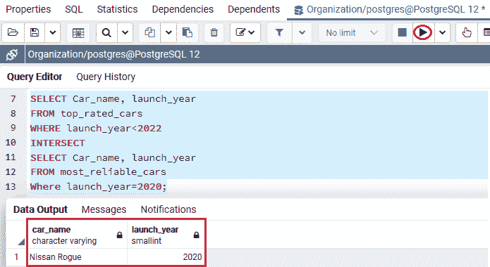
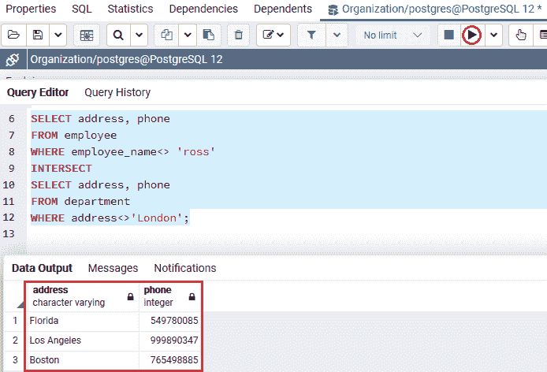
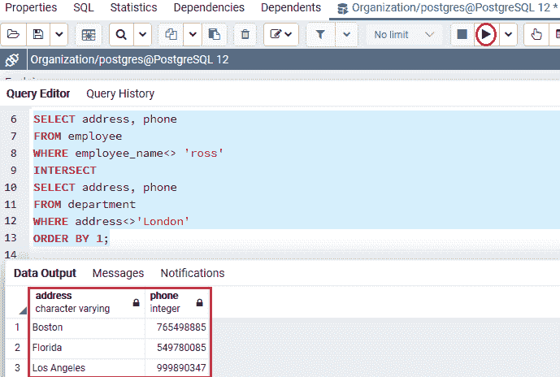

# PostgreSQL INTERSECT

> 原文：<https://www.javatpoint.com/postgresql-intersect>

在本节中，我们将了解 **PostgreSQL Intersect 运算符**的工作原理，该运算符用于合并多个命令的输出。

而 **PostgreSQL 的**示例**将运算符**与**单个、多个**表达式以及 **Order by 子句相交。**

## 什么是 PostgreSQL Intersect 运算符？

在 [PostgreSQL](https://www.javatpoint.com/postgresql-tutorial) 中， **INTERSECT 运算符**检索两个输出中的任何可用行，就像 [UNION](postgresql-union) 和[除了运算符](postgresql-except)之外。

换句话说，我们可以说 **PostgreSQL intersect** 运算符得到了多个数据集的交集。

如果两个数据集中都存在一条记录，它将包含在 INTERSECT 结果中，并且每个数据集都由 SELECT 命令定义。但是，如果一个记录出现在一个数据集中而不出现在另一个数据集中，它将从 **INTERSECT** 结果中消失。

下图表示最终输出，由 **INTERSECT 操作符**产生。



在上图中，蓝色区域显示了圆 P 和圆 q 之间的交点。

INTERSECT 中的每个 [SELECT 命令](https://www.javatpoint.com/postgresql-select)必须有相似数量的具有相似数据类型的输出字段。

### PostgreSQL 交集运算符的语法

PostgreSQL Intersect 运算符的图示如下:

```sql

SELECT expression1, expression2, ... expression_n
FROM tables
[WHERE conditions]
INTERSECT
SELECT expression1, expression2, ... expression_n
FROM tables
[WHERE conditions];

```

在上面的语法中，我们有以下参数，我们在下表中讨论了这些参数:

| 参数 | 描述 |
| **表达式 1，表达式 2，表达式 _n** | 这些是我们想要检索的列或计算。 |
| **表格** | 我们想从中获取记录的表。 |
| **条件** | 这些是要选择的值必须满足的条件。它是一个可选参数。 |

#### 注意:要使用 INTERSECT 运算符，出现在 SELECT 命令中的列必须遵循以下规则:

*   两个 SELECT 子句中必须有匹配数量的表达式或列。
*   等效表达式在 SELECT 命令中必须具有相似的数据类型，就像表达式 1 在第一个和第二个 **SELECT** 命令中必须具有相似的数据类型一样。

### PostgreSQL INTERSECT 运算符示例

为了理解 **PostgreSQL intersect 运算符的工作原理，**我们将采用在 PostgreSQL UNION 教程中创建的**顶级汽车**和**最可靠汽车**表:

要查看来自**顶级汽车**表的数据，我们将使用**选择**命令，如下命令所示:

```sql

SELECT * FROM top_rated_cars;

```

**输出**

执行上述命令后，我们将得到以下结果:


以下命令从**最可靠汽车**表返回数据:

```sql

SELECT * FROM most_reliable_cars;

```

**输出**

在执行上述命令时，我们将获得以下输出:


*   **PostgreSQL 与单个表达式相交的示例**

在下面的示例中，我们将使用 INTERSECT 运算符，该运算符包含一个具有相似数据类型的字段:

```sql

SELECT Car_name
FROM top_rated_cars
INTERSECT
SELECT Car_name
FROM most_reliable_cars;

```

**输出**

执行上述命令后，我们将获得以下输出:



#### 注意:在上面的例子中，如果 Car_name 同时出现在 top_rated_cars 和最可靠 _cars 表中，它将出现在我们的输出中。

现在，如果我们想要将 [WHERE 子句](https://www.javatpoint.com/postgresql-where-clause)添加到上面示例中的 INTERSECT 命令中，它将如下所示:

```sql

SELECT Car_name
FROM top_rated_cars
WHERE launch_year< 2020
INTERSECT
SELECT Car_name
FROM most_reliable_cars
Where launch_year=2020;

```

**输出**

在实现了上面的命令之后，我们将得到下面的输出，它显示了我们在使用 where 条件之后检索到的那些交集值。



#### 注意:在上面的例子中，WHERE 子句已经被添加到所有数据集。

*   初始数据集已被过滤，因此仅返回来自**上市年**小于 **2022** 的 ***顶级汽车*** 表的记录。
*   第二个数据集已被过滤；因此，在**发射 _ 年**等于 **2020** 的地方，只返回 ***最可靠 _ 车*** 表中的记录。

### PostgreSQL 与各种表达式相交的示例

我们现在将看到一个示例来理解 PostgreSQL INTERSECT 运算符处理多个列。

在下面的例子中，我们将在 PostgreSQL 中使用 INTERSECT 运算符来检索各种列。

为此，我们从**组织**数据库中获取**员工** 和 ***部门*** 表，该数据库是我们在 PostgreSQL 教程的前面部分创建的。

```sql

SELECT address, phone
FROM employee
WHERE employee_name<> 'ross'
INTERSECT
SELECT address, phone
FROM department
WHERE address<>'London';

```

**输出**

执行上述命令后，我们将获得以下输出，其中显示了来自*员工表的记录，其中**地址和电话**值与**部门表的地址和电话**值相匹配。*

*

在上面的例子中，添加了每个数据集上的 WHERE 条件来过滤输出；因此，只有来自 ***员工*** 表的记录被返回到**员工 _ 姓名**不是 ***罗斯*** 的地方。

而 ***部门*** 表格中的记录是在**地址**不是**伦敦**的地方检索的。

*   **PostgreSQL 与 ORDER BY 子句相交**

如果我们想对 INTERSECT 操作符的输出进行排序，我们将 [ORDER BY](https://www.javatpoint.com/postgresql-order-by-clause) 放在查询列表的最后一个命令中。

**PostgreSQL 的语法与 ORDER BY 子句相交**

下图用于表示 PostgreSQL 与 order by 子句的交集:

```sql

SELECT select_list
FROM table1
INTERSECT
SELECT select_list
FROM table2
ORDER BY sort_expression;

```

### PostgreSQL 与 Order by 子句相交的示例

在下面的例子中，我们使用类似于 ***员工*** 和 ***部门*** 的表格来理解带有 ORDER BY 子句的 INTERSECT 运算符的用法:

```sql

SELECT address, phone
FROM employee
WHERE employee_name<> 'ross'
INTERSECT
SELECT address, phone
FROM department
WHERE address<>'London'
ORDER BY 1;

```

**输出**

执行上述命令后，我们将得到下面的结果集，该结果集按**地址**升序显示排序后的结果，用 **ORDER BY 1** 表示。

地址列字段位于输出中#1 的位置。



### 概观

在 PostgreSQL Intersect 部分，我们学习了以下主题:

*   我们使用了 **PostgreSQL Intersect 运算符**来合并多个命令的输出。
*   我们也了解了 **PostgreSQL 交集**运算符与**单个和多个**的工作原理
*   我们还使用了 **PostgreSQL 与 ORDER By** 子句来对命令输出进行排序。

* * **