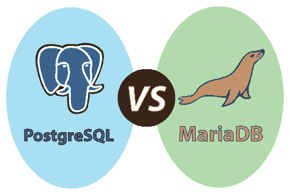

# PostgreSQL vs MariaDB

> 原文：<https://www.javatpoint.com/postgresql-vs-mariadb>

PostgreSQL 和 MariaDB 都是关系数据库管理系统(RDBMS)的类型，这两种软件都是开源的 RDBMS，用于在数据库中存储数据。

在本节中，我们将基于各个方面讨论 PostgreSQL 和 MariaDB 数据库系统之间的**差异。但是，首先，我们要了解关于 MariaDB 的必要信息。**

## 什么是 MariaDB？

它是一个开源工具，出现在 **GNU 通用公共许可证**中。它是 MySQL[RDBMS](https://www.javatpoint.com/what-is-rdbms)T5 的一个商业支持的**分叉。MariaDB 的开发是由 MySQL 的一些原始设计者管理的。引入 MariaDB 是为了保持与 [MySQL](https://www.javatpoint.com/mysql-tutorial) 的高兼容性，同时还包含了新的存储引擎，如 Column Store、Aria 和 My Rocks。**

为了支持本机非阻塞操作和进度报告，MariaDB 的协议和应用编程接口与 MySQL 使用的协议和应用编程接口兼容。是跨平台软件；这就是为什么我们可以在几个[操作系统](https://www.javatpoint.com/operating-system)中运行 MariaDB，比如 [Windows](https://www.javatpoint.com/windows) 、 [Linux](https://www.javatpoint.com/linux-tutorial) 和 macOS。

让我们看看 [PostgreSQL](https://www.javatpoint.com/postgresql-tutorial) 和 [MariaDB](https://www.javatpoint.com/mariadb-tutorial) 之间的一些本质区别**，这将有助于我们增强知识:**

**

| 不同的方面 | 一种数据库系统 | MariaDB DB |
| **定义** | 它是一个**对象关系数据库管理系统(ORDBMS)** ，兼容各种 SQL 特性。它跟随着事务以及 **ACID(原子性、一致性、隔离性和持久性)**属性。它还为**外键、视图、连接、触发器和存储过程提供了完整的支持。** | 是一个**开源 RDBMS** 。它提供了**高可用性、安全性、性能和互操作性。**Mariadb 的更新和新版本具有增强模式和 SQL 完整性的功能。 |
| **开发** | **PostgreSQL 全球开发组**开发。 | **MariaDB 数据库基金会**(社区 MariaDB 数据库服务器)**MariaDB 数据库公司**(MariaDB 数据库企业)，开发它。 |
| **发布** | PostgreSQL 发布于 **1996** 。 | MariaDB 于 **2009** 发布。 |
| **最新发布版本** | 最新发布版本为**PostgreSQL 12.3【2020 年 5 月】** | 最新发布版本为**10 . 4 . 12【2020 年 1 月】** |
| **牌照** | PostgreSQL 许可证属于**麻省理工风格的**。 | MariaDB 只包含 **GPLv2** 的一个许可证。 |
| **编程或写入** | 它主要是用 **C** 语言编写的。 | 它主要是用 **C** 和 **C++** 语言编写的。 |
| **编程语言** | PostgreSQL 支持多种编程语言，如 **C、C++、Java、。Net、Perl、Python、Tcl、JavaScript (Node.js)、PHP** 。 | MariaDB 支持 **C、C++、Java、C#、Perl、PHP、Ruby、Tcl、Python、Ada、JavaScript (Node.js)、**等多种编程语言。 |
| **平台** | 主要支持 **Unix、Window、Linux、FreeBSD、惠普-UX、NetBSD、OpenBSD、OS X 和 Solaris** 。 | 主要兼容 **Windows、FreeBSD、Linux、Solaris 等多个操作系统。** |
| **功能** | 以下是 PostgreSQL 的特点:

*   It supports many features of SQL.
*   High ductility.
*   Compatible data integrity.
*   Support multiple programming languages.
*   Download for free.
*   Compatible with secondary indicators.
*   XML support is provided.
*   High reliability.
*   Compatible with multiple operating systems.
*   PostgreSQL is consistent with the data scheme.

 | 以下是 MariaDB 的基本功能:

*   It contains a high-performance storage engine and a variety of storage engines, which helps to work with other RDBMS data sources.
*   It is licensed under LGPL, GPL or BSD.
*   Follow the standard and popular query language.
*   It provides support for PHP, which is one of the most popular web development languages.
*   It supports multiple operating systems, which is why we can execute MariaDB on various platforms.
*   Compatible with multiple programming languages.
*   Support Galera cluster technology.
*   Follow the concept of instant consistency.
*   MariaDB's ultimate cloud is **SkySQL, and** is the first and only DBA to bring all the power of MariaDB platform to the cloud.

 |
| **其他访问方法和 API** | 在 PostgreSQL 中，我们可以访问以下方法 **JDBC、ODBC、原生 C 库、ADO.NET、**和**大对象流 API**。 | 在 MariaDB 中，我们可以访问以下方法，包括 **ODBC、ADO.NET、JDBC 和专有本机 API** 。 |
| **划分方法** | 它可以由**列表、范围和散列(后来的 PostgreSQL 11** )来划分。 | 支持**水平分区**。 |
| **复制** | 它支持**主从复制，如级联、流式和同步复制。** | 它通过 MariaDB Galera Cluster 支持**并行、半同步、多主集群**等数据的**主从和主从复制**。不同版本的 MariaDB 允许将数据从 MySQL Server 复制到 MariaDB 服务器。 |
| **文档维护** | 在 PostgreSQL 中，文档由 **PostgreSQL 主团队**保存。但是，在创建 PostgreSQL 社区帐户后，该组的一些成员可以管理或生成记录。 | 在 MariaDB 中，文档由**MariaDB 基金会和 MariaDB 公司**保存。但是活跃的提供商社区可以增强、生成和翻译记录。 |
| **记忆能力** | PostgreSQL **没有**内存能力。 | MariaDB **确实有**的记忆能力。 |
| **数据库结构** | 它与 ISO/IE 9075:2011 最重要的特性和基本要求兼容。 | MariaDB 的数据库结构与 MySQL 并行。正如我们所知，MariaDB 是 MySQL 的增强版本，并且仍然致力于成为 MySQL 的附加插件。 |
| **服务器端脚本** | 兼容**自定义功能**。 | 它支持**服务器端脚本**。 |
| **由**使用 | 大型组织可以使用它，例如**电子商务、制造、教育、生物制药、游戏、政府、金融医疗保健、媒体、技术、零售和电信，**以及几个开源项目。 | 它被各种大公司、Linux 交付等使用。使用 MariaDB 的公司如下:**谷歌、阿里巴巴、WordPress.com、脸书、惠普、维基百科、腾讯**。 |
| **官网** | [https://www.postgresql.org/](https://www.postgresql.org/) | [https://mariadb.com/](https://mariadb.com/) |

* * ***