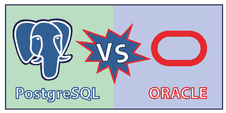

# PostgreSQL vs Oracle

> 原文：<https://www.javatpoint.com/postgresql-vs-oracle>

PostgreSQL 和 Oracle 是两个著名的关系数据库，其中 **PostgreSQL** 是**开源**关系数据库管理系统， **Oracle** 是**商用关系数据库管理系统**，有各种版本。

在本节中，我们将基于各个方面讨论 PostgreSQL 和 Oracle 数据库系统之间的**差异。**

## 什么是 PostgreSQL？

PostgreSQL 是最流行的**对象关系数据库管理系统**，用于管理关系数据库并安全存储。它是开源数据库软件，初始数据库提供**多版本并发控制** (MVCC)功能。

[PostgreSQL](https://www.javatpoint.com/postgresql-tutorial) 支持 **[微软 Windows](https://www.javatpoint.com/windows) 、UNIX、Mac OS X、 [LINUX](https://www.javatpoint.com/linux-tutorial)** 等各种操作系统。它跟随事务以及 **ACID** 属性，即**原子性、一致性、隔离性和持久性**。

## 什么是甲骨文？

[Oracle](https://www.javatpoint.com/what-is-oracle) 是第一个为使用查询语言部署数据的业务目的而建立的数据库软件。它是**一个可以在多个操作系统上执行的跨平台**数据库系统。

这是一个商业关系数据库系统，允许安全快速地存储和检索数据。对于中间层软件的数据库开发和运营，甲骨文开发了一些工具，如 **HCM(人力资本管理)、SCM(供应链管理)、ERP(企业资源规划)和 CRM(客户关系管理)软件**。

让我们看看 PostgreSQL 和 Oracle 之间的一些本质区别，这将有助于我们增强知识:

| 不同的方面 | 一种数据库系统 | 神谕 |
| **定义** | 是一个**对象关系数据库管理**系统，兼容**子查询、外键、触发器**等各种 SQL 特性。
同时支持**多种用户自定义类型和功能**。 | Oracle 是一个**商业关系数据库管理系统**。它有二级数据库模型，如**文档存储、键值存储、RDF 存储和图形数据库管理系统**。 |
| **编程或写入** | 它主要是用 **C** 语言编写的。 | 它主要是用 **C** 和 **C++** 语言编写的。 |
| **开发** | **PostgreSQL 全球开发组**开发。 | **甲骨文**开发。 |
| **发布** | PostgreSQL 发布于 **1996** 。 | 甲骨文发布于 **1980** 。 |
| **最新发布版本** | 最新发布版本为**PostgreSQL 12.3【2020 年 5 月】** | 最新发布版本为**19c【2019 年 2 月】** |
| **牌照** | PostgreSQL 是一个**开源**工具。 | 甲骨文是一个**商业**工具。 |
| **编程语言** | 兼容 **C、C++、Java 等多种编程语言。Net、Perl、Python、Tcl、JavaScript (Node.js)、PHP** 。 | Oracle 支持 C、C++、C#、Cobol、Java、JavaScript、Lisp、Perl、PHP、Python、R、Ruby、Tcl、Scala、Visual Basic、等多种编程语言**。** |
| **处理大数据量** | 它可以高效地处理大量数据，从而提高软件的生产率。 | 与 PostgreSQL 相比，企业版的 Oracle 数据库成功地处理了大量数据。 |
| **功能** | 以下是 PostgreSQL 的特点:

*   It supports multiple programming languages.
*   Download for free.
*   Support multiple functions of SQL.
*   It is highly scalable.
*   Compatible data integrity.
*   Is highly reliable.
*   Compatible with multiple operating systems.

 | 以下是甲骨文数据库的基本特征:

*   Oracle Bone Inscriptions is a portable, extensible and programmable distributed software.
*   Can quickly process a large amount of data.
*   Compatible with ACID attribute, let's keep the reliability and integrity of data.
*   Support logical database structure.
*   It has a network stack, which enables us to easily communicate with oracle database through multiple platforms.
*   Oracle Bone Inscriptions provides a recovery manager tool.

 |
| **生产率** | 与 Oracle 数据库相比，它每秒包含的事务数量更少，这就是为什么它不如 Oracle 数据库高效的原因。 | 与 PostgreSQL 相比，它每秒包含更多的事务；这就是为什么它基于其技术优势提高了生产率。 |
| **平台** | 主要支持 **Unix、Window、Linux、FreeBSD、惠普-UX、NetBSD、OpenBSD、OS X 和 Solaris** 。 | 主要兼容 **Windows、AIX 惠普-UX、Linux、Mac、Solaris 等多个操作系统。** |
| **可扩展性** | 它为免费开发提供了可扩展性支持，如**基于集群的存储解决方案，替代 Skype 在数据库集合中分配信息**取决于 PostgreSQL。 | 支持**四插槽**，标准版可扩展性。然而，对于高工作量的项目，我们需要购买稍微昂贵的原始版本。 |
| **服务器端脚本** | 兼容**自定义功能**。 | 支持 **PL/SQL** 。 |
| **安全** | 它提供了出色的安全支持，但没有 Oracle 数据库那么先进。 | 与 PostgreSQL 相比，它提供了高级安全性；但是，我们需要购买 Oracle 的增强版本，其中包含有助于我们保护数据库的功能。 |
| **记忆能力** | PostgreSQL **没有**内存能力。 | 甲骨文**确实有**内存能力。 |
| **客户支持** | 在 PostgreSQL **中，客户支持是免费的**，但是这需要一些时间来解决问题，因为开发人员的社区会解决它。我们还可以购买付费服务 PostgreSQL，它比 Oracle 数据库客户支持价格便宜。 | 在甲骨文，**客户支持不是免费的**，因为它几乎是许可价格的 1/4，并且每年增加 3-5 个百分点。 |
| **其他访问方法和 API** | 在 PostgreSQL 中，我们可以访问以下方法 **JDBC、ODBC、原生 C 库、ADO.NET、**和大对象的流 API。 | 在 Oracle 中，我们可以访问以下方法，包括 **ODBC、OCI (Oracle 调用接口)、JDBC 和 ODP.NET。** |
| **更新** | PostgreSQL 的开发团队每 4-5 年发布一次更新的新版本。尽管如此，他们总是增强新功能，并根据客户需求和市场发展进行更新。 | 它每 2-3 年发布一次 oracle 数据库的新版本或更新版本，并根据市场趋势进行质量修改。 |
| **官网** | [https://www.postgresql.org/](https://www.postgresql.org/) | [https://www.oracle.com/in/index.html](https://www.oracle.com/in/index.html) |

## 概观

在看到 PostgreSQL 和 Oracle 的区别后，我们可以说 PostgreSQL 在各种情况下都比 Oracle 更强大，因为它是开源软件，与新的关系数据库管理系统兼容，并且易于与大量开发人员一起使用。正如我们所知，PostgreSQL 用于多个组织，如企业对企业应用程序、患者基因和医院应用程序。我们可以根据实际的项目需求来选择数据库。

* * *