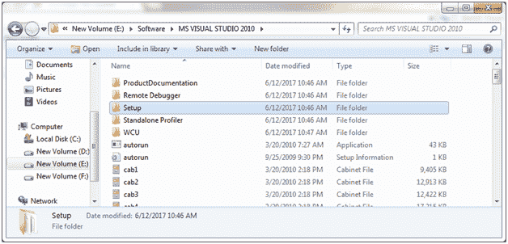
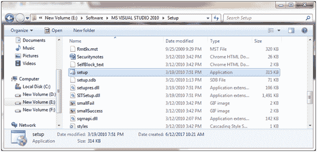
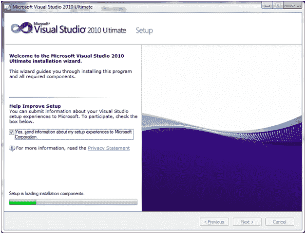
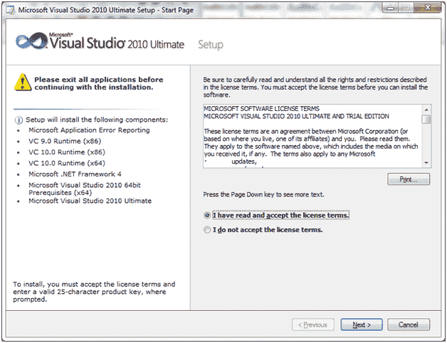
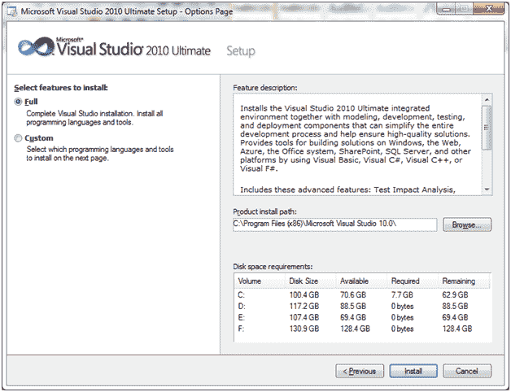
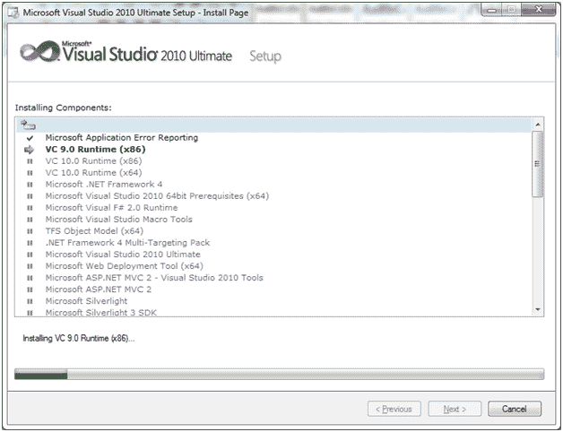
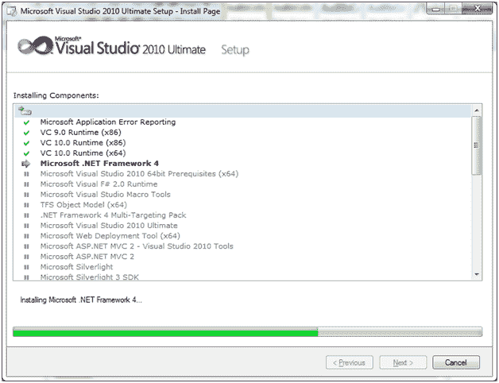
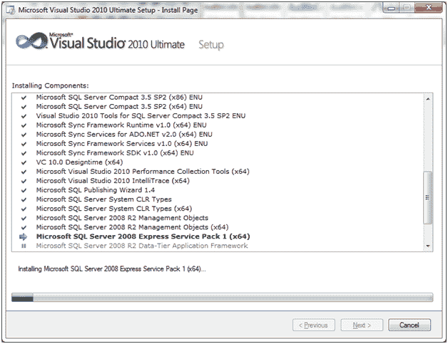
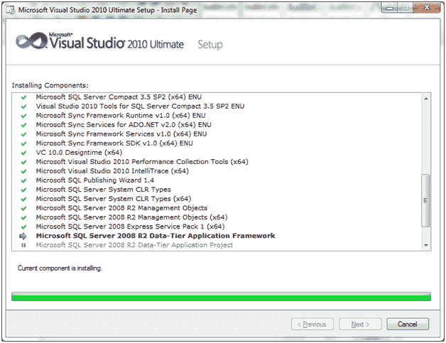
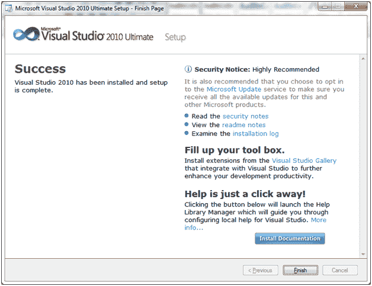

# 下载 Visual Studio

> 原文：<https://www.javatpoint.com/install-visual-studio>

Microsoft Visual Studio 是一个集成开发环境(IDE)，用于为 Microsoft Windows 开发计算机程序，以及网站、web 应用程序和 web 服务。它支持不同的编程语言，如 C、C++和 C++/CLI、Visual Basic。NET、C#和 F#。

当你想用 SQL Server 数据库在 ASP.NET 上制作程序时，就要用到它。

下面的截图指定了如何安装 visual studio。

您将找到一个名为“setup”的应用程序文件。

运行此文件:

选中您已阅读并接受许可条款的复选框。点击“下一步”。

选择安装位置并点击“安装”按钮。

完成后，它会要求重新启动计算机。

**完成:**

现在，您可以检查 Visual Studio 完整版本是否与 Microsoft SQL Server 框架一起安装。

