# 如何下载和安装微软服务器

> 原文：<https://www.javatpoint.com/install-sql-server>

本文全面概述了如何使用安装向导安装和配置 SQL Server。它解释了使用 SQL Server 安装向导安装新的 [SQL Server 实例](https://www.javatpoint.com/sql-server-tutorial)的分步过程。通过这种设置，我们不必单独安装每个 SQL Server 组件，因为安装向导为所有组件提供了一个功能树。

### 服务器系统要求

以下是与最新的可用服务包一起使用时安装 SQL Server 的要求:

**将支持以下软件和操作系统:**

*   Windows 10 (64 位)版本 1607 (10.0.14393)或更高版本
*   Windows 8.1 (64 位)
*   视窗服务器 2019 (64 位)
*   视窗服务器 2016 (64 位)
*   视窗服务器 2012 R2 (64 位)
*   视窗服务器 2012 (64 位)
*   视窗服务器 2008 R2 (64 位)
*   。NET 框架

**在我们的系统上安装之前，我们必须具备以下硬件:**

*   4 GHz 或更快的 x64 处理器。为了更好地使用，建议使用 2.0 GHz 或更快。
*   它需要至少 512 兆内存用于快速，所有其他版本都需要 1 GB 内存。为了更好地使用，建议快速版为 1 GB，所有其他版本都需要 4 GB，并且应该在数据库大小增加时增加。
*   硬盘上必须至少有 6 GB 的空间。

## 如何下载 SQL Server 安装程序

我们可以使用以下步骤在 Windows 操作系统中下载 MS SQL Server:

**第一步:**通过这个网址进入官方页面:[https://www . Microsoft . com/en-in/SQL-server/SQL-server-downloads](https://www.microsoft.com/en-in/sql-server/sql-server-downloads)。

**微软提供了两个免费版本，可与 MS SQL Server 配合使用:**

*   **开发人员:**它拥有 MS SQL Server 的所有功能，但是我们无法在非生产环境中将其用作开发和测试数据库。这是学习视角的理想版本。
*   **Express:** 它也是一个免费版，但它附带了一组有限的功能，适用于桌面、web 和小型服务器应用程序的开发和生产。

**在这里，我们将选择快速版安装在我们的系统**上。

**第二步:**点击**立即下载**按钮。SQL Server 安装程序立即开始在我们的系统上下载。

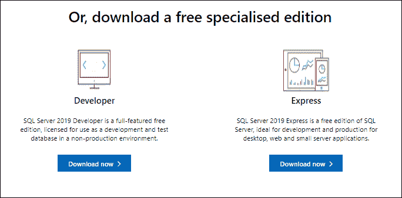

**第三步:**一旦文件下载完毕，我们将获得名为“**SQL2019-SSEI-Expr.exe**的设置。”

## 如何安装 SQL Server

以下步骤帮助我们在视窗操作系统中安装微软服务器:

**第一步:**双击**SQL2019-SSEI-Expr.exe**设置文件。我们将看到下面的屏幕，有三个选项:**基本、自定义**和**下载媒体文件**。在这里，我们将选择**‘基本’**选项来安装基本版本，该版本包括学习微软 SQL Server 所需的所有默认配置。

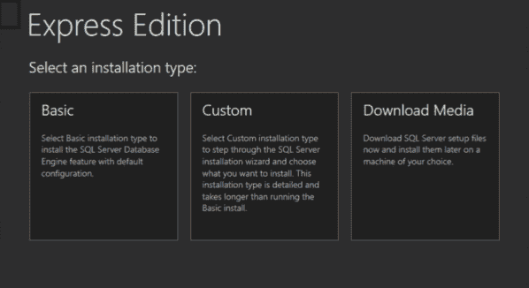

**第二步:**下一个向导会要求你接受**【微软服务器许可条款】**，点击**【接受】**按钮。接下来，我们将指定 SQL Server 的安装位置；如果需要，我们可以将其更改到所需的位置，然后点击**安装**按钮。

在下一个向导中，我们需要等待下载过程完成安装包。安装成功完成后，我们将看到类似于以下屏幕的“SQL Server 安装中心”窗口:

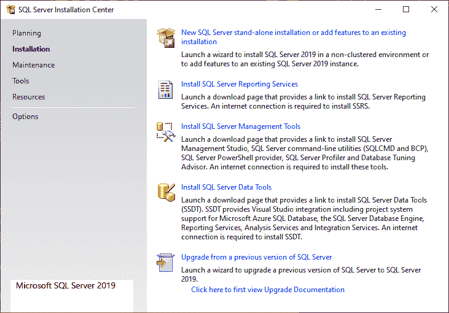

如果您想要创建新的 SQL Server 安装，请选择**新的 SQL Server 独立安装或向现有安装选项**添加功能。

**步骤 3:** 在下一页，阅读许可协议的条款，然后单击“下一步”按钮。

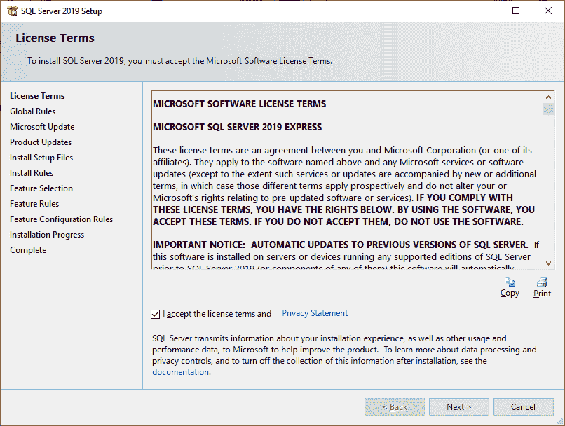

**步骤 4:** 在下一个向导中，即在**全球规则页面**上，如果没有发现规则错误，设置将自动导航到**产品更新页面**。

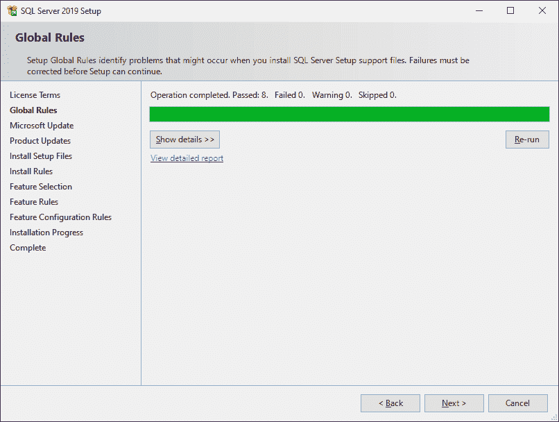

**第五步:**下一页是**微软更新页面**。当我们单击复选框时，它将检查所有 Microsoft 产品的最新更新，以更改计算机设置。完成更新后，单击下一步。

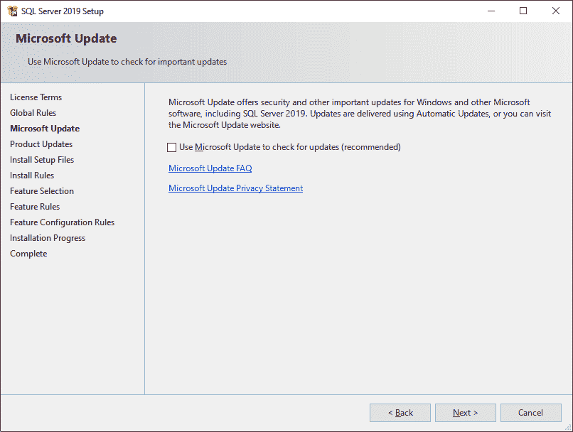

**步骤 6:** 下一个向导是产品更新页面，显示最新的 SQL Server 软件更新。如果没有找到任何产品更新，安装程序将跳过此页面，并自动导航到“安装安装文件”页面。

**步骤 7:** 下一个向导是**安装安装文件页面**，显示安装文件的下载、解压缩和安装进度。如果它找到一个更新，我们希望包括这些更新，它也会被安装。如果没有找到更新，安装程序将自动导航到下一页。

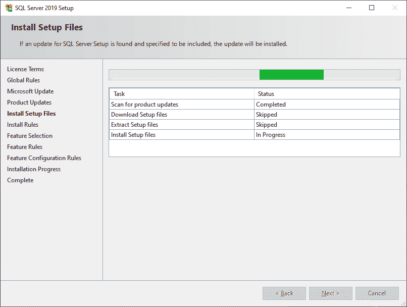

**步骤 8:** 下一个向导是**安装规则页面**，在该页面上，安装程序测试运行安装程序时可能出现的问题。如果发现问题，请在**状态** **列**中选择一个项目以了解更多详细信息。如果没有发现问题，请单击“下一步”。

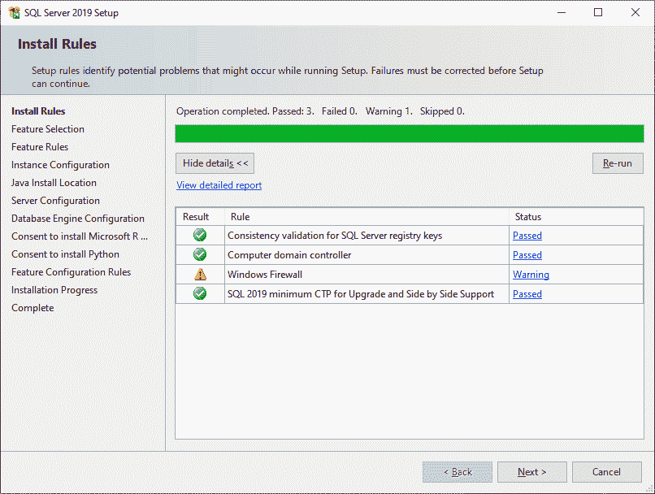

**第 9 步:**如果我们第一次在系统上安装此设置，它将跳过**安装类型**页面并导航到**功能选择**页面。如果在系统上找到该设置，我们可以在“安装类型”页面上选择是执行新安装还是向其添加新功能。

在“功能选择”页面上，我们需要为安装选择组件。假设我们要安装一个新的 SQL Server 数据库引擎实例，我们将选择**数据库引擎服务**。单击“下一步”继续。

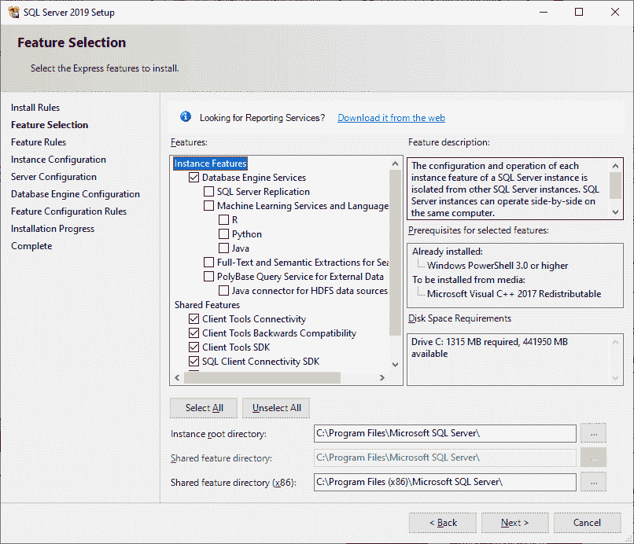

**步骤 10:** 在下一个向导中，我们将指定**名称**和**实例** **ID** 来创建 SQL Server 的新实例。保留默认值，然后单击下一步继续。

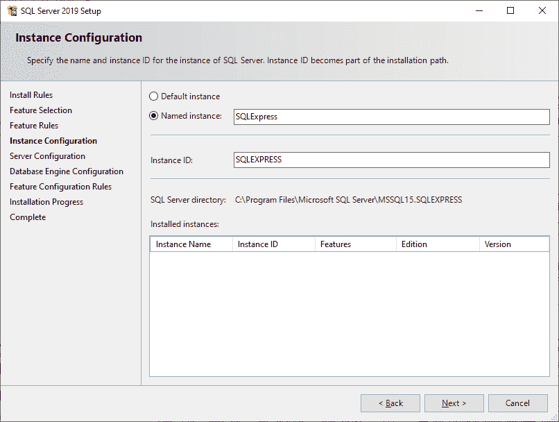

**步骤 11:** 下一个向导是**服务器配置页面**，我们将在这里指定服务帐户和整理配置。在这里，我们将设置启动类型“**自动**”，点击下一步继续。

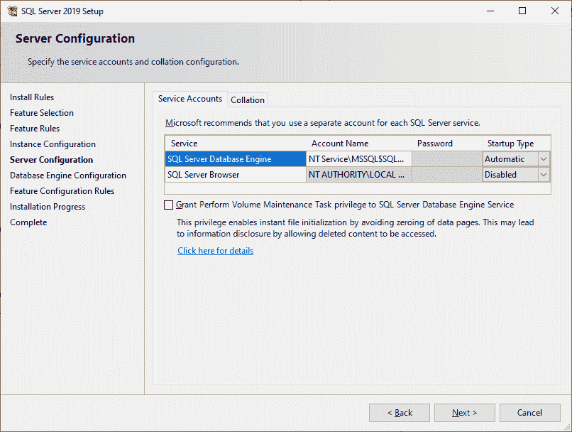

**步骤 12:** 下一个向导是**数据库引擎配置**，我们将在这里指定身份验证安全模式、管理员和数据目录。在这里，我们将选择以下内容:

**认证模式**

*   选择混合模式
*   为系统管理员帐户输入 STRONG 密码

**指定 SQL Server 管理员**

*   添加本地管理员帐户

单击下一步继续。安装过程开始。

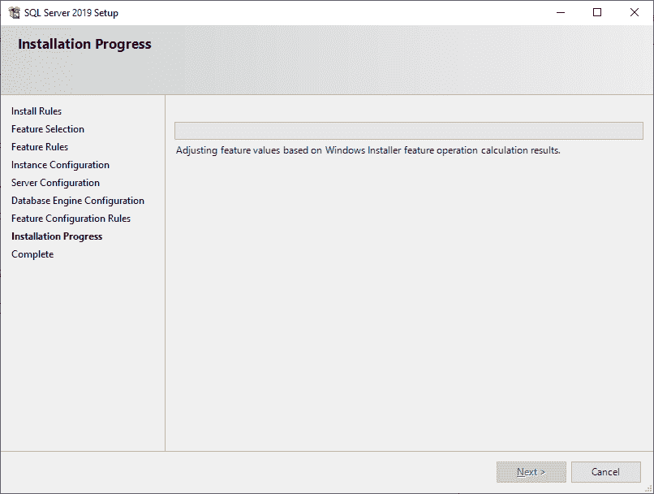

**步骤 13:** 安装完成后，点击**关闭**按钮完成设置。

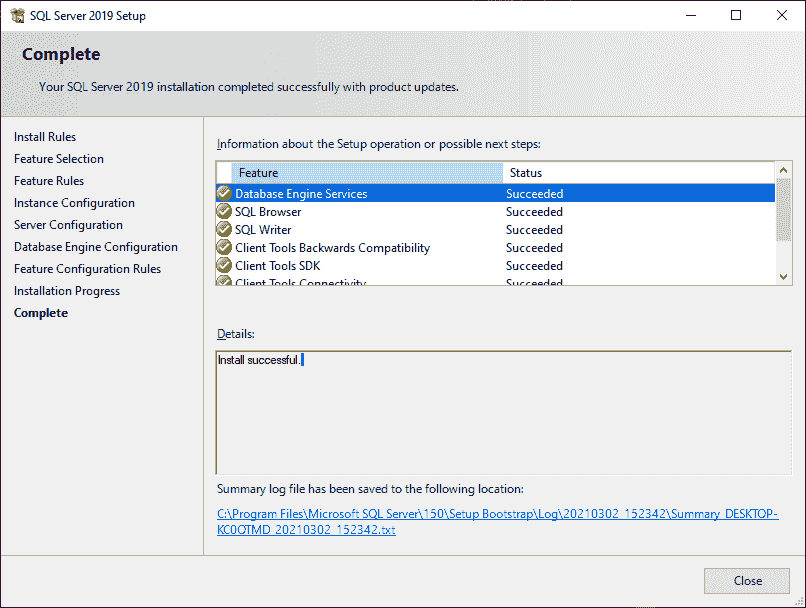

**步骤 14:** 如果系统指示您重新启动计算机，请立即重新启动以完成 SQL Server 安装。

* * *