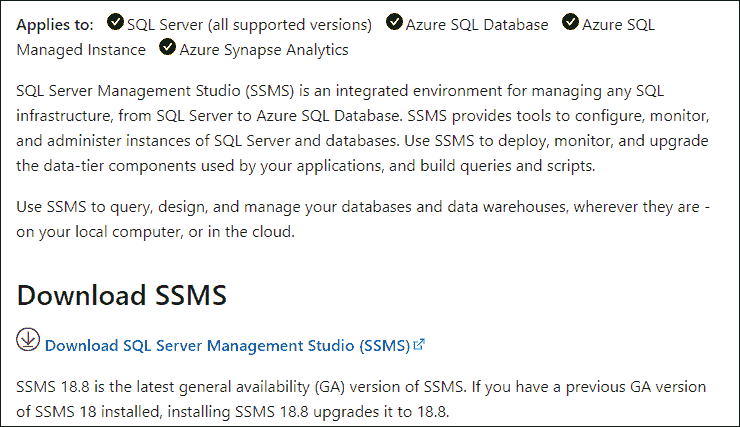
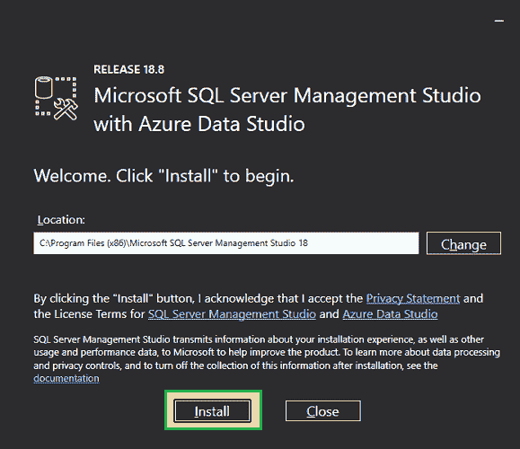
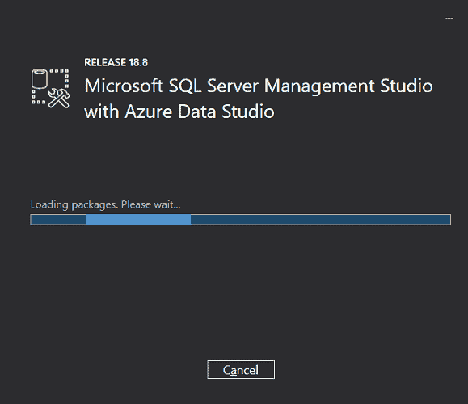
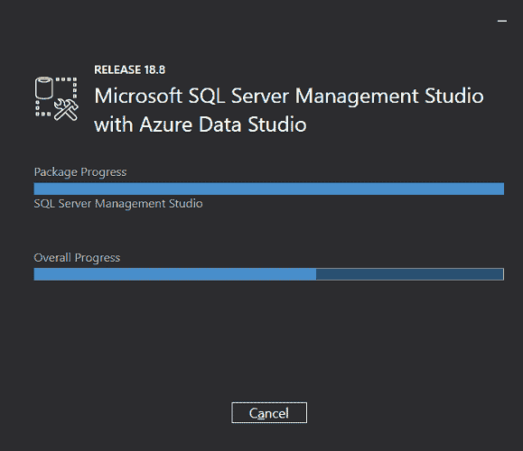
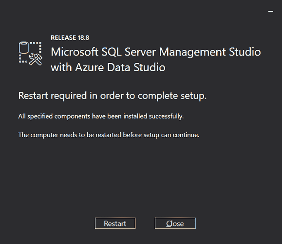
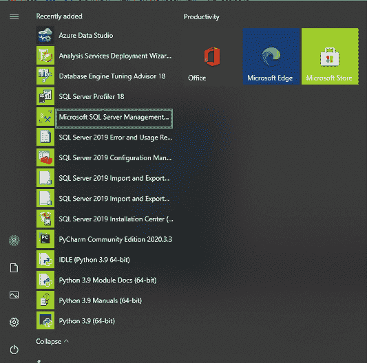
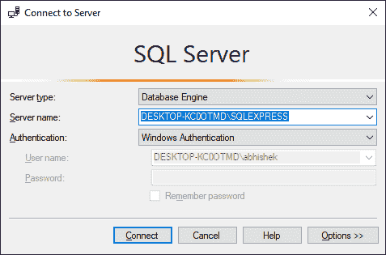
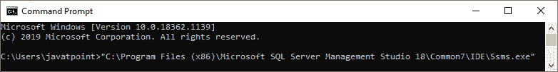
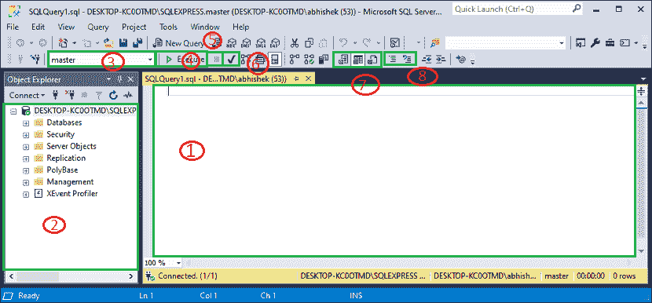
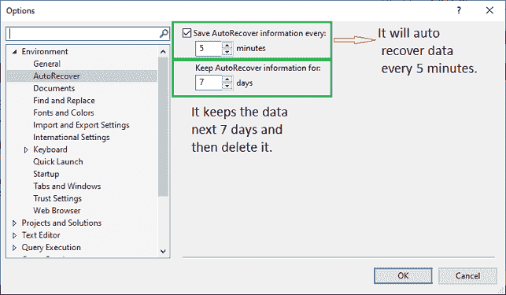

# SQL Server 管理工作室(SSMS)

> 原文：<https://www.javatpoint.com/sql-server-management-studio>

微软 SQL Server 管理工作室是一个工作站或客户端工具，用于连接和管理您的 SQL Server

SQL Server Management Studio (SSMS)是一款 **windows 软件或客户端工具**，用于从**图形界面**连接和使用我们的 SQL Server，而不是使用命令行。微软 SQL Server 2005 推出管理工作室，与 [SQL Server](https://www.javatpoint.com/sql-server-tutorial) 和 Azure SQL 数据库合作。

它允许数据库管理员和数据库开发人员配置、管理和管理 SQL Server 中的所有组件。它的主要功能是创建数据库和表，执行用于插入、更新和删除数据的 SQL 查询，创建和管理存储过程、触发器、视图和游标。它还使我们能够在数据库及其对象上设置特权(安全性)。

SSMS 还包括部署、数据库运行状况监控和报告工具。它包括 **SQL Profiler** ，允许我们检查我们的 SQL 数据库的性能。也可以用它来安排后台工作。如果我们想连接到一个远程的 SQL Server 实例，我们将需要这个图形用户界面工具或类似的软件。它由管理员、开发人员、测试人员等使用。最新版本的 SQL Server 管理工作室是 **SSMS 18.8 RC** 。如果我们已经安装了以前的版本，我们只需要安装 **SSMS 18.8 升级版**。

### SSMS 系统要求

以下是与最新可用服务包一起使用时安装当前版本的 SSMS 的要求:

**支持以下操作系统:**

*   Windows 10 (64 位)版本 1607 (10.0.14393)或更高版本
*   Windows 8.1 (64 位)
*   视窗服务器 2019 (64 位)
*   视窗服务器 2016 (64 位)
*   视窗服务器 2012 R2 (64 位)
*   视窗服务器 2012 (64 位)
*   视窗服务器 2008 R2 (64 位)

**在您的系统上安装之前，我们必须具备以下硬件:**

*   8 GHz 或更快的 x86 处理器。为了更好地使用，建议使用双核。
*   它至少需要 2 GB 内存，但建议为 4 GB(如果在虚拟机上运行，则至少需要 2.5 GB)。
*   硬盘上必须至少有 2 GB 到 10 GB 的空间。

### 如何下载和安装 SQL Server 管理工作室(SSMS)

**我们可以使用以下步骤在 Windows 系统中下载并安装微软 SQL Server 管理工作室(SSMS):**

**第一步:**点击本[链接](https://docs.microsoft.com/en-us/sql/ssms/download-sql-server-management-studio-ssms?view=sql-server-2017)进入官方页面，点击[下载 SQL Server 管理工作室 18.08](https://aka.ms/ssmsfullsetup) 。SSMS 安装程序立即开始在您的系统上下载。



**第二步:**文件下载完成后，将被命名为“**SSMS-Setup-ENU.exe**”现在，双击它继续。


如果您看到提示消息“是否允许以下人员对此计算机进行更改？说**是**。

**第三步:**我们会看到下方有一个窗口。在这里，我们可以更改安装位置，然后点击**‘安装’**按钮，在您的设备上安装 SQL Server Management Studio (SSMS)。



**第四步:**安装过程开始。我们将在下面的屏幕上看到软件包的进度和整体进度。由于它从互联网下载必要的软件包，安装可能需要一些时间。




**第五步:**当 SSMS 设置完成后，会在下方显示**设置完成**信息。有可能我们会提示我们重启电脑。



### 如何访问 SQL Server 管理工作室

我们可以使用以下步骤访问 SQL Server 管理工作室(SSMS):

**转到开始菜单>程序>微软 SQL Server 工具 18 >微软 SSMS 18。**



当我们启动 SSMS 时，**“连接到服务器”**对话屏幕将出现在我们面前。在此屏幕上设置我们要连接的 SQL Server 的**服务器名称**和**身份验证类型**，然后点击**连接**按钮连接到**“数据管理工作室”**。这里的服务器名称默认为安装微软 SQL Server 时选择的名称。



让我们详细了解上面屏幕的每个字段:

**服务器类型:**这是一个下拉菜单，允许我们从四个 MS SQL 服务选项中选择一个。在这里，我们将致力于**“数据库引擎”**，使我们能够创建和使用数据库。其他服务器类型的一些示例有分析、报告和集成服务。

**服务器名:**是安装 [MS SQL Server](https://www.javatpoint.com/install-sql-server) 的服务器名，我们需要和那个服务器连接。在大多数情况下，我们称服务器名为“机器名/实例”在这里，我们在安装过程中给了 SQL Server 实例一个实例名。

**身份验证:**如果我们在安装 SQL Server 时使用“ **Windows 身份验证**，则该选项设置为“Windows 身份验证”如果我们选择了**混合模式** (Windows 身份验证& Windows 身份验证)，身份验证将设置为 **SQL Server 安装**

**用户名\密码:**当身份验证设置为“Windows 身份验证”之外的“SQL Server 安装”时，将需要这两个字段

### 如何使用命令行访问 SQL Server 管理工作室？

我们还可以使用窗口命令行工具来启动 SQL Server 管理工作室。我们可以通过使用通往 ssms.exe 的完整路径来做到这一点。默认位置和文件名如下:

```

C:\Program Files (x86)\Microsoft SQL Server Management Studio 18\Common7\IDE
Exe name: ssms.exe

```

通过命令行访问管理工作室的步骤如下:

*   在搜索框中键入 CMD 以打开命令提示符。
*   接下来，我们需要键入 ssms.exe 遵循的完整路径，然后按回车键。

我们将立即看到类似于上面描述的“连接到服务器”屏幕。



### 数据管理工作室 IDE 简介

数据管理工作室启动屏幕如下所示。我们将详细讨论每一部分。



**1。查询编辑器**

这个部分用于编写我们所有的查询。微软 SQL Server 为表、列和其他项目提供交互式建议，以便于查询创建和各种其他功能。

**2。对象浏览器**

对象资源管理器以树格式显示服务器上包含的数据库对象。为了便于快速参考，本节列出了所有数据库、安全性和服务器对象。我们只需按下对象左侧的+图标来展开它，就可以看到每个对象的组件。

**3。数据库选择下拉菜单**

这是一个下拉选项，允许用户选择数据库来运行我们的查询。

**4。执行按钮**

它是一个执行按钮，允许用户执行查询并返回结果。

**5。取消执行查询**

这是一个用于停止查询执行的按钮。

**6。解析**

它是一个用于验证查询语法的按钮，但不检查数据库对象。

**7。更改查询结果目的地**

这个按钮组允许我们设置查询结果的目的地。有三种选择:

*   网格结果
*   结果到文本
*   结果到文件

**8。注释/取消注释所选行**

这些按钮允许我们对我们选择的代码行进行注释或取消注释。例如，在查询编辑器中查看代码的行号。

### 要记住的要点

**使用 SQL Server 管理工作室时，以下几点必须有用:**

*   SSMS 是一个独立的应用程序，不引用任何特定的 SQL Server 版本。**比如**，我们可能会用 18 版搭配 SQL Server 2017 和 SQL Server 2016。
*   如果我们编写更大的代码，它会降低可读性。在这种情况下，我们需要利用注释来提高可读性。我们可以注释掉一行，只需在前面加上“-”。
*   突然关机或设备故障可能会导致数据丢失。我们可以通过选中设置“**自动恢复**”选项来最小化数据丢失。我们还可以配置“自动恢复”数据时间段以及该信息在被删除之前的存储天数。我们可以设置自动恢复选项如下:
    **工具>选项>环境>自动恢复**



### SSMS 版本和更新

SSMS 的第一个版本是与 SQL Server 2005 一起发布的。借助于 SQL Server 2008、SQL Server 2012 和 SQL Server 2016，SSMS 是 SQL Server 不可分割的一部分。微软在 2016 年开始了第一个数字版本序列，SSMS 版本号为 16.3。所有系列的版本号包括 16.x、17.x 和 18.0。

最新的 18.0 系列有以下版本:18.0(预览版 4)、18.0(预览版 5)和 18.0(预览版 6)。截至 2021 年 3 月，SQL Server 管理工作室的当前版本为 SSMS 18.8 RC。

* * *