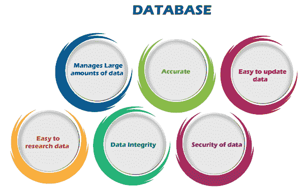
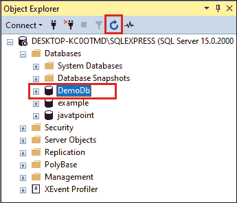
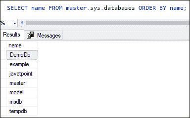
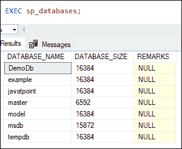
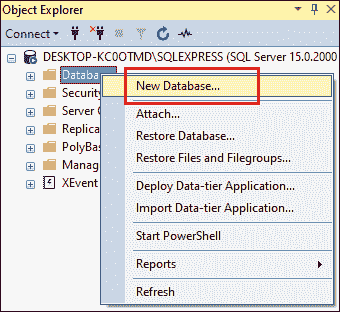
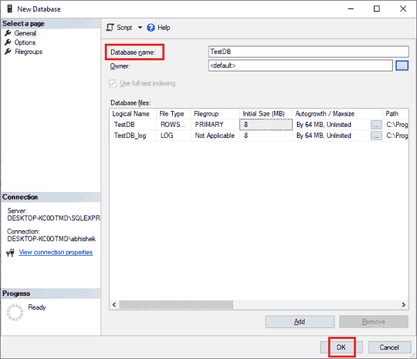
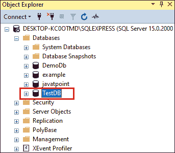

# 创建数据库

> 原文：<https://www.javatpoint.com/sql-server-create-database>

数据库是结构化为表、行、列和索引的有组织的数据集合。它帮助用户频繁地找到相关信息。它使用户能够非常容易地通过数据库访问和管理记录。通常，SQL Server 中的每个数据库都以表的形式存储所有文件。

### 为什么我们需要一个数据库？

大多数公司和组织都需要数据库，因为它维护所有相关信息，如员工记录、交易记录、工资信息等。**以下是需要数据库的流行原因:**



**管理大量数据:**每个数据库每天可以在一个地方存储和管理大量数据。没有其他可用的工具，包括电子表格，来做同样的事情。

**精确:**每个数据库都可以精确地存储数据，因为它提供了内置的约束、检查和其他功能。因此，数据库信息几乎总是保证是正确的。

**易于更新:**用户可以使用各种数据操作语言(DML)命令轻松更新数据库，如 [SQL](https://www.javatpoint.com/sql-tutorial) 、 [SQL Server](https://www.javatpoint.com/sql-server-tutorial) 等。

**安全性:**每个数据库都让用户能够使用各种方法来保证数据的安全性。例如，需要登录才能访问数据库，或者只授予访问数据库特定部分的权限，而不是全部。

**数据完整性:**各数据库确保存储的数据准确一致。用户可以通过对数据使用各种约束或遵守 ACID 属性规则来做到这一点。

**易于研究的数据:**数据库使用户能够使用数据查询语言(DQL)快速搜索和找到相关信息。

### SQL Server 提供了两种类型的数据库:

1.  系统数据库
2.  用户数据库

**系统数据库:**系统数据库是在我们的系统上安装 MS SQL Server 时自动创建的。它在服务器这样的数据库完美运行中起着至关重要的作用。以下是 SQL Server 中系统数据库的**列表:**

*   掌握
*   模型
*   微软官方
*   数据库

**用户数据库:**用户数据库由数据库用户创建，如**数据库管理员**和**测试员**，他们也可以访问数据库。

### 我们可以主要通过两种方式在 SQL Server 中创建数据库:

*   Transact-SQL 命令
*   SQL Server 管理工作室

让我们逐一详细讨论。

### 使用命令创建数据库

以下语法使用户能够在 SQL Server 中创建新数据库:

```

CREATE DATABASE database_name  

```

在上面的语法中，**数据库名称**表示新数据库的名称。

**创建新数据库的规则**

创建新数据库时，我们必须遵循以下规则:

*   在特定的服务器实例中，新数据库的名称应该是唯一的。
*   每个数据库最多应包含 128 个字符。
*   创建数据库命令应该在**自动提交模式**下执行。

### 例子

让我们通过一个例子来了解如何在 SQL Server 中创建一个数据库。为此，首先，打开 Management Studio，并通过提供服务器地址和身份验证详细信息来连接数据库引擎。然后，从标准栏中单击新查询。

一旦连接成功，执行下面的语句创建一个名为 **DemoDb:** 的新数据库

```

CREATE DATABASE DemoDb;

```

一旦语句成功执行，我们就可以在**对象浏览器**中看到新创建的数据库。如果这里没有显示，我们需要点击**刷新按钮**或者按下键盘上的 **F5** 来更新对象列表。请参见下图:



SQL Server 允许用户使用以下命令列出存储在数据库引擎中的所有数据库:

```

SELECT name FROM master.sys.databases ORDER BY name;

```

执行该语句将显示所有数据库的列表:



SQL Server 允许**存储过程语句**列出数据库引擎中存储的所有数据库，如下所示:

```

SELECT name FROM master.sys.databases ORDER BY name;

```

执行存储过程将显示所有数据库的列表，包括其大小和备注(如果有)。否则，该字段显示为**空**。



### 使用 SQL Server 管理工作室创建数据库

SQL Server 管理工作室是一个图形用户界面工具，它使数据库管理员能够配置、管理和管理 SQL Server 的所有组件，而不是使用命令行。我们可以通过以下步骤在 SSMS 创建一个数据库:

**步骤 1:** 在管理员模式下打开 SSMS，避免任何权限问题。我们将看到下面的屏幕，我们将首先连接到服务器。在这里，我们必须填写服务器名称、服务器类型、认证信息，然后点击**连接**按钮继续。


**步骤 2:** 一旦连接成功，**对象浏览器**窗口将出现在屏幕左侧。我们连接到的服务器显示在对象资源管理器的顶部。要查看数据库文件夹，如果它没有扩展，请单击“+”按钮。


**步骤 3:** 下一步是右键单击**数据库**文件夹，从下拉列表中选择**新数据库**创建数据库。



**第 4 步:**下一步将打开新建数据库对话框。在这里我们可以在创建数据库之前**配置**。现在，键入数据库名称，根据需要更改设置，然后单击“确定”按钮。在大多数情况下，数据库管理员将设置保留为默认值。



**步骤 5:** 一旦数据库创建成功，我们可以通过展开对象资源管理器下的 Databases 文件夹来查看它们。数据库图标有一个**圆柱体图标**。



本文将解释使用 SQL Server 管理工作室(SSMS)和 SQL 命令在 SQL Server 中创建新数据库的完整概述。

* * *