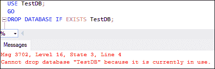
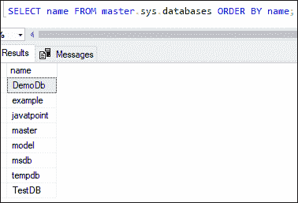
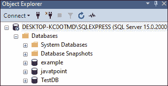
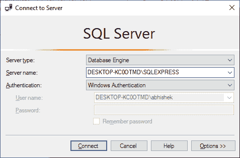
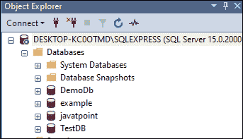
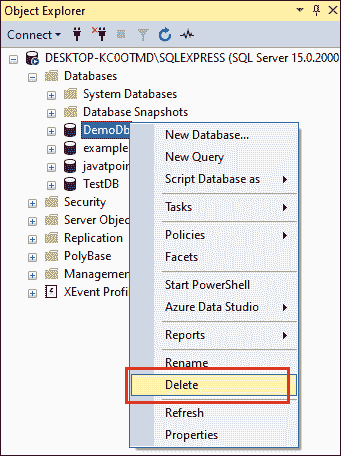
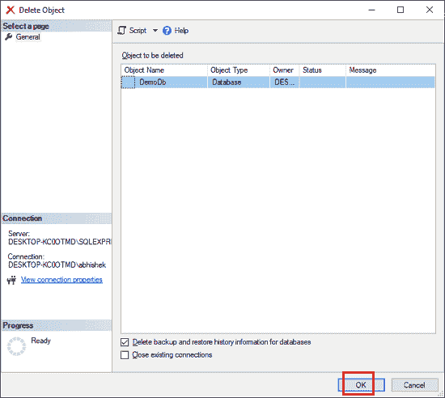

# SQL Server 删除数据库

> 原文：<https://www.javatpoint.com/sql-server-drop-database>

有时，数据库在我们的服务器实例上不相关或过时。在这种情况下，我们可以从服务器上删除它们。当我们删除数据库时，它也将永久删除所有的表、索引和约束。因此，我们在删除数据库时必须非常小心，因为我们将丢失数据库中所有可用的数据。如果数据库在服务器实例上不可用， [SQL Server](https://www.javatpoint.com/sql-server-tutorial) 将抛出一条错误消息。

**我们可以在 SQL Server 中删除一个数据库，主要有两种方式:**

*   Transact-SQL 命令
*   SQL Server 管理工作室

让我们逐一详细讨论。

### 使用命令删除数据库

SQL Server 使用户能够使用以下语法从服务器实例中删除数据库:

```

DROP DATABASE [IF EXIST] database_name  

```

如果我们想在一个命令中删除多个数据库，我们可以使用逗号分隔的数据库名称列表，如下所示:

```

DROP DATABASE  [ IF EXISTS ] database_name , database_name2, ...;

```

在这个语法中， **database_name** 表示我们想要从服务器实例中删除的数据库的名称。IF EXIST 是一个可选子句，表示如果数据库已经存在于服务器中，它将被删除。

**删除数据库前一定要记住以下几点:**

1.  DROP DATABASE 命令将删除数据库以及数据库的物理磁盘文件。因此，如果我们将来需要恢复数据库，我们需要保留一个数据库备份。
2.  DROP DATABASE 语句应该在**自动提交模式**下运行。它不能在事务中使用，无论是显式的还是隐式的，因为自动提交是默认的事务管理模式。
3.  我们无法删除当前活动的数据库。如果我们这样做，SQL Server 会发出以下错误:



### 例子

让我们了解如何删除数据库，这在服务器实例上不再需要。首先，我们将使用以下命令列出数据库引擎中存储的所有数据库:

```

SELECT name FROM master.sys.databases ORDER BY name;

```

执行该语句将显示所有数据库的列表:



如果我们想删除一个'**demod '**数据库，我们可以使用如下语句:

```

DROP DATABASE IF EXISTS DemoDb;

```

执行完命令后，点击**刷新按钮**或者按下我们键盘上的 **F5** 来更新对象列表。我们可以看到 DemoDb 数据库不再可用:



### 使用 SQL Server 管理工作室删除数据库

我们可以通过以下步骤删除 SSMS 的数据库:

**步骤 1:** 在管理员模式下打开 SSMS，避免任何权限问题。我们将看到下面的屏幕，我们需要点击**连接**按钮继续。



**步骤 2:** 一旦连接成功，**对象浏览器**窗口将出现在屏幕左侧。要查看数据库文件夹，如果没有扩展，请单击**“+”**按钮。


**步骤 3:** 下一步是通过点击加号(+)按钮展开**数据库**文件夹。我们将看到当前服务器实例中所有可用的数据库。



**第 4 步:**下一步是删除想要的数据库。假设我们想删除 DemoDb 数据库。为此，右键单击所选数据库，并从上下文菜单中选择**删除**选项。请参见下图:



**第五步:**点击删除选项后，会出现**删除模型对象框**确认删除过程。点击**确定**按钮，从 SQL Server 中永久删除数据库。



**第六步:**如果一切正常，则删除选中的数据库。我们可以通过单击刷新按钮或按键盘上的 F5 来更新对象列表来验证这一点。我们可以看到 DemoDb 数据库不再可用:


* * *