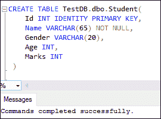
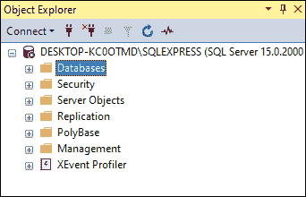
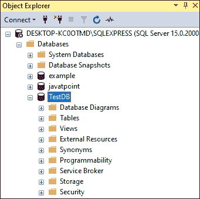
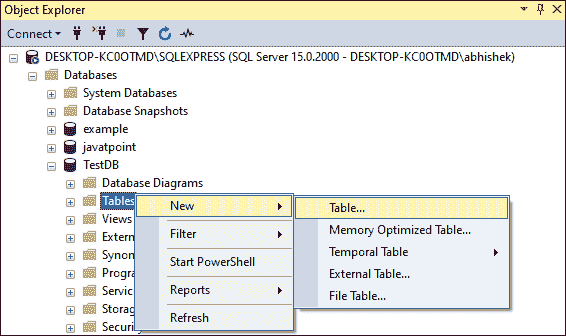
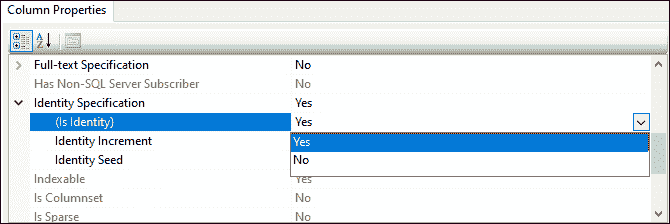
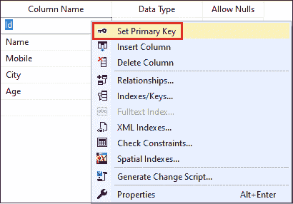
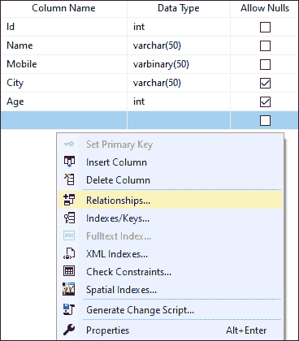
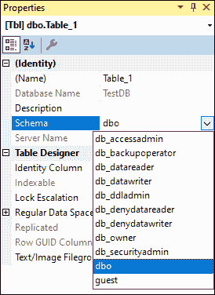
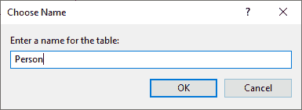
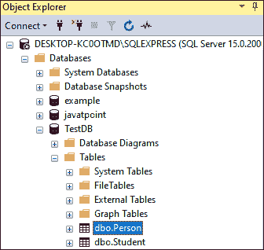

# SQL Server 创建表

> 原文：<https://www.javatpoint.com/sql-server-create-table>

表格使用户能够在数据库中存储数据和显示信息。它按行和列排列数据。它可以有几行和几列，每列都有与之关联的数据类型，该数据类型指定了它可以存储的数据类型，如数字、字符串或时态数据。它类似于电子表格应用程序中的工作表。创建表需要三个项目:

*   表的名称
*   字段名称
*   每个字段的定义

### 我们可以主要通过两种方式在 SQL Server 中创建一个表:

*   Transact-SQL 命令
*   SQL Server 管理工作室

让我们逐一详细讨论。

### 使用命令创建表格

我们可以使用 CREATE TABLE 命令在选定的数据库中创建一个表。只有当我们对创建表的模式拥有 **ALTER 权限**并且在数据库中拥有 **CREATE TABLE 权限**时，我们才能使用这个语句。以下是一个通用语法，使用户能够在 [SQL Server](https://www.javatpoint.com/sql-server-tutorial) 中创建新表:

```

CREATE TABLE [database_name.][schema_name.]table_name (
    column_definition1,  
    column_definition2,  
    ........,  
    table_constraints  
);

```

### 参数说明

上述语法的参数描述如下:

**database_name:** 是我们要在其中创建表的数据库名称。它必须存在于已定义的数据库中。否则，它将默认采用当前数据库。

**schema_name:** 表示我们新创建的表所属的模式。

**表名:**是新表的名称，在所选数据库中必须唯一。最大长度应为 128 个字符。

**column_definition:** 表示表的列名以及每列的数据类型。这些数据类型可以是 int、float、char、varchar、text、datetime 和 Boolean。表定义中的列由逗号运算符分隔。

**table_constraints:** 表示主键、唯一键、外键、校验等表约束。

我们应该为每个表提供一个**主键列**。它可以有一列或多列。通常，我们使用第一列作为主键，然后使用其他列。如果我们在一个表中只定义一个主键列，我们应该使用**主键**关键字。否则，建议将主键定义为表约束。一列可以有单个或多个约束，如“检查”、“唯一”和“非空”。

### 例子

让我们通过一个例子来了解如何在 SQL Server 中创建一个表。在这里，我们将使用以下语句创建一个名为“**学生**”的表:

```

CREATE TABLE TestDB.dbo.Student(  
    Id INT IDENTITY PRIMARY KEY,  
    Name VARCHAR(65) NOT NULL,  
    Gender VARCHAR(20),  
    Age INT,  
    Marks INT 
 )

```

在上面的陈述中，我们已经在**【数据库】**模式下的**【测试数据库】**数据库中创建了一个“学生”表。此表包含五列标识、姓名、性别、年龄和标记。这里，我们将 **id 列**定义为**主键**。 **IDENTITY** 数据类型会生成整数，这些整数会自动以 1 开头，并为每一个新行增加 1。

成功执行该语句后，我们将获得以下输出。现在，我们可以使用 **INSERT** 语句向该表中添加记录。



### 使用 SQL Server 管理工作室创建表

我们可以使用**表格设计器**在 SSMS 创建一个表格。以下步骤解释了如何使用表设计器创建表:

**步骤 1:** 在管理员模式下打开 SSMS，避免任何权限问题。我们将看到下面的屏幕，我们需要点击**连接**按钮继续。


**步骤 2:** 一旦连接成功，**对象浏览器**窗口将出现在屏幕左侧。如果**数据库**文件夹不可见，单击**“+”**图标将其展开。



**步骤 3:** 接下来，点击加号(+)按钮，展开**数据库**文件夹。我们将看到当前服务器实例中所有可用的数据库。


**步骤 4:** 下一步是选择想要在其中创建表的数据库，并将其展开。它将显示子菜单，如数据库图表、表格、视图和，如下屏幕所示。



**第五步:**下一步是选择**表格**文件夹，右击它，我们会得到弹出菜单。点击**新建**选项将显示一个下拉列表，我们将在其中选择**表格**选项。请参见下图:



**第 6 步:**一旦我们点击表格选项，我们将获得**表格设计器窗口**。此窗口将包括列名、数据类型和非空约束，以选择是否允许每个列为空。例如，我们希望创建一个名为“Person”的表，该表将存储四列:

*   西方人名的第一个字
*   姓
*   移动的
*   城市
*   年龄

我们可以通过填充这些列名及其数据类型来创建该表，如下图所示:


**第 7 步:**如果您想为任何特定的列定义更多的属性，如 IDENTITY 或 COMPUTED 列值，那么单击所需的列将显示列**属性选项卡**。在这里你可以选择合适的属性。



如果要将列定义为主键，请右键单击所需的列，然后选择设置主键，如下所示:



如果要定义外键关系、检查约束或索引，需要右键单击表设计器窗格中的任意位置，然后从上下文菜单中选择所需的选项，如下所示:



**步骤 8:** 默认情况下存储在 dbo 模式中的表。如果要将表存储在不同的模式中，您需要在表设计器窗格中的任意位置单击鼠标右键，然后选择**属性**。我们将看到下面的下拉列表，从中可以选择合适的模式。



**步骤 9:** 完成后，导航至**文件**菜单，选择**保存**表名。


当我们单击保存按钮时，SQL Server 将显示一个框来选择表的名称。为表格写下你想要的名字，点击**确定**。例如，我们给我们的表起了一个**人**的名字:



**步骤 10:** 一旦表创建成功，我们可以通过展开对象浏览器下的 Tables 文件夹并按下键盘上的 **F5 按钮**来刷新对象列表来查看它们。现在，我们可以在表格列表中看到新的表格(人员)。



本文将解释使用 T-SQL 语句和 SQL Server 管理工作室(SSMS)在 SQL Server 中创建新表的完整概述。

* * *