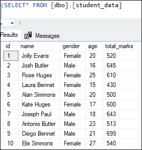
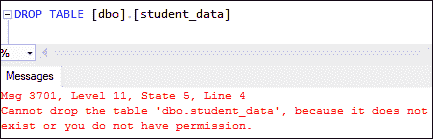
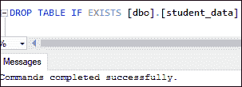
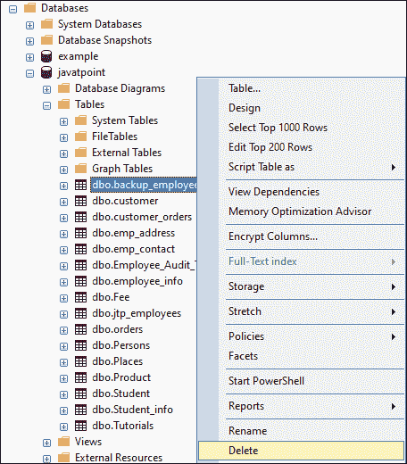
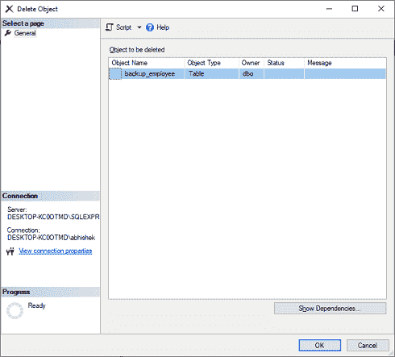

# SQL Server 删除或删除表

> 原文：<https://www.javatpoint.com/sql-server-delete-table>

SQL Server 允许数据库管理员删除一个在我们的数据库中不相关或过时的表。当我们移除一个表时，完整的数据和整个结构或定义将从表中永久删除。因此，从指定的数据库中删除表时，我们必须非常小心。如果 SQL Server 找不到目标数据库表，它将抛出一条错误消息。

### SQL Server 主要提供了两种删除表的方法:

*   Transact-SQL 命令
*   SQL Server 管理工作室

让我们逐一详细讨论。

### 使用命令删除表

我们可以使用以下语法删除 SQL Server 中的表:

```sql

DROP TABLE [IF EXISTS] [database_name.][schema_name.]table_name;

```

在上面的语法中，

*   我们首先需要写下想要删除的**表名**。接下来，我们需要指定存储该表的**数据库名称**，并且**模式名称**指示该表属于哪个。应当注意，数据库名称是可选的。如果我们忽略这一点，这个查询将从当前连接的数据库中删除该表。
*   **IF EXIST** 是一个可选子句，表示只有当表已经存在于数据库中时，该表才会被删除。本子句自 **SQL Server 2016 13.x** 起生效。

如果我们想在一个命令中删除多个表，我们可以使用逗号分隔的表名列表，如下所示:

```sql

DROP TABLE [IF EXISTS] [database_name.][schema_name.]table_name1,
[schema_name.]table_name2.....
[schema_name.]table_nameN;

```

当我们在 [SQL Server](https://www.javatpoint.com/sql-server-tutorial) 中移除一个表时，它也会擦除该表的所有数据、触发器、约束和权限。此查询不允许删除显式引用已删除表的视图、用户定义函数和存储过程。因此，如果我们想显式删除这些对象，我们应该使用**删除视图**和**删除过程**语句。

**删除表格前一定要记住以下几点:**

1.  DROP TABLE 查询将删除该表，包括其物理磁盘文件。因此，如果将来需要恢复，我们必须保留备份。
2.  如果**外键**约束引用了该表，则该查询不会删除表。如果我们想这样做，我们将首先删除引用外键约束或表。此外，当引用表和主键表都在同一个 DROP TABLE 语句中被删除时，我们首先列出事件中的引用表。
3.  当表中有一个带有 **FILESTREAM** 的 varbinary (max)列时，该语句不会删除文件系统中存储的数据

#### 注意:我们必须对该表所属的模式拥有 ALTER 权限，并对该表拥有 CONTROL 权限，才能执行 DROP TABLE 语句。

### 例子

此示例指定了如何从数据库中删除现有表。假设我们的数据库有一个名为“ **student_data** ”的表，其中包含以下数据:



如果我们想从数据库中删除这个表，我们可以使用如下语句:

```sql

DROP TABLE [dbo].[student_data]

```

它将永久删除该表。如果我们重新访问该表，我们将获得如下输出所示的错误消息:


如果我们试图删除数据库中不存在的表，SQL Server 将通过以下错误消息:



但是，如果我们使用 IF EXISTS 子句尝试删除数据库中不可用的表，SQL Server 不会显示任何错误或警告消息。请参见以下输出:



## 使用 SQL Server 管理工作室删除表

我们还可以使用 SSMS 从数据库中删除一个表。以下步骤说明了如何使用 SSMS 删除表:

**步骤 1:** 打开 SSMS，然后导航到**对象浏览器- >数据库- >** **表格**文件夹。它将显示所有可用的表格。

**第 2 步:**选择您的数据库中不再需要的所需表格，并右键单击它以获得弹出菜单。现在，从出现的菜单中选择**删除**选项。请参见下图:



**第三步:**一旦点击删除选项，我们会看到**删除模型对象**框，确认删除过程。点击**确定**按钮，从 SQL Server 中永久删除数据库。



**步骤 6:** 如果一切正常，所选表将从数据库中删除。我们可以通过点击刷新按钮或按下键盘上的 **F5** 来更新对象列表来验证这一点。我们可以看到“**backup _ employee”**表不再可用。

本文有助于了解如何使用 SQL 查询和 SQL Server Management Studio 从数据库中永久删除表。

* * *