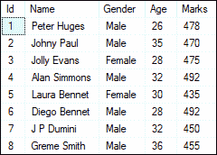
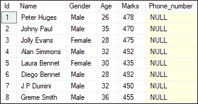
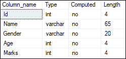
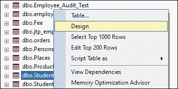
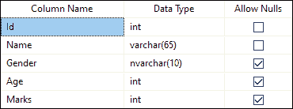
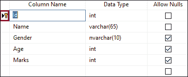
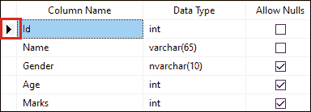
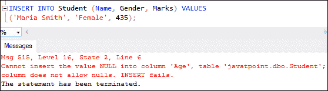

# SQL Server 更改表

> 原文：<https://www.javatpoint.com/sql-server-alter-table>

SQL Server 中的 ALTER 命令是**用来对现有的表**进行修改。这些变更可以是添加列、删除列、更改大小、修改数据类型、添加或删除索引，以及在表定义中添加或删除约束。它还允许我们重命名和重建分区，禁用和启用约束和触发器。本文将通过各种例子解释表格中所有可能的变化。

我们将使用名为**“学生”**的表格来演示所有示例。



### SQL Server 添加新列

数据库开发人员需要多次向现有表中添加新列。他们可以通过使用**更改表格添加列命令**来实现。它将总是在表的最后一个位置添加新列。添加新列的语法如下:

```sql

ALTER TABLE table_name  ADD column_name data_type column_constraints;

```

在这个语法中，我们将首先指定我们想要修改的**表名**。然后，我们将指定要添加到表中的**新列名**。最后，我们将为列指定**数据类型和约束**。

**如果要添加多列，可以使用以下语法**:

```sql

ALTER TABLE table_name   
    ADD column_name1 column_definition,
    ADD column_name2 column_definition;  

```

**例**

假设我们想在**学生**表中添加一个新列“**电话号码**”。我们可以通过使用下面的命令来做到这一点:

```sql

ALTER TABLE Student ADD Phone_number VARCHAR(20) NULL;

```

我们可以使用 SELECT 语句来验证表中新插入的列。请参见下图，该列被添加为表中的最后一列:



### SQL Server 删除列

我们还可以使用 ALTER 命令从表中删除一列或多列。SQL Server 提供了 **ALTER TABLE DROP COLUMN** 语句来从表中删除现有的列。为此，我们可以使用以下语法:

```sql

ALTER TABLE table_name  DROP COLUMN column_name;  

```

在这个语法中，我们将首先指定要进行修改的表名。然后，我们将在 DROP COLUMN 子句之后指定要从表中删除的列名。

**如果要删除多列，可以使用以下语法:**

```sql

ALTER TABLE table_name  
DROP COLUMN column_name1, DROP COLUMN column_name2...  

```

**例**

假设我们想从**学生**表中删除一个**“电话号码”**列。我们可以通过使用下面的命令来做到这一点:

```sql

ALTER TABLE Student DROP COLUMN Phone_number;

```

我们可以使用下面的语句来验证该列是否已从表中删除:

```sql

EXEC sp_help 'dbo.Student';

```

请参见下表中电话号码列不再可用的位置:



### SQL Server 修改列数据类型

我们还可以使用 ALTER 命令将列的数据类型更改为指定的表。SQL Server 提供 **ALTER TABLE ALTER COLUMN** 语句来修改列数据类型。我们可以通过使用以下语法来做到这一点:

```sql

ALTER TABLE table_name ALTER COLUMN column_name new_data_type(size);

```

在这个语法中，我们将首先指定要进行修改的表名。然后，我们将指定要修改的列名，最后定义其**新数据类型，大小为**。

我们必须确保新旧列数据类型必须兼容。否则，如果列包含值，SQL Server 会给出转换错误。

**例**

我们已经将“学生”表的**“性别”**列的数据类型定义为“VARCHAR”，长度为 20。现在要从 **VARCHAR** 改成 **NVARCHAR** ，尺寸**为 10** 。为此，我们将使用以下语法:

```sql

ALTER TABLE [Student] ALTER COLUMN Gender NVARCHAR(10);

```

我们可以从 SQL Server Management Studio 中的表设计选项中验证此列是否已更改，如下所示:



请参见下图，我们可以看到表中的性别列数据类型已成功更改:



### 在列上添加约束

我们还可以使用 ALTER 命令在指定的表中添加或移除约束。SQL Server 提供了 **ALTER TABLE ADD CONSTRAINT** 语句，用于向指定的列添加约束。以下语法说明了这种变化:

```sql

ALTER TABLE table_name
ADD CONSTRAINT [constraint_name] PRIMARY KEY ([column_name])

```

在这个语法中，我们将首先指定要在其中进行修改的**表名**。接下来，我们将在 ADD 关键字后指定**约束名称**。接下来，指定**约束类型**，如主键、外键、唯一、非空、检查和默认，最后定义**列名**。

**例**

假设我们想在**身份证栏**上添加一个**主键约束**到**学生**表中。我们可以通过使用下面的语句来做到这一点:

```sql

ALTER TABLE Student ADD CONSTRAINT PrimaryKey PRIMARY KEY (Id);

```

成功执行后，我们可以使用 SQL Server Management Studio 中的表设计选项来验证 Id 列中是否添加了主键。在下图中，我们可以看到主键在列中添加成功:



### 删除列上的约束

SQL Server 提供了 ALTER TABLE DROP CONSTRAINT 语句，用于从指定的列中移除约束。以下语法说明了这种变化:

```sql

ALTER TABLE table_name DROP CONSTRAINT [constraint_name]

```

在这个语法中，我们将首先指定要进行修改的表名。接下来，我们将在 DROP CONSTRAINT 关键字之后指定约束名称。

**例**

假设我们想从学生表中删除上面创建的对**标识列**的约束。我们可以通过使用下面的语句来做到这一点:

```sql

ALTER TABLE Student DROP CONSTRAINT PrimaryKey;

```

成功执行后，我们可以使用 SQL Server Management Studio 中的**表设计选项**验证主键是否从 Id 列中删除。在下图中，我们可以看到主键被成功删除:



### 向可空列添加非空约束

我们还可以将可空列更改为非空列。为此，我们首先需要将空值更新为非空值，然后将非空约束添加到列中。

**例**

学生表的**年龄列**允许我们存储空值。如果我们想将它从空值更改为非空值，我们必须首先使用下面的语句将空值更新为非空值:

```sql
UPDATE Student SET Age = '' WHERE Age IS NULL;

```

现在，我们可以使用下面的语句添加非空约束:

```sql

ALTER TABLE Student ALTER COLUMN Age VARCHAR (10) NOT NULL;

```

让我们在“年龄”列中插入一个不包含值的行:

```sql

INSERT INTO Student (Name, Gender, Marks) VALUES
('Maria Smith', 'Female', 435);

```

我们将得到以下错误:



但是，如果我们在“年龄”列中插入一个值，它将成功执行:

```sql

INSERT INTO Student (Name, Gender, Age, Marks) VALUES
('Maria Smith', 'Female', 29, 435);

```

以下是输出:


在本文中，我们已经了解了 SQL Server 中的 ALTER 命令，该命令使用已定义表中的各种示例来更改现有列的属性。

* * *