# 在 SQL Server 中查看

> 原文：<https://www.javatpoint.com/view-in-sql-server>

视图是没有值的数据库对象。**是一个虚拟表，是根据一个 SQL 查询**的结果集创建的。但是，它看起来类似于包含行和列的实际表。因此，我们可以说它的内容是基于基表的。它的操作类似于基表，但不包含任何自己的数据。**它的名字总是独一无二的，就像桌子**。视图不同于表，因为它们是在其他表(或视图)之上创建的定义。如果基础表中发生任何更改，视图中也会反映相同的更改。

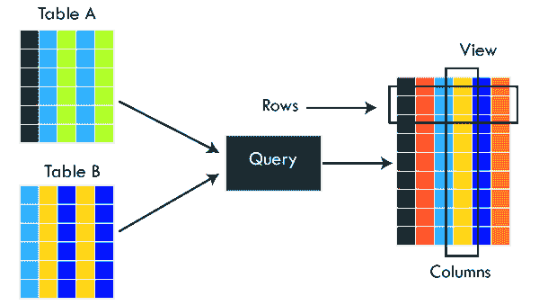

此图说明了包含多个表中的列的视图的概念。这里我们有两个名为**【表 A】**和**【表 B】**的表，通过使用一个 SQL 语句，创建了一个包含这两个表的数据的视图。视图是数据库对象；这就是为什么它没有物理存储。这个特性使得视图非常适合抽象或隐藏复杂的查询。

### 视图的使用

视图在 SQL Server 中的主要用途是实现安全机制。它防止用户看到表中的特定列和行。它只显示创建视图时声明的查询返回的数据。其余的信息对最终用户是完全隐藏的。

### 视图类型

SQL Server 将视图分为两种类型:

**1。用户定义的视图**

**用户定义这些视图以满足他们的特定需求**。它也可以分为两种类型一种是简单视图，另一种是复杂视图。**简单视图**基于单个基表，不使用任何复杂的查询。**复杂视图**基于多个表以及分组子句、顺序子句和连接条件。

**2。系统定义视图**

**系统定义视图是预定义的，现有视图存储在 SQL Server** 中，如 Tempdb、Master 和 temp。每个系统视图都有自己的属性和功能。它们可以自动连接到用户定义的数据库。我们可以将 SQL Server 中的系统定义视图分为三种类型:信息模式、目录视图和动态管理视图。

**SQL Server 允许我们主要通过两种方式创建视图**:

*   使用测试-SQL 查询
*   使用 SQL Server 管理工作室

让我们详细解释这两种方式。

### 使用测试-SQL 查询

我们可以使用 **CREATE VIEW 和 SELECT** 语句创建一个新视图。SELECT 语句用于从源表中获取数据来创建视图。

**语法**

以下语法用于在 SQL Server 中创建视图:

```

CREATE VIEW view_name AS  
SELECT column1, column2, ...  
FROM table_name  
WHERE condition;   

```

在该语法中，**视图名称**表示视图的名称。它应该是独一无二的。 **SELECT** 语句从源表中选择列。 **WHERE** 是一个可选条款，规定了要将记录包含在视图中必须满足的条件。

**例**

让我们借助一个例子来理解它。假设我们的数据库有一个名为**学生**和**费用**的表，其中包含以下数据:

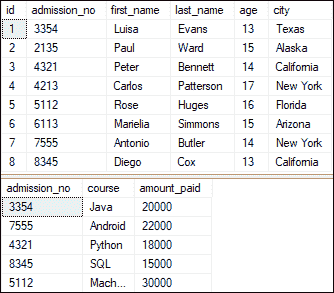

现在，我们将基于这些表创建一个视图。因此，下面的示例将创建一个视图名称“**课程**”，该视图通过从两个表中获取数据来创建一个虚拟表。

```

CREATE VIEW course_enrolled
AS 
SELECT first_name, last_name, course, amount_paid 
FROM Student AS S 
INNER JOIN Fee AS F
ON S.admission_no = F.admission_no;

```

我们可以使用 SELECT 语句验证视图数据，如下所示:

```

SELECT * FROM course_enrolled;

```

该查询将显示以下输出:

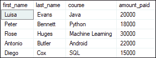

### 在 SQL Server 中重命名视图

我们还可以在 SQL Server 中更改视图的名称。我们可以通过使用名为 **sp_rename** 的内置存储过程或 SQL Server 管理工作室来实现这一点。在这里，我们将看到两种方式:

**使用 sp_rename**

以下语法用于重命名视图:

```

SP_RENAME View_Old_Name, View_New_Name

```

假设我们想将上面创建的视图**课程 _ 已注册的名称更改为课程**。以下查询解释了这个概念:

```

sp_rename course_enrolled, course

```

### 使用 SQL Server 管理工作室

要更改 SSMS 视图的名称，我们需要导航到**对象浏览器- >数据库- >视图**。在这里，您将看到所有可用的视图。选择一个您想要修改的，右键单击它并选择**重命名**选项。**例如**，我们将视图名称课程重命名如下:

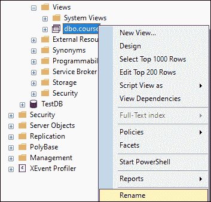

单击重命名选项后，我们可以更改其名称:

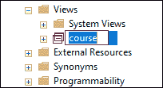

### 更新 SQL Server 中的视图

我们还可以在 SQL Server 中更新视图。我们可以通过使用 **ALTER VIEW** 命令或管理工作室来实现。在这里，我们将看到两种方式:

**更改视图声明**

假设我们想在上面创建的视图**课程 _ 注册**中再添加一个名为**【城市】**的列。为此，我们需要使用如下语句:

```

ALTER VIEW course_enrolled
AS 
SELECT first_name, last_name, course, city, amount_paid 
FROM Student AS S 
INNER JOIN Fee AS F
ON S.admission_no = F.admission_no;

```

我们可以使用 SELECT 语句来验证这种修改。它将显示下面的输出，我们可以看到城市列添加成功。

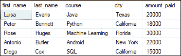

### 使用 SQL Server 管理工作室

要使用 SSMS 更改现有视图，我们需要导航到**视图**。然后，选择您想要修改的视图名称，右键单击并选择**设计选项。例如**，我们将修改视图名称课程 _ 注册如下:

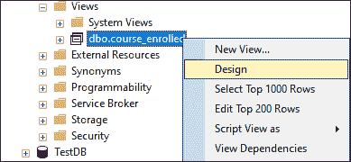

此选项将显示一个包含现有表及其关系的新设计查询窗口。在这里我们可以对我们的观点做任何改变。

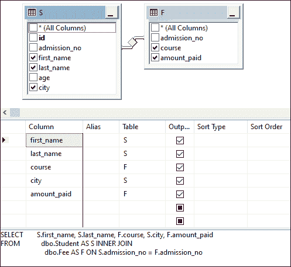

### 如何在 SQL Server 中获取视图定义？

SQL Server 提供了 **sp_helptext** 存储过程，允许我们获取任何视图的信息。我们可以使用下面的语法来查看视图的定义:

```

SP_HELPTEXT view_name

```

假设您想查看课程注册视图的定义。您可以按如下方式进行:

```

SP_HELPTEXT course_enrolled

```

它将显示以下输出:

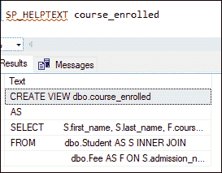

### SQL Server 中的列表视图

我们可以使用**系统视图**或**系统对象**目录视图来列出或显示一个 SQL Server 数据库中所有可用的视图。这里有一个例子:

```

SELECT OBJECT_SCHEMA_NAME(v.object_id) schema_name, v.name
FROM sys.views as v;

```

### 在 SQL Server 中删除视图

我们还可以从 SQL Server 中删除现有视图。我们可以通过使用 SQL 查询或管理工作室来做到这一点。在这里，我们将看到两种方式:

**使用 SQL 查询**

SQL Server 提供了一个**删除视图**命令来从数据库中删除视图。如果视图不存在，我们将得到一个错误。我们可以使用以下语法删除视图:

```

DROP VIEW [IF EXISTS] schema_name.view_name;

```

假设您想删除 view course _ registered，我们可以按如下方式进行:

```

DROP VIEW course_enrolled

```

它将成功删除视图。如果我们再次执行此命令，我们将获得以下错误消息:

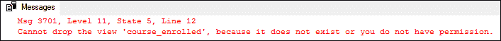

### 使用 SQL Server 管理工作室

要使用 SSMS 移除现有视图，我们需要导航到视图。选择您想要删除的视图名称，右键单击并选择**删除**选项。**例如**，我们将删除一个视图名称课程，如下所示:

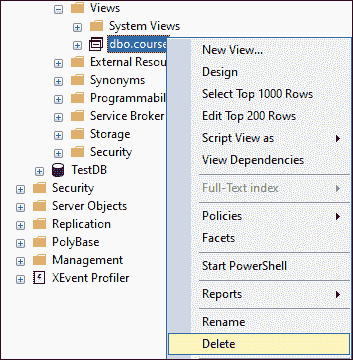

一旦我们点击删除选项，我们将获得一个新的窗口来确认删除过程。单击是完成删除。我们将确保它也会删除视图的所有权限。

* * *