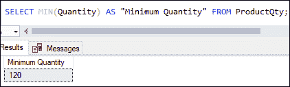
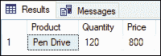
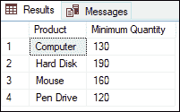
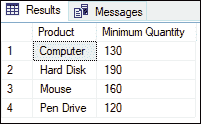
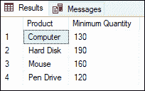
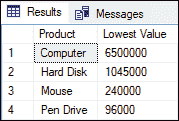
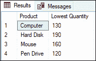

# 最小函数

> 原文：<https://www.javatpoint.com/sql-server-min-function>

SQL Server 中的 MIN()函数是一种聚合函数。用于**获取指定列或表达式的最小值或最小值**。它是 SQL Server 中最常用的内置函数。它属于数字函数，该函数只接受一个参数，并在求值后返回一个结果来汇总输入数据集。我们可以将这个函数与几个子句一起使用，例如 WHERE、GROUP BY、ORDER BY 和 HAVING 子句，以获得过滤后的输出。

### 句法

以下语法解释了 SQL Server 中的 MIN()函数:

```sql

SELECT MIN ( DISTINCT aggregate_expression)  
FROM table_name(s)  
[WHERE conditions];

```

功能参数解释如下:

**aggregate_expression:** 是表示从中返回最低值的列名的必需表达式。

**表名:**它表示我们要从中检索列的表的名称。可以指定多个表。

**WHERE 条件:**定义条件过滤列或表达式是一个可选子句。

**DISTINCT:** 返回表达式中唯一值的最小值。但是，它不影响 MIN()函数，并且在不使用此关键字的情况下会产生相同的结果。

#### 注意:MIN()函数忽略空值。

### 最小()函数示例

借助各种示例，让我们了解最小函数在 SQL Server 中是如何工作的。假设我们的数据库有一个名为“ **ProductQty** ”的表，其中包含以下数据:


**示例 1:** 本示例使用 MIN()函数从表中获取销售产品的最小数量:

```sql

SELECT MIN(Quantity) AS "Minimum Quantity" FROM ProductQty;

```

执行该语句将显示所有行中最小值的结果:



**示例 2:** 本示例使用带有 MIN()函数的 **WHERE 子句**。该子句用于从表中筛选记录。以下语句将显示销售量最低的产品名称:

```sql

SELECT Product, Quantity, Price
FROM ProductQty
WHERE Quantity = (
SELECT MIN(Quantity) AS "Minimum Quantity" 
FROM ProductQty);

```

这里，SQL Server 首先计算使用 MIN()函数的子查询，然后外部查询显示其数量等于子查询结果的产品名称。执行该语句将返回所需的输出:



**示例 3:** 本示例使用带有 MIN()函数的 **GROUP BY 子句**。此子句从多行收集数据，并根据单列或多列对数据进行分组。以下语句将返回每个产品组的产品数量表中所有行的最小数量。

```sql

SELECT Product, MIN(Quantity) AS "Minimum Quantity" 
FROM ProductQty
GROUP BY Product;

```

执行该语句将显示每个产品的最小数量:



**示例 4:** 本示例使用带有 MIN()函数的 **HAVING 子句**。此子句必须与 GROUP BY 子句一起使用，以从表中筛选分组的记录。以下语句将显示最小数量大于 200 的产品名称。

```sql

SELECT Product, MIN(Quantity) AS "Minimum Quantity" 
FROM ProductQty
GROUP BY Product
HAVING MIN(Quantity)>100;

```

执行该语句将返回以下输出:



**示例 5:** 本示例使用带有 MIN()函数的 **DISTINCT 子句**。此子句用于从列中删除重复的行。下面的语句通过从“产品数量”表的“数量”列中删除重复数据来返回最小销售产品数量。

```sql

SELECT Product, MIN( DISTINCT Quantity) AS "Minimum Quantity" 
FROM ProductQty
GROUP BY Product;

```

结果如下:



**示例 6:** 本示例使用包含两列的 MIN()函数获得最低的结果输出:

```sql

SELECT Product, MIN(Quantity * Price) AS "Lowest Value" 
FROM ProductQty
GROUP BY Product;

```

执行该语句将从产品数量表中返回(数量*价格)的最低值:



**示例 7:** 本示例使用带有 MIN()函数的 **OVER()子句**。此子句确定查询中的哪些行应用于该函数，该函数计算这些行的顺序，以及该函数的计算应在何时重新开始。

```sql

SELECT DISTINCT Product, 
MIN(Quantity) OVER (PARTITION BY Product) AS "Lowest Quantity"  
FROM ProductQty;

```

执行查询将返回以下结果:



### 结论

本文将解释 SQL Server 中 MIN()函数的完整概述。在这里，我们已经学习了如何借助 WHERE、GROUP BY、HAVING 和 OVER 子句从表中获取最低值。

* * *