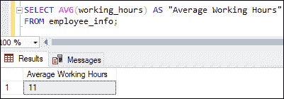
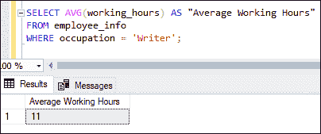
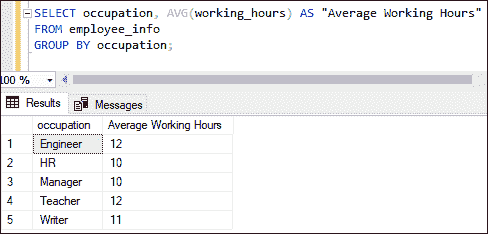
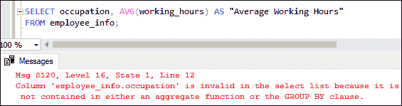
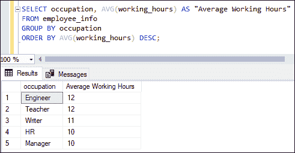
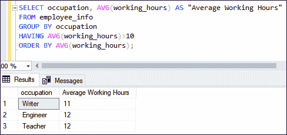
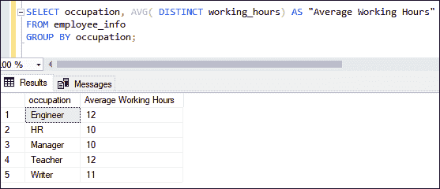

# SQL Server AVG()函数

> 原文：<https://www.javatpoint.com/sql-server-avg-function>

SQL Server 中的 AVG()函数是聚合函数的一部分。**我们用这个函数计算一个表达式的平均值**。该函数忽略空值。但是，当结果集没有任何行时，它会返回空值。AVG()是一个内置函数，通常与 **SELECT** 语句一起使用。该函数只接受一个可以是列或有效表达式的参数，并返回一个结果来汇总输入数据集。它还可以与 WHERE 子句、GROUP BY 子句、ORDER BY 子句和 HAVING 子句一起工作，以获得过滤后的结果。

### 句法

以下语法说明了 SQL Server 中的 AVG()函数:

```

SELECT AVG(ALL | DISTINCT expression)  
FROM table_name(s)  
[WHERE conditions];

```

该函数包含以下参数:

**表达式:**是表示列名的必需表达式，其非空值用于计算平均值。

**表名:**是我们要从中检索记录的表的名称。可以指定多个表。

**WHERE 条件:**定义选择记录必须满足的条件是一个可选子句。

**ALL|DISTINCT:** 默认使用 ALL，指示函数对所有值进行运算进行计算。相比之下，DISTINCT 告诉函数只接受唯一的值。

### AVG()函数示例

借助各种示例，让我们了解 AVG()函数在 SQL Server 中是如何工作的。我们将使用“**employee _ info”**表来实际演示 AVERAGE 函数，该函数包含以下数据:


### 平均函数的基本例子

这个例子解释了在 SQL Server 中 AVERAGE 函数的基本用法。它返回表达式的平均值，包括空值、非空值和重复值。假设我们要**计算表中列出的所有员工的平均工作时间**。我们可以编写如下查询:

```

SELECT AVG(working_hours) AS "Average Working Hours" 
FROM employee_info; 

```

执行查询将返回显示员工平均工作时间的以下输出:



### 带 WHERE 子句的平均函数

SQL Server 使用 WHERE 子句来筛选表的记录。这个例子将使用带有 AVG()函数的 WHERE 子句来获得职业为作家的员工的平均工作时间。

```

SELECT AVG(working_hours) AS "Average Working Hours" 
FROM employee_info
WHERE occupation = 'Writer'; 

```

当我们执行查询时，我们看到编写器的平均工作时间是 11 小时:



### 带有分组依据子句的平均函数

SQL Server 使用 GROUP BY 子句将具有相同值的行分组到汇总行中。我们使用这个子句是因为它生成摘要报告来制定进一步的策略。下面的查询将使用 AVG()函数来**返回表中列出的每个职业**的员工总工作时间:

```

SELECT occupation, AVG(working_hours) AS "Average Working Hours" 
FROM employee_info
GROUP BY occupation;  

```

执行查询将返回与每个职业相关联的员工的平均工作时间:



如果我们试图在 SELECT 语句中组合**聚合和非聚合**列，我们将会得到一个错误。以下是错误消息:



### 带顺序子句的平均函数

SQL Server 使用 ORDER BY 子句以升序或降序对表进行排序。以下示例将使用带有 ORDER BY 子句的 AVG()函数，计算与每个职业相关联的员工的平均工作时间，然后按照合计平均值的降序对结果集进行排序:

```

SELECT occupation, AVG(working_hours) AS "Average Working Hours" 
FROM employee_info
GROUP BY occupation
ORDER BY AVG(working_hours) DESC;

```

**执行该语句将根据汇总平均值以降序显示结果:**



### 带 HAVING 子句的平均函数

SQL Server 使用 HAVING 子句来筛选分组的行，这个子句总是需要 GROUP BY 子句来产生输出。下面的例子将使用带有 AVG()函数的 HAVING 子句。它计算每个职业中员工的平均工作时间，然后检查合计平均值是否大于 10。如果这是真的，则相应的结果会以聚合平均值的升序返回:

```

SELECT occupation, AVG(working_hours) AS "Average Working Hours" 
FROM employee_info
GROUP BY occupation
HAVING AVG(working_hours)>10
ORDER BY AVG(working_hours);

```

执行该语句将返回该职业中大于 10 的员工的平均工作时间:



### 带有非重复子句的平均函数

SQL Server 使用 DISTINCT 关键字从表中删除重复数据。假设我们要**计算 employee_info 表中列出的每个职业**中唯一员工的总工作时间。我们可以编写如下查询来获取这些数据:

```

SELECT occupation, AVG( DISTINCT working_hours) AS "Average Working Hours" 
FROM employee_info
GROUP BY occupation;

```

执行查询将返回以下结果，该结果显示了表中每个职业中唯一员工的工作时间:



### 结论

本文将解释如何以及何时在 SQL Server 中使用 AVG()函数的完整概述。此函数仅适用于数值数据类型。在这里，我们讨论了基于 AVERAGE 函数的几个用例的各种示例，例如如何使用 WHERE、GROUP BY、ORDER BY 和 HAVING 子句获取表中员工的平均工作时间。

* * *