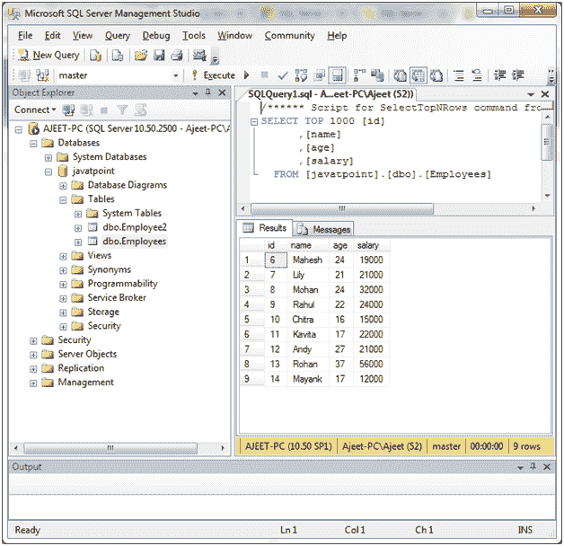
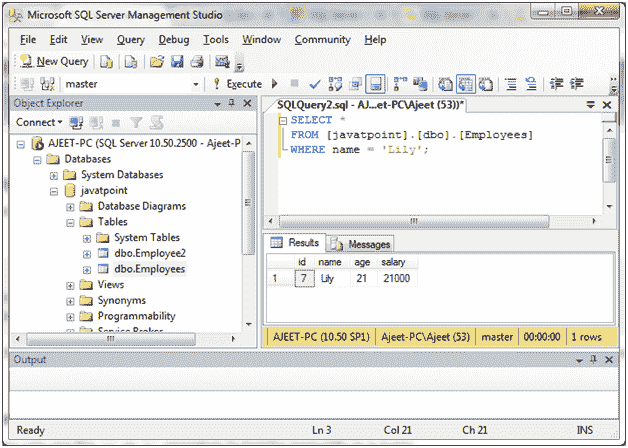
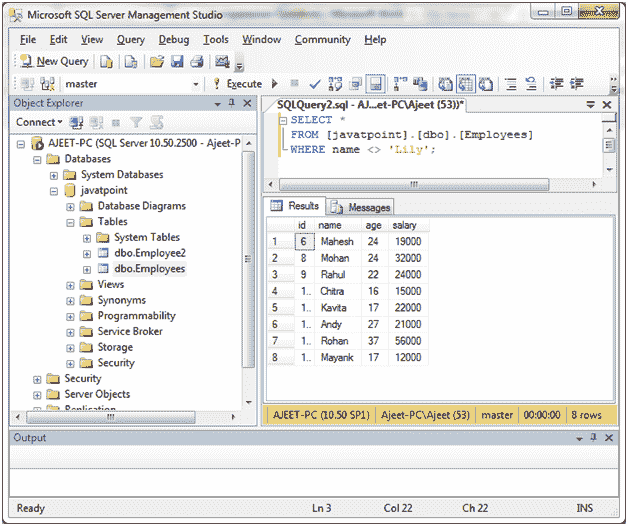
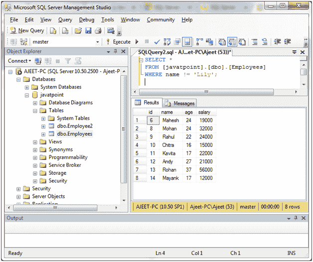
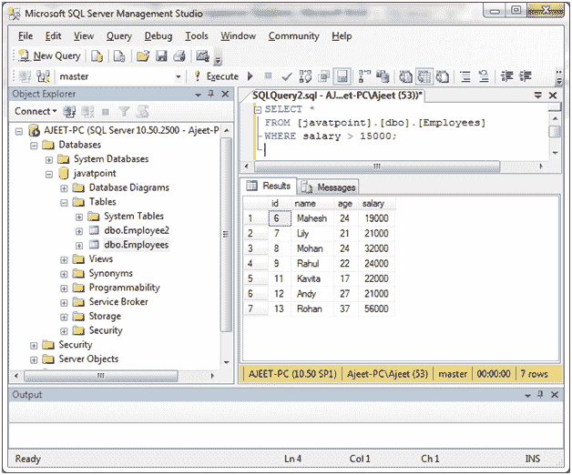
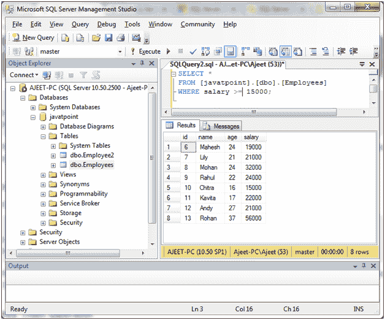
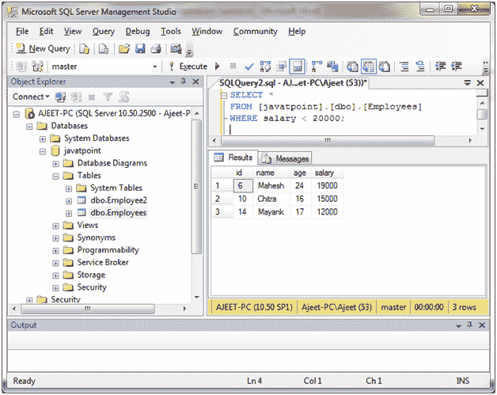
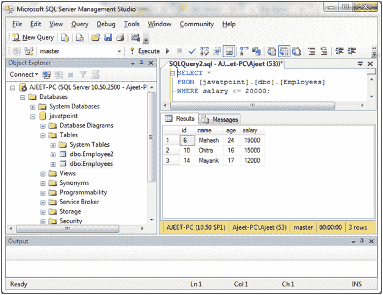

# SQL Server 比较运算符

> 原文：<https://www.javatpoint.com/sql-server-comparison-operator>

在 SQL Server 中，比较运算符用于测试等式和不等式。这些运算符在 WHERE 子句中用于确定选择哪些记录。

以下是 SQL Server 比较运算符的列表:

| 索引 | 比较运算符 | 描述 |
| 1) | = | 它指定相等的符号。 |
| 2) | <> | 它指定了不相等的符号。 |
| 3) | ！= | 它指定了不相等的符号。 |
| 4) | > | 它指定大于符号。 |
| 5) | >= | 它指定大于或等于符号。 |
| 6) | < | 它指定小于符号。 |
| 7) | <= | 它指定小于或等于符号。 |
| 8) | ！> | 它指定不大于符号。 |
| 9) | ！< | 它指定不小于符号。 |
| 10) | IN() | 它匹配列表中的一个值。 |
| 11) | 不 | 它用来否定一个条件。 |
| 12) | 在...之间 | 它用于指定一个范围(包括)内的值。 |
| 13) | 为空 | 它指定空值。 |
| 14) | 不为空 | 它指定非空值。 |
| 15) | 喜欢 | 它用%和\u 指定模式匹配 |
| 16) | 存在 | 它指定如果子查询至少返回一行，则满足条件。 |

* * *

## 相等运算符

在 SQL Server 数据库中，相等运算符“=”用于测试查询中的相等性。

**示例:**

我们有一个名为“员工”的表，包含以下数据:



使用以下查询选择特定数据，其中“名称”=“莉莉”:

```

SELECT *
FROM [javatpoint].[dbo].[Employees]
WHERE name = 'Lily'; 

```

输出:



* * *

## 不等式算子

在 SQL Server 中，不等式运算符“<>或！= "用于测试查询中的不等式。

```

SELECT *
FROM [javatpoint].[dbo].[Employees]
WHERE name <> 'Lily'; 

```

输出:



**或**

```

SELECT *
FROM [javatpoint].[dbo].[Employees]
WHERE name != 'Lily';

```

输出:



* * *

## 大于运算符

大于“>”运算符用于测试表达式是否“大于”。

**示例:**

让我们从工资> 15000 的“员工”表中选择员工。

```

SELECT *
FROM [javatpoint].[dbo].[Employees]
WHERE salary > 15000; 

```

输出:



* * *

## 大于或等于运算符

大于或等于“> =”运算符用于测试表达式是否“大于或等于”。

```

SELECT *
FROM [javatpoint].[dbo].[Employees]
WHERE salary >= 15000; 

```

输出:



* * *

## 小于运算符

小于“

**示例:**

从“员工”表中选择所有员工，其中工资< 20000。

```

SELECT *
FROM [javatpoint].[dbo].[Employees]
WHERE salary < 20000; 

```

输出:



* * *

## 小于或等于运算符

小于或等于“< =”运算符用于测试表达式是否“小于或等于”另一个表达式。

```

SELECT *
FROM [javatpoint].[dbo].[Employees]
WHERE salary <= 20000; 

```

输出:



* * *