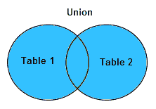
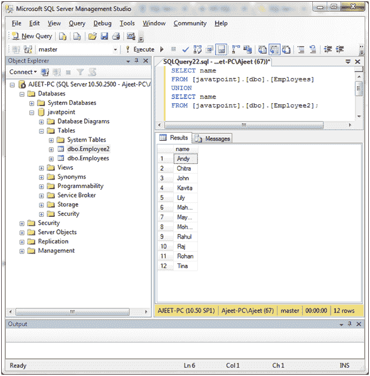
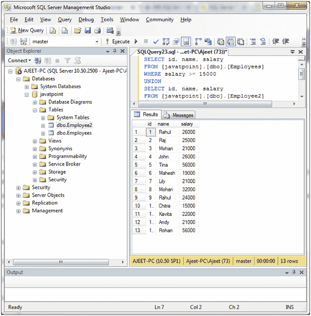
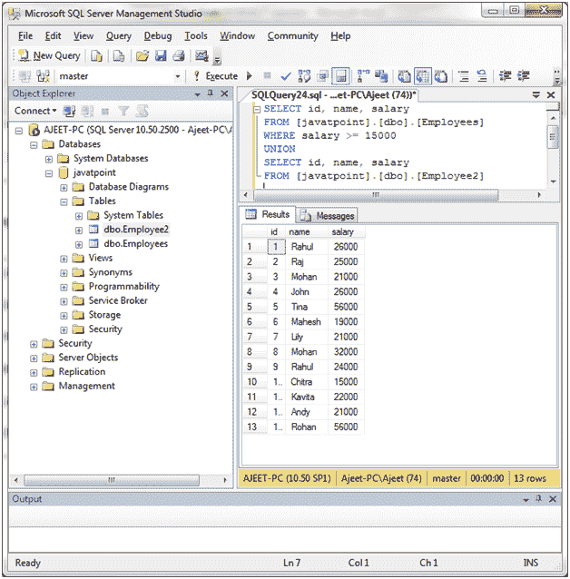

# SQL Server UNION 运算符

> 原文：<https://www.javatpoint.com/sql-server-union-operator>

在 SQL Server 中，UNION 运算符用于组合两个或多个 SELECT 语句的结果集。

**语法:**

```

SELECT expression1, expression2, ... expression_n
FROM tables
[WHERE conditions]
UNION      
SELECT expression1, expression2, ... expression_n
FROM tables
[WHERE conditions]; 

```

## 参数说明

**表达式 1，表达式 2，...expression_n:** 表达式指定要在两个 SELECT 语句之间进行比较的列或计算。

**表:**指定要从中检索记录的表。FROM 子句中必须至少列出一个表。

**WHERE 条件:**为可选条件。它指定了选择记录必须满足的条件。

**图像表示:**



#### 注意:覆盖的蓝色区域指定联合数据。

* * *

## 带有单表达式的 UNION 运算符

**示例:**

```

SELECT name
FROM [javatpoint].[dbo].[Employees]
UNION
SELECT name
FROM [javatpoint].[dbo].[Employee2]; 

```

输出:



* * *

## 具有多个表达式的 UNION 运算符

**示例:**

让我们使用每个表的多个表达式。比如:身份证、姓名、工资。

```

SELECT id, name, salary
FROM [javatpoint].[dbo].[Employees]
WHERE salary >= 15000
UNION
SELECT id, name, salary
FROM [javatpoint].[dbo].[Employee2]

```

输出:



* * *

## 联合所有操作员

默认情况下，UNION 运算符仅选择不同的值。因此，UNION ALL 运算符也用于允许重复值。

```

SELECT column_name(s) FROM table1
UNION ALL
SELECT column_name(s) FROM table2; 

```

**示例:**

```

SELECT id, name, salary
FROM [javatpoint].[dbo].[Employees]
WHERE salary >= 15000
UNION
SELECT id, name, salary
FROM [javatpoint].[dbo].[Employee2]

```

输出:

