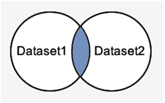
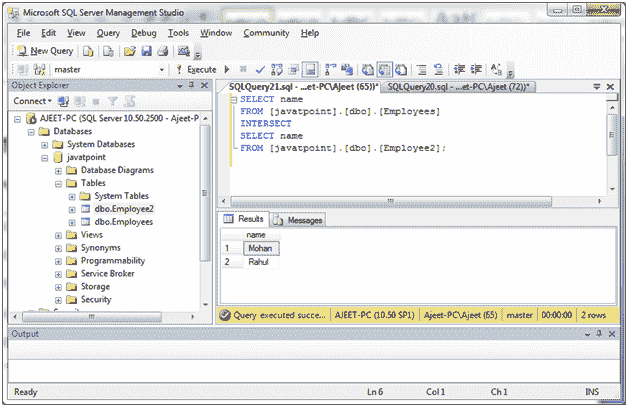
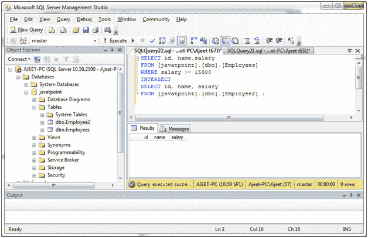

# SQL Server 交集运算符

> 原文：<https://www.javatpoint.com/sql-server-intersect-operator>

在 SQL Server 中，INTERSECT 运算符用于获取两个 SELECT 语句或数据集之间共有的记录。如果一条记录存在于一个查询中，而不存在于另一个查询中，它将从 INTERSECT 结果中被忽略。

**语法:**

```sql

SELECT expression1, expression2, ... expression_n
FROM tables
[WHERE conditions]
INTERSECT
SELECT expression1, expression2, ... expression_n
FROM tables
[WHERE conditions]; 

```

## 参数说明

**表达式 1，表达式 2，...expression_n:** 表达式指定要在两个 SELECT 语句之间进行比较的列或计算。每个 SELECT 语句中不必有相同的字段，但是两个表中相应的列必须是相似的数据类型。

**表:**指定要从中检索记录的表。FROM 子句中必须至少列出一个表。

**WHERE 条件:**为可选条件。它指定了选择记录必须满足的条件。

**图像表示:**



#### 注意:重叠的蓝色字段指定相交数据。

* * *

## INTERSECT 操作的强制条件

*   两个 SELECT 语句中的表达式数量必须相同。
*   每个 SELECT 语句中对应的列必须具有相似的数据类型。
*   INTERSECT 运算符只获取 SELECT 语句中的公共记录。

## 带有单个表达式的 INTERSECT 运算符

**示例:**

```sql

SELECT name
FROM [javatpoint].[dbo].[Employees]
INTERSECT
SELECT name
FROM [javatpoint].[dbo].[Employee2]; 

```

输出:



* * *

## 带有单个表达式的 INTERSECT 运算符

```sql

SELECT id, name, salary
FROM [javatpoint].[dbo].[Employees]
WHERE salary >= 15000
INTERSECT
SELECT id, name, salary
FROM [javatpoint].[dbo].[Employee2]

```

输出:



它显示为空白，因为根据查询，它们之间没有任何共同点。