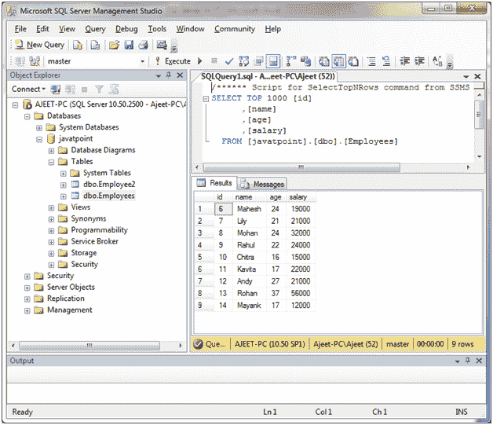
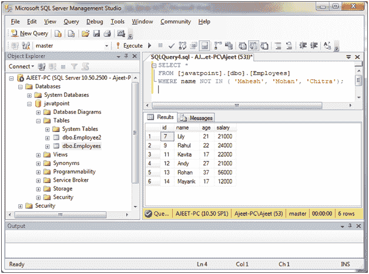
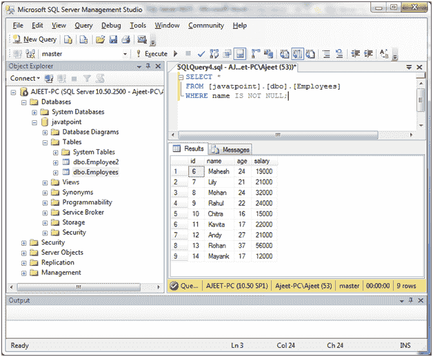
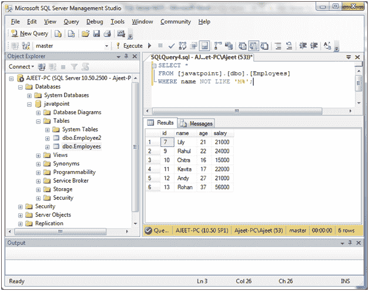
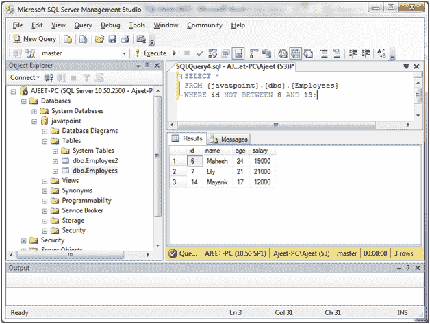
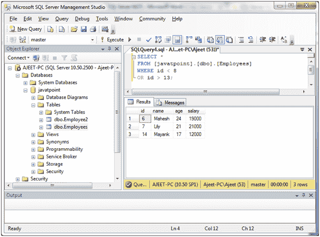
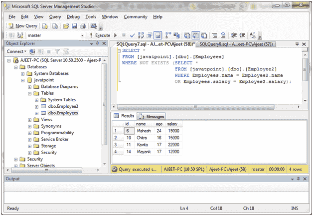
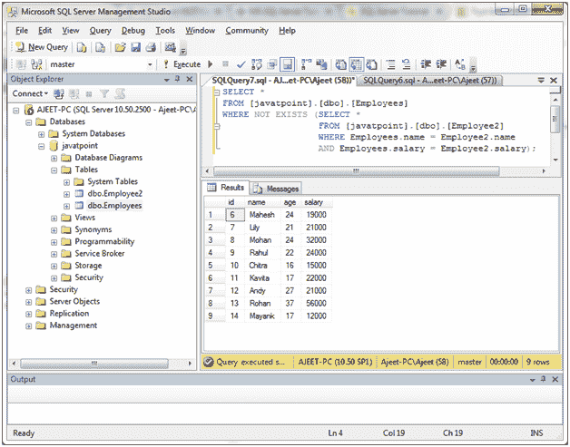

# SQL Server 非条件(运算符)

> 原文：<https://www.javatpoint.com/sql-server-not-operator>

SQL Server NOT 条件或 NOT 运算符用于否定 SELECT、INSERT、UPDATE 或 DELETE 语句中的条件。

**语法:**

```

NOT condition 

```

## 参数说明

**条件:**指定你要否定的条件。

* * *

## 非操作符处于输入状态

我们有一个“员工”表，包含以下数据:



**例**

从满足以下“不”条件的表中检索所有员工:

```

SELECT *
FROM [javatpoint].[dbo].[Employees]
WHERE name NOT IN ('Mahesh', 'Mohan', 'Chitra');

```

输出:



* * *

## 条件为空的非运算符

从符合非空条件的“员工”表中检索所有员工:

```

SELECT *
FROM [javatpoint].[dbo].[Employees]
WHERE name IS NOT NULL; 

```

输出:



* * *

## 具有相似条件的非运算符

从“员工”表中检索所有员工，该表遵循“不相似”条件。它将只显示不知道的名字。不要以“M”开头。

```

SELECT *
FROM [javatpoint].[dbo].[Employees]
WHERE name NOT LIKE 'M%'; 

```

输出:



* * *

## 具有介于条件的非运算符

从“员工”表中检索所有员工，该表遵循以下条件。它不会显示 id 8 到 13 之间的员工。

```

SELECT *
FROM [javatpoint].[dbo].[Employees]
WHERE id NOT BETWEEN 8 AND 13; 

```

输出:



**或**

```

SELECT *
FROM [javatpoint].[dbo].[Employees]
WHERE id < 8
OR id > 13; 

```

输出:



* * *

## 条件为“不存在”的运算符

您也可以将 SQL Server NOT 条件与 EXISTS 条件组合在一起。

**或条件:**

```

SELECT *
FROM [javatpoint].[dbo].[Employees]
WHERE NOT EXISTS (SELECT *
                  FROM [javatpoint].[dbo].[Employee2]
                  WHERE Employees.name = Employee2.name
                  OR Employees.salary = Employee2.salary); 

```

输出:



**和条件:**

```

SELECT *
FROM [javatpoint].[dbo].[Employees]
WHERE NOT EXISTS (SELECT *
                  FROM [javatpoint].[dbo].[Employee2]
                  WHERE Employees.name = Employee2.name
                  AND Employees.salary = Employee2.salary);

```

输出:



此 SQL Server NOT 示例将返回“员工”表中的所有记录，其中“员工 2”表中没有匹配姓名和工资的记录。