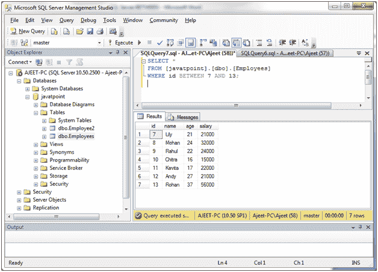
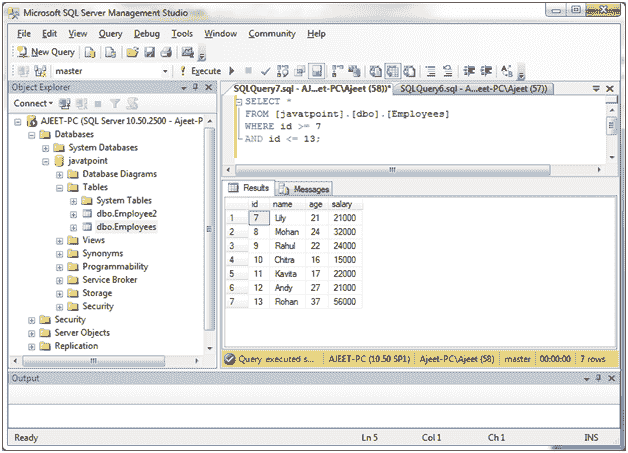
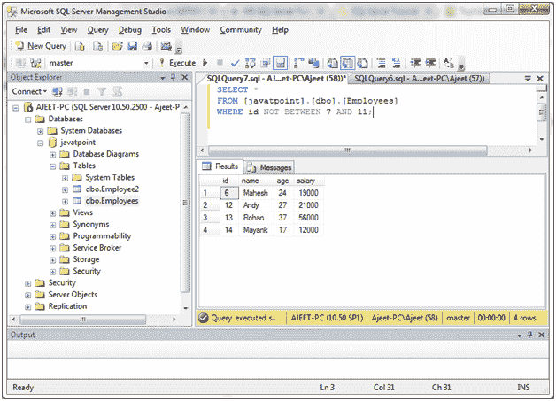
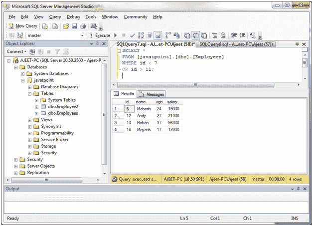

# 条件之间的 SQL Server(运算符)

> 原文：<https://www.javatpoint.com/sql-server-between-operator>

“服务器间”运算符用于检索 SELECT、INSERT、UPDATE 或 DELETE 语句中指定范围内的值。

**语法:**

```

expression BETWEEN value1 AND value2;

```

## 参数说明

**表达式:**指定一列或一个计算。

**值 1 和值 2:** 这些值指定表达式用于比较的包含范围。

* * *

## 数值运算符之间

从 id 介于 7 和 13 之间的“员工”表中检索所有员工。

```

SELECT *
FROM [javatpoint].[dbo].[Employees]
WHERE id BETWEEN 7 AND 13; 

```

输出:



**或**

```

SELECT *
FROM [javatpoint].[dbo].[Employees]
WHERE id >= 7
AND id <= 13; 

```

输出:



* * *

## 运算符与非运算符之间

从“员工”表中检索所有员工，该表满足以下介于和之间的条件。

```

SELECT *
FROM [javatpoint].[dbo].[Employees]
WHERE id NOT BETWEEN 7 AND 11; 

```

输出:



**或**

```

SELECT *
FROM [javatpoint].[dbo].[Employees]
WHERE id < 7
OR id > 11;

```

输出:

