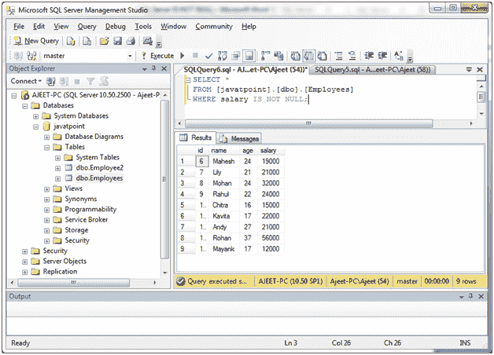
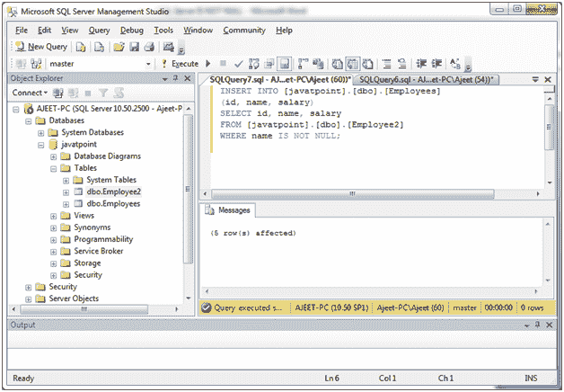
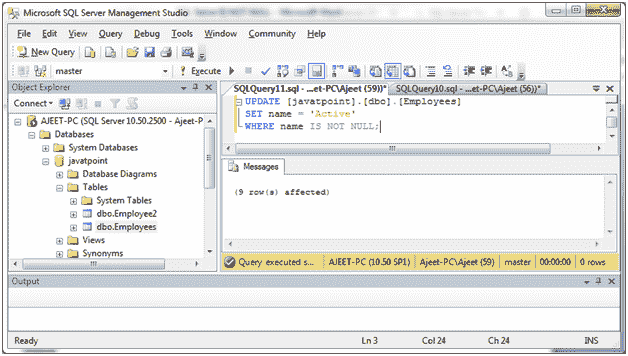
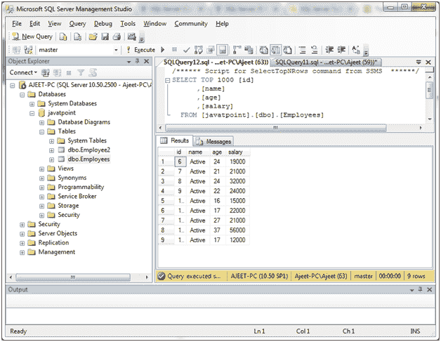
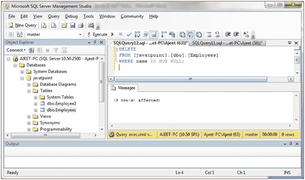
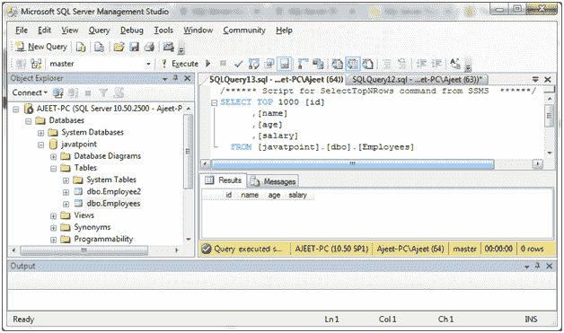

# SQL Server 不为空条件(运算符)

> 原文：<https://www.javatpoint.com/sql-server-is-not-null-operator>

SQL Server 非空条件用于测试非空值。

**语法:**

```

expression IS NOT NULL

```

## 参数说明

**表达式:**它指定要测试的值，其中它不是空值。

#### 注意:如果表达式不是空值，则条件的计算结果为真。如果是空值，条件的计算结果为假。

* * *

## 带选择语句的非空运算符

**示例:**

从“员工”表中检索所有员工，其中工资不是空值。

```

SELECT *
FROM [javatpoint].[dbo].[Employees]
WHERE salary IS NOT NULL;

```

输出:



* * *

## 带插入语句的非空运算符

**示例:**

```

INSERT INTO [javatpoint].[dbo].[Employees]
(id, name, salary)
SELECT id, name, salary
FROM [javatpoint].[dbo].[Employee2]
WHERE name IS NOT NULL;

```

输出:



* * *

## 带更新语句的非空运算符

更新“员工”表的员工，并将名称设置为“有效”，其中名称不为空。

**示例:**

```

UPDATE [javatpoint].[dbo].[Employees]
SET name = 'Active'
WHERE name IS NOT NULL;

```

输出:



**验证示例:**



* * *

## 带删除语句的非空运算符

更新“员工”表中名称不为空的员工。

```

DELETE
FROM [javatpoint].[dbo].[Employees]
WHERE name IS NOT NULL; 

```

输出:



**验证示例:**



您可以看到所有员工都从名称不为空的“员工”表中删除。