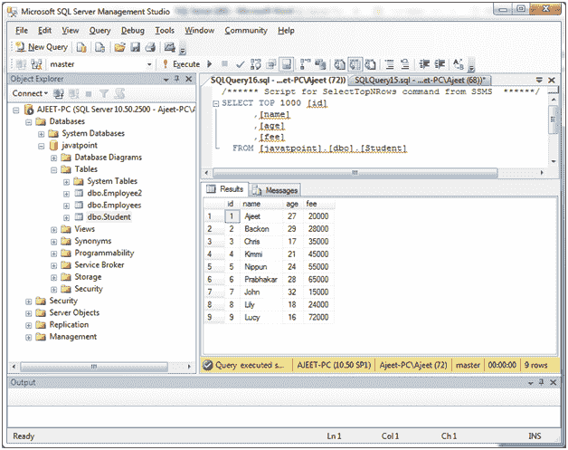
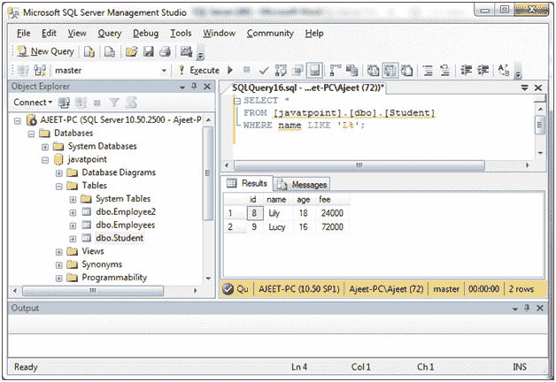
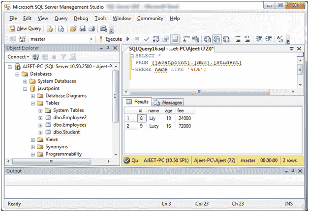
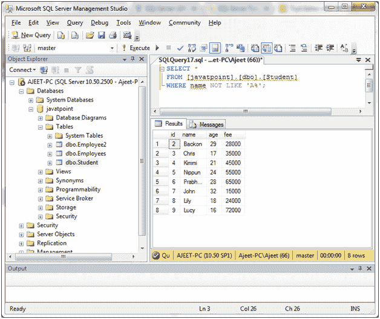

# 类似条件(运算符)

> 原文：<https://www.javatpoint.com/sql-server-like-operator>

SQL Server LIKE 条件或运算符用于执行模式匹配。它与 WHERE 子句和 SELECT、INSERT、UPDATE 和 DELETE 语句一起使用。

**语法:**

```sql
expression LIKE pattern [ ESCAPE 'escape_character' ] 

```

## 参数说明

**表达式:**是一个像列或字段一样的字符表达式。

**模式:**是包含模式匹配的字符表达式。

下面是 LIKE 运算符使用的模式列表:

| 通配符 | 说明 |
| % | 它用于匹配任何长度(包括零长度)的任何字符串。 |
| _ | 它用于匹配单个字符。 |
| [ ] | 它用于匹配[ ]括号中的任何字符(例如，[abc]将匹配 a、b 或 c 字符) |
| [^] | 它用于匹配任何不在[^]括号内的字符(例如，[^abc]将匹配任何不是 a、b 或 c 字符的字符) |

* * *

## 使用%通配符(百分号通配符)的类似运算符

**示例:**

您有一个名为“学生”的表，包含以下数据:



让我们在 SQL Server LIKE 条件下使用%通配符。在这里，我们从名称以“L”开头的“学生”表中检索所有学生。

```sql
SELECT *
FROM [javatpoint].[dbo].[Student]
WHERE name LIKE 'L%'; 

```

输出:



**或**

```sql
SELECT *
FROM [javatpoint].[dbo].[Student]
WHERE name LIKE '%L%'; 

```



* * *

## 使用[ ]通配符的 LIKE 运算符(方括号通配符)

让我们对 SQL Server LIKE 条件使用[]通配符。

```sql
SELECT *
FROM [javatpoint].[dbo].[Student]
WHERE name LIKE 'Aj[ie]et%';

```

#### 注意:
将返回所有姓名长度为 5 个字符的学生，其中前两个字符为‘Aj’，后两个字符为‘et’，第三个字符为‘I’或‘e’。所以在这种情况下，它将匹配“阿吉特”或“阿吉特”。

输出:


* * *

## 非运算符的相似条件

让我们从“学生”表中检索所有名字不以“L”开头的学生。

```sql
SELECT *
FROM [javatpoint].[dbo].[Student]
WHERE name NOT LIKE 'A%';

```

输出:

