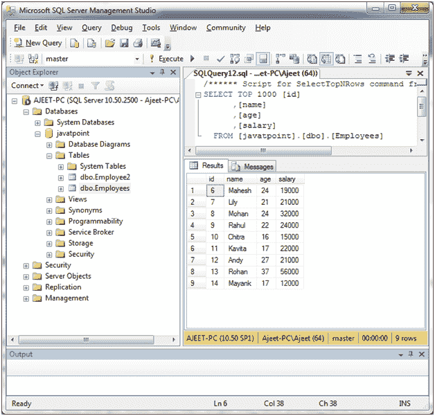
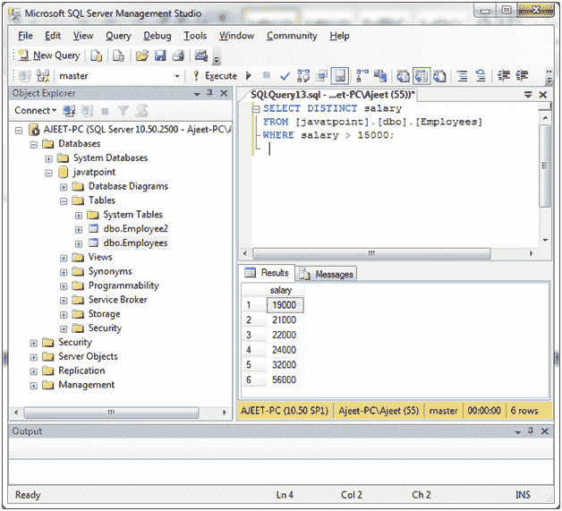
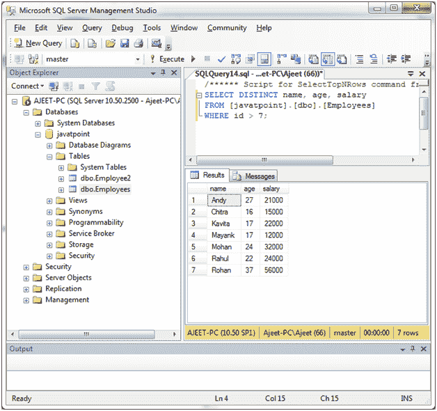

# SQL Server DISTINCT 子句

> 原文：<https://www.javatpoint.com/sql-server-distinct-clause>

在 SQL Server 中，DISTINCT 子句用于从表中删除重复项。DISTICT 子句仅用于 SELECT 语句。

**语法:**

```sql

SELECT DISTINCT expressions
FROM [database_name].[dbo].[table_name]
[WHERE conditions]; 

```

## 参数说明

**表达式:**指定要检索的列或计算。

**数据库 _ 名称&表 _ 名称:**它指定了数据库的名称和要在其上执行操作的表的名称。

**示例:**

**单表达式 DISTINCT 子句**

您有一个名为“员工”的表，其中包含以下数据:



从薪资大于 12000 的员工中选择不同的薪资。

```sql

SELECT DISTINCT salary
FROM [javatpoint].[dbo].[Employees]
WHERE salary > 15000;

```

输出:



在这里，你可以看到在 9 条记录中只有 6 条不同的工资。Distinct 子句只显示唯一的记录。

* * *

## 具有多个表达式的 DISTINCT 子句

DISTINCT 子句也可以用于多个表达式。它将删除 SELECT 语句中多个字段的重复项。

```sql

SELECT DISTINCT name, age, salary
FROM [javatpoint].[dbo].[Employees]
WHERE id > 7; 

```

输出:

