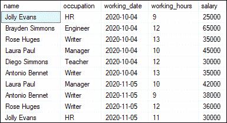
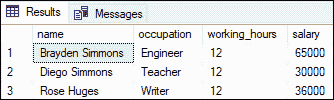
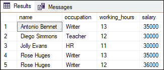
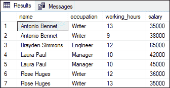
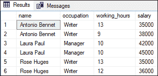
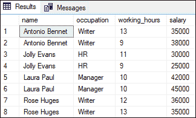
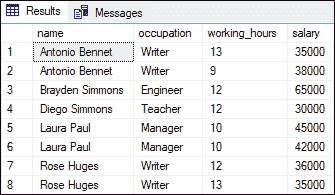
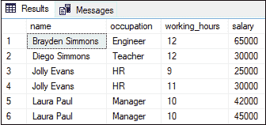

# SQL Server WHERE 子句

> 原文：<https://www.javatpoint.com/sql-server-where-clause>

SQL Server 中的 WHERE 子句是**，用于从表中筛选记录。**这是一个可选子句，用于限制查询返回的行数。我们还可以说，这个子句指定了一个条件，只返回那些满足定义条件的记录。WHERE 子句也可以用于**更新**和**删除**查询。

### 需要 WHERE 子句

当我们使用 SELECT 语句对表执行操作时，它将返回该表中的所有记录。如果我们的表有许多记录，SELECT 语句可能会返回不必要的数据，因为应用程序一次只处理一组行。在这种情况下，我们需要一些条件，只返回那些我们希望在输出表中看到的记录。因此，我们使用 WHERE 子句来限制查询从表中获取不必要的记录，并且只返回那些满足 WHERE 子句中提到的条件的行。

### 句法

以下是说明 SQL Server 中 WHERE 子句的语法:

```sql

SELECT column_list
FROM table_name
WHERE search_condition;

```

该语法具有以下参数:

**Column_list:** 是我们要从结果集中的表中检索的列的名称。

**表名:**是从中选择列的表名。

**Search_condition:** 是一个只返回满足这个条件的记录的条件。它在桌子上进行过滤。它还指示评估结果的逻辑表达式或多个逻辑表达式的组合:**真、假、**或**未知。**如果计算结果为假或未知，WHERE 子句将不返回任何记录。

WHERE 子句还支持以下运算符来筛选记录:

| 操作员名 | 操作员符号 |
| 平等的 | = |
| 不到 | < |
| 大于 | > |
| 小于或等于 | <= |
| 大于或等于 | >= |
| 不平等 | <> |
| 搜索特定模式 | 喜欢 |
| 查找给定范围内的记录 | 在...之间 |
| 用于指定多个值 | 在…里 |

### 例子

让我们通过几个例子来理解 WHERE 子句在 SQL Server 中的工作原理。我们将列出 **employee_info** 表来演示 WHERE 子句的所有示例。雇员信息表包含以下数据:



**示例 1:** 本示例将使用简单的等式运算符来筛选行。以下语句将**检索所有工作时间等于 12** 的员工，然后根据他们的姓名对他们进行排序:

```sql

SELECT name, occupation, working_hours, salary
  FROM employee_info
  WHERE working_hours = 12
  ORDER BY name;

```

执行该语句将只返回那些工作时间等于 12:



**示例 2:** 本示例检索满足 WHERE 子句中两个条件的行。以下示例**返回工作时间大于 10、工资小于 50000 的员工信息。**这里我们使用逻辑运算符**和**来组合 WHERE 子句中的两个条件。

```sql

SELECT name, occupation, working_hours, salary
  FROM employee_info
  WHERE working_hours>10 AND salary<50000
  ORDER BY name;

```

执行该语句将返回所有工作时间大于 10 且工资小于 50000 的员工:



**示例 3:** 本示例检索满足 WHERE 子句中两个条件中任何一个的行。以下示例**返回职业为作家，工资大于 35000 的员工信息。**这里我们使用**或**运算符来组合 WHERE 子句中的条件。

```sql

SELECT name, occupation, working_hours, salary
  FROM employee_info
  WHERE occupation='Writer' OR salary>35000
  ORDER BY name;

```

执行该语句将返回满足查询中包含的这些条件之一的所有员工。



**示例 4:** 本示例将检索那些属于两个值范围的行。以下陈述**找到工资在 35000 到 60000 之间的员工信息。**这里我们使用**介于**运算符来获得期望的结果。

```sql

SELECT name, occupation, working_hours, salary
  FROM employee_info
  WHERE salary BETWEEN 35000 AND 60000
  ORDER BY name;

```

执行该语句将返回所有工资在 35000 到 60000 之间的员工。



**示例 5:** 本示例检索值列表中有值的记录。以下语句将使用**输入操作符**来查找其职业为作家、经理或人力资源的员工信息

```sql

SELECT name, occupation, working_hours, salary
  FROM employee_info
  WHERE occupation IN ('HR', 'Writer', 'Manager')
  ORDER BY name;

```

执行查询将返回所有职业为作家、经理或人力资源的员工信息:



**示例 6:** 本示例检索值包含字符串的记录。以下语句将使用 **LIKE 运算符**来查找职业包含**er 字符串的员工信息。**

```sql

SELECT name, occupation, working_hours, salary
  FROM employee_info
  WHERE occupation LIKE '%er%'
  ORDER BY name; 

```

执行查询将返回其职业包含“er”字符串的所有员工信息:



**示例 7:** 本示例检索值不满足条件的记录。以下语句将使用**不平等运算符**来查找其职业不包含**【作家】**职业的员工信息。

```sql

SELECT name, occupation, working_hours, salary
  FROM employee_info
  WHERE occupation <> 'Writer'
  ORDER BY name;

```

执行查询将返回其职业不包含“作者”职业的所有员工信息:



本文将解释与 WHERE 子句相关的所有信息，例如 WHERE 子句的介绍，它在 SQL Server 中的需求，以及如何使用它根据单个或多个条件过滤记录。

* * *