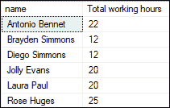
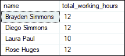
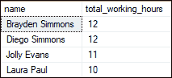
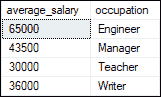

# 拥有

> 原文：<https://www.javatpoint.com/sql-server-having>

SQL Server **中的 HAVING 子句用于指定组或聚合的搜索条件。**只能与 **SELECT 语句**一起使用，通常与 **GROUP BY 子句一起使用。**它使我们能够过滤哪些组结果出现在结果中。我们使用此子句代替 WHERE 子句，因为它对 GROUP BY 子句创建的组设置了一个条件，而 WHERE 子句对选定的列设置了一个条件。

SQL 中的每个 HAVING 条件可以将一个组列或聚合表达式与另一个组聚合表达式或常数进行比较。我们可以使用 HAVING 对组列表中的列值和聚合值设置条件。

### 拥有条款的好处

HAVING 子句验证组的方式与 WHERE 子句验证单个行的方式相同。使用 HAVING 子句的主要好处是聚合可以包含在搜索条件中，而聚合不能用于 WHERE 子句的搜索条件中。

### 句法

以下是 SQL Server 中 HAVING 子句的基本语法:

```

SELECT column_list, 
aggregate_function (expression)  
FROM table_name
GROUP BY group_list
HAVING  search_conditions;

```

上述语法的参数描述解释如下:

*   首先，我们将**在结果中选择我们想要的列名**。在这里，我们还可以指定聚合函数，例如 SUM、COUNT、MIN、MAX 或 AVG。
*   第二步，我们将**写表名**，从中选择一列。
*   第三，我们使用 **GROUP BY 子句**将行汇总成组。
*   第四，我们使用带有单个或多个条件的 **HAVING 子句**对 GROUP BY 子句评估的组进行分组。最终的结果只包括那些对病情进行评估的组**为真。**如果发现条件**为假**或**未知，**则过滤掉各组。

### HAVING 子句示例

让我们用例子来理解 HAVING 子句，帮助我们将它用于不同的 SQL 聚合函数。假设我们有一个名为 **employees_info** 的表，其中包含以下数据:


我们将使用这个表格用不同的例子来演示 HAVING 子句。

**示例 1:** 下面的查询将使用带有 HAVING 子句的 **SUM 函数。**返回工作时间超过 6 小时的员工姓名及其工作时间总和:

```

SELECT name, SUM(working_hours) AS "Total working hours"  
FROM employee_info  
GROUP BY name  
HAVING SUM(working_hours) > 6;

```

执行查询将返回以下输出:



**示例 2:** 下面的查询将使用带有 HAVING 子句的**计数函数。**本报表统计工资大于 30000 的员工的工作时间:

```

SELECT name, COUNT(working_hours) AS total_employee
FROM employee_info WHERE salary>30000
GROUP BY name
HAVING COUNT(working_hours)>= 1;  

```

执行该语句将返回以下输出:


**示例 3:** 下面的查询将使用带有 HAVING 子句的 **MIN 函数。**返回最低工作时间大于 10 的每个员工的最低工作时间。

```

SELECT name, MIN(working_hours) AS total_working_hours
FROM employee_info 
GROUP BY name
HAVING MIN(working_hours)>= 10;

```

执行该语句将返回下面的输出，其中显示了员工姓名及其最低工作时间:



**示例 4:** 下面的查询将使用带有 HAVING 子句的 **MAX 函数。**返回每个员工最长工作时间小于 12 小时的最长工作时间。

```

SELECT name, MAX(working_hours) AS total_working_hours
FROM employee_info 
GROUP BY name
HAVING MAX(working_hours) <= 12;

```

执行该语句将返回下面的输出，其中我们看到员工姓名以及他们不到 12 小时的最大工作时间:



**示例 5:** 下面的查询将使用带有 HAVING 子句的 **AVERAGE 函数。**返回平均工资大于等于 30000 的职业名称。

```

SELECT AVG(salary) AS average_salary, occupation 
FROM employee_info 
GROUP BY occupation
HAVING AVG(salary) >= 30000;

```

执行该语句将返回以下输出:



本文将描述 HAVING 子句，它与 WHERE 子句的不同之处，以及它如何与聚合函数 SUM、COUNT、MAX、MIN 和 AVERAGE 一起工作。

* * *