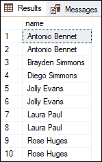
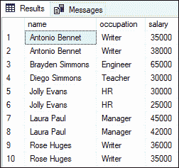
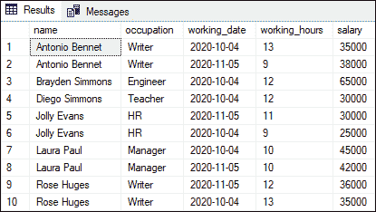
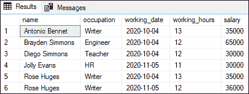
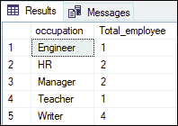
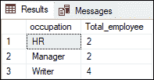
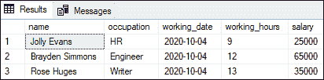
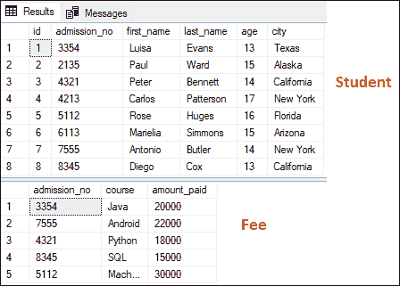
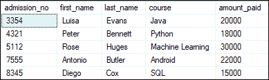

# SQL 服务器选择

> 原文：<https://www.javatpoint.com/sql-server-select>

SQL Server 中的 SELECT 语句用于显示表中的所有或特定记录。该语句允许我们根据需要获取记录，或者检索表中的所有记录。

### 需要 SELECT 语句

数据库可以包含一个或多个表，每个表按顺序存储我们的数据。表中的数据以行和列的形式组织，类似于电子表格。每行代表唯一的记录，列代表表中的字段。SQL Server 使用模式对表进行逻辑排列。

当我们从表中提取所需数据时，我们使用用 SQL 语言编写的查询。用于此类操作的最基本语句是 SELECT 语句。

### 句法

以下语句说明了 SELECT 语句从表中获取记录的最基本用法:

```

SELECT column1, column2,... columnN   
FROM table1, table2....
[WHERE condition]  
[GROUP BY column]  
[HAVING condition]   
[ORDER BY column];

```

如果我们想从表中获取所有列，我们使用下面的语句:

```

SELECT * FROM tables;

```

**在这个语法中，我们看到了以下参数:**

**列或*:** 它表示我们要在结果集中获取的表的字段名。当需要提取所有列时，我们使用星号(*)。

**表:**表示我们要从中检索数据的表的名称。我们可以列出不止一张桌子。

**WHERE:** 根据给定条件筛选记录是一个可选子句。

**GROUP BY:** 是一个可选子句，用于根据单个或多个列对记录进行分组。

**HAVING:** 它是一个可选子句，与 GROUP BY 子句一起使用，只返回那些条件为 TRUE 的行。

**ORDER BY:** 是一个可选子句，用于按升序或降序排列表记录。

### 需要记住的要点

*   SQL Server 将首先计算 FROM 子句，然后计算 SELECT 子句。
*   不建议在实时数据库中使用 SELECT *命令，因为它获取的数据超过了我们的要求。
*   SELECT *查询会降低应用程序的性能。
*   当用户向表中添加新列时，SELECT *查询获取所有列，包括新列，导致应用程序崩溃。

### 选择语句示例

让我们借助几个例子来理解 SELECT 查询在 SQL Server 中是如何工作的。假设我们有一个名为**“employee _ info”**的表，其中包含以下数据:


**示例 1:** 假设我们只想从表中以排序的方式获取一列(名称)。我们可以使用下面的语句获得这些数据:

```

SELECT name 
FROM employee_info
ORDER BY name;

```

执行该语句将获得以下只有一列的输出:



**示例 2:** 假设我们想从表中获取多个按员工姓名排序的列。我们可以使用下面的语句获得这些数据:

```

SELECT name, occupation, salary
FROM employee_info
ORDER BY name;

```

执行该语句将获得以下输出，我们可以在其中看到员工的姓名、职业和工资:



**示例 3:** 假设我们想要检索表的所有列数据。在这种情况下，要么我们需要用 select 语句写出所有列的名称，要么使用**星号(*)符号**代替列名称。指定所有列名对用户来说并不方便，所以我们通常使用星号(*)来检索所有列数据并保存一些键入内容。检查我们不熟悉的表的列和数据也很有用。以下是查询:

```

SELECT * FROM employee_info
ORDER BY name;

```

执行查询将显示以下输出，我们可以在其中看到表的所有列:



**示例 4:** 本示例将解释带有 WHERE 子句的 SELECT 语句。WHERE 子句用于根据一列或多列筛选数据。以下查询将返回工作时间大于 10 的所有员工信息:

```

SELECT * FROM employee_info
WHERE working_hours > 10
ORDER BY name;

```

执行该语句会显示以下输出:



**示例 5:** 本示例解释了带有 **GROUP BY** 子句的 SELECT 语句，该子句用于根据单列或多列将行分组。以下语句显示每个职业的职业和员工人数，然后按升序排序:

```

SELECT occupation, COUNT(*) AS Total_employee 
FROM employee_info
GROUP BY occupation
ORDER BY occupation;

```

执行该语句将显示预期结果:



**示例 6:** 本示例使用 HAVING 子句解释 SELECT 语句。我们使用 **HAVING** 子句通过使用单个或多个列来过滤组。请注意，WHERE 子句过滤记录，而 HAVING 子句过滤组。以下语句显示了拥有多名员工的每个职业的职业和员工人数，然后按升序对其进行排序:

```

SELECT occupation, COUNT(*) AS Total_employee 
FROM employee_info
GROUP BY occupation
HAVING COUNT(*)>1
ORDER BY occupation;

```

执行该语句将显示预期结果:



**示例 7:** 本示例使用 **TOP** 子句解释 SELECT 语句。TOP 子句显示了表中有限数量的记录。请注意，我们必须指定在 TOP 子句中返回多少行。

假设我们想得到表的前三条记录。为了获取这个细节，我们使用如下查询:

```

SELECT TOP(3) * FROM employee_info;

```

执行该查询将只返回前三条记录，如下所示:



**示例 8:** 本示例使用 **JOIN** 子句解释 SELECT 语句。我们使用 JOIN 子句从两个以上的表中获取数据。

我们以**【学生】****【费用】**两张表来演示这个例子。下图显示了两个表的数据:



假设我们想获取已经支付课程费用的学生信息。在这种情况下，我们使用公共列**“accession _ no”**作为连接条件，从两个表中获取数据。让我们执行下面的语句从两个表中获取所需的数据:

```

SELECT Student.admission_no, Student.first_name, Student.last_name, Fee.course, Fee.amount_paid  
FROM Student  
INNER JOIN Fee  
ON Student.admission_no = Fee.admission_no;

```

执行该命令将显示预期结果:



### 结论

本文将帮助我们详细了解 SELECT 语句，我们为什么使用它，以及如何在 SQL Server 中使用它来查询单个表和多个表中的数据。

* * *