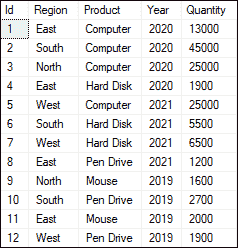
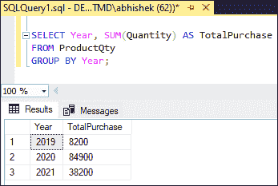
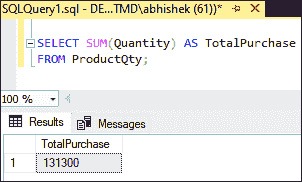
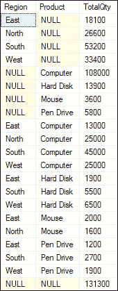
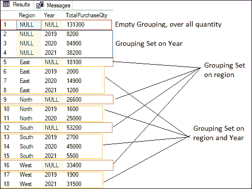
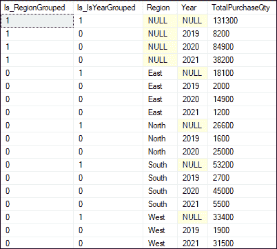

# SQL Server 分组集

> 原文：<https://www.javatpoint.com/sql-server-grouping-sets>

分组集是 GROUP BY 子句的扩展。GROUP BY 语句是 GROUP SET，是 GROUP BY 子句的扩展。GROUP BY 语句用于结合 SUM、AVG、COUNT 等聚合函数来汇总数据。它根据单个或多个列对结果集进行分组。分组集是在 SQL Server 2008 版本中首次引入的。

**以下场景解释了 SQL Server 中的 GROPING SET 的概念:**

SQL Server 允许我们通过组合**员工表**的**部门**和**城市**来创建一个组，以检索在一个城市的特定部门工作的员工总数。**假设我们想得到所有在班加罗尔市 IT 部门工作的员工。**此外，我们还可以进一步向部门和城市添加员工类型(writer)，以检索在班加罗尔市 IT 部门工作的所有 writer。这是两个不同的组，因此不能使用 GROUP BY 子句在单个查询中执行。我们需要为这些组写两个不同的语句，其中第一个是**(部门、城市)**，第二个是**(部门、城市、员工类型)。**

在这种情况下，我们使用分组集使其变得简单。它通过在一个查询中指定多个组来增强 GROUP BY 子句的功能。它允许创建许多组，并在单个查询中使用分组集分析和比较它们的属性，因为它是多个组的集合。

### 句法

以下是说明 SQL Server 中分组集的语法:

```

SELECT column_list, aggregate(column_name)
FROM table_name
GROUP BY
GROUPING SETS (
(column1, column2),
(column1),
(column2),
()
);

```

该语法参数解释如下:

*   **Column_list:** 它表示我们要从表的结果集中检索的列的名称。
*   **聚合(column_name):** 表示聚合函数(即 SUM、COUNT、AVG 等)所在的列。)被应用
*   **GROUP BY:** 用于将一列或一列列表指定为单个组。
*   **分组集:**表示必须分组在一起的一组列。
*   **():** 可以选择指定一个空的分组集并单独聚合列。

### 分组集合等价物

将集合分组相当于一个**联合所有**运算符。SQL Server 使用联合所有查询生成相同的信息，每个查询都有一个分组依据列表，分组集被定义为分组依据列表。分组集也可以用来代替**汇总**和立方体。

**下表更清楚地解释了分组集合等价的联合所有、汇总和立方:**

| 分组集合相当于联合所有 |
| 从表 1 中选择第 1 列、第 2 列和(第 3 列)
通过
分组集合((第 1 列)、(第 2 列))； | 从表 1 分组依据列 1 中选择列 1 空作为列 2，求和(列 3)

联合所有
从表 1 分组依据列 2 中选择空作为列 1，列 2，求和(列 3)
； |
| 分组集合相当于累计 |
| 分组依据汇总(第 1 列、第 2 列、第 3 列) | 按分组集分组((第 1 列、第 2 列、第 3 列)、
(第 1 列、第 2 列)、
(第 1 列)、
()； |
| 分组集合相当于立方体 |
| 按多维数据集分组(第 1 列、第 2 列、第 3 列) | 按分组集分组((第 1 列、第 2 列、第 3 列)、
(第 1 列、第 2 列)、
(第 1 列、第 3 列)、
(第 2 列、第 3 列)、
(第 1 列)、
(第 2 列)、
(第 3 列)、
()； |

## 分组集合示例

让我们通过例子来看看分组集合在 SQL Server 中是如何工作的。我们将通过首先创建一个名为 **ProductQty** 的示例表来演示这一点，该表包含购买产品的详细信息，然后在表中插入一些记录。

**执行以下语句创建一个产品数量表:**

```

CREATE TABLE ProductQty(
 Id INT IDENTITY(1,1),
 Region VARCHAR(100),
 Product VARCHAR(50),
 Year INT,
 Quantity INT
)

```

**接下来，执行以下语句将记录插入该表:**

```

INSERT INTO ProductQty(Region, Product, Year, Quantity)
VALUES('East', 'Computer', 2020, 13000),
('South', 'Computer', 2020, 45000),
('North', 'Computer', 2020, 25000),
('East', 'Hard Disk', 2020, 1900),
('West', 'Computer', 2021, 25000),
('South', 'Hard Disk', 2021, 5500),
('West', 'Hard Disk', 2021, 6500),
('East', 'Pen Drive', 2021, 1200),
('North', 'Mouse', 2019, 1600),
('South', 'Pen Drive', 2019, 2700),
('East', 'Mouse', 2019, 2000),
('West', 'Pen Drive', 2019, 1900);

```

现在，我们可以通过执行 SELECT 语句来验证数据:



这里我们将从 GROUP BY 子句开始，而不是从 GROUP SET 开始，这样我们就可以逐渐扩展逻辑，并清楚地理解 GROUP SET 的意义和用法。

**1)按地区查询确定采购总量**

此语句使用**“区域”**列创建一个组，以获取总采购量。这里，我们使用**“数量”**列上的聚合函数 **SUM** 来合计总购买量。

```

SELECT Region, SUM(Quantity) AS TotalPurchase 
FROM ProductQty 
GROUP BY Region;

```

执行查询将显示采购总量:


**2)查询确定每年的采购总量**

此语句使用**‘Year’**列创建一个组，以获取每年的总采购量。这里，我们还使用 SUM 函数对总购买量求和。

```

SELECT Year, SUM(Quantity) AS TotalPurchase 
FROM ProductQty 
GROUP BY Year;

```

执行查询将显示采购总量:



**3)查询确定各地区、各年度可用采购总量**

此语句使用**【地区】**和**【年份】**列创建一个组，并返回每个地区和年份的总购买次数。

```

SELECT Region, Year, SUM(Quantity) AS TotalPurchase 
FROM ProductQty 
GROUP BY Region, Year;

```

执行查询将显示采购总量:


**4)如果要显示整体采购数量，使用空组集查询:**

```

SELECT SUM(Quantity) AS TotalPurchase 
FROM ProductQty;

```

执行查询将显示采购总量:



如我们所见，上述四个查询使用不同的分组集返回四个结果集。这里我们有一个问题，每次执行一个新的查询来创建一个新的组或类别，以便从不同的角度分析数据。通过使用 UNION ALL 运算符[，将所有查询结果集组合成一个查询，SQL Server 还有另一种方法可以获得相同的结果。

下面的 UNION ALL 语句产生相同的结果。因为 UNION ALL 运算符要求所有参与查询的结果集具有相同的列数，所以我们必须向选择列表中添加一个伪列 NULL，以确保所有语句具有相同的列数。

```

SELECT Region, NULL AS Product, SUM(Quantity) AS TotalQty  
FROM ProductQty 
GROUP BY Region
UNION ALL
SELECT NULL AS Region, Product, SUM(Quantity) AS TotalQty
FROM ProductQty
GROUP BY Product
UNION ALL
SELECT Region, Product, SUM(Quantity) AS TotalQty  
FROM ProductQty
GROUP BY Region, Product
UNION ALL
SELECT NULL AS Region, NULL AS Product, SUM(Quantity) AS TotalQty 
FROM ProductQty

```

执行该语句将显示下面的输出，其中我们看到 UNION ALL 生成一个结果，所有分组集的聚合都如预期的那样。这个结果集也是以上四个查询的集成输出。



然而，这种方法在单个查询中返回结果，但是它是临时的、麻烦的和低效的。数据库服务器有很大的压力来执行这种方法，这可能会导致查询缓慢和性能问题，因为它必须执行四个不同的查询。在这里，数据库服务器首先组合前两个查询的结果集，然后将这些结果集与第三个查询组合，再与第四个查询组合。这种方法需要多次读表、临时存储和许多 IOs。

**SQL Server 2008 引入了分组集**功能来克服这些缺点，允许我们在一个查询中定义多个组。我们可以通过在 group SET 子句中包含所有组来实现相同的目标，从而得到包含所有组及其基本细节的输出。以下是定义单个语句中每个分组集的查询:

```

SELECT Region, Year, SUM(Quantity) AS TotalPurchaseQty  
FROM ProductQty 
GROUP BY GROUPING SETS
((Region), 
(Year), 
(Region, Year), 
()) 
ORDER BY Region, Year;

```

执行该语句将产生以下输出:



在这个输出中，我们可以看到这个查询给出了相同的结果，并且与使用 UNION ALL 查询相比非常简单有效。这里我们可以看到它有一行(第一行)，不是一个组；这只是总量的总和。

### 分组函数

SQL Server 还使我们能够通过使用上述查询中的分组函数来检查 GROUP BY 子句中指定的列是否被聚合。该函数返回两个值， **0 & 1，**，其中 1 表示聚合结果集，0 表示未聚合。

以下查询解释了分组函数的使用:

```

SELECT GROUPING(Region) AS Is_RegionGrouped, GROUPING(Year) AS Is_YearGrouped, 
Region, Year, SUM(Quantity) AS TotalPurchaseQty  
FROM ProductQty 
GROUP BY GROUPING SETS ((Region), (Year), (Region, Year), ( )) 
ORDER BY Region, Year;

```

执行该语句将显示以下输出:



在该输出中，**为 _ regional grouped**一栏表示 **1** 当产品数量按地区合计时， **0** 表示产品数量不按地区合计。同样的概念也适用于**Is _ year group**列。

**结论**

本文详细演示了如何在查询中借助分组集生成许多分组集。在这里，我们还了解了几个 GROUP BY 子句和 UNION ALL 运算符在一个语句中的缺点。

* * *