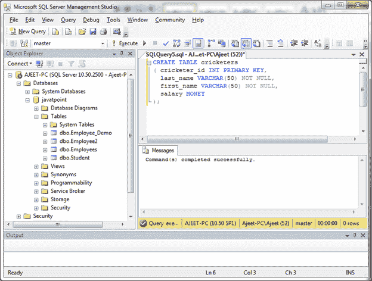
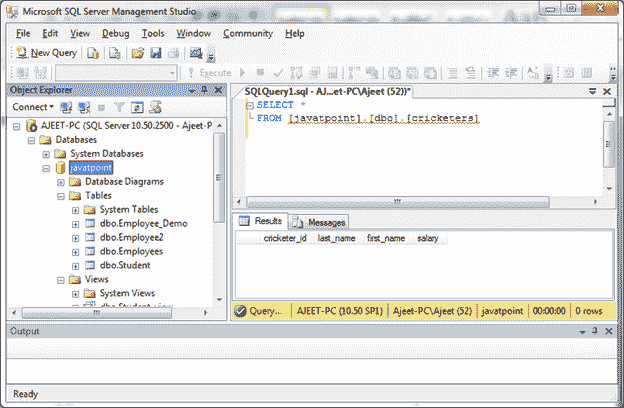
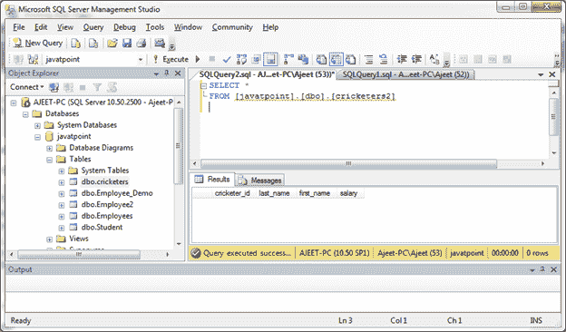
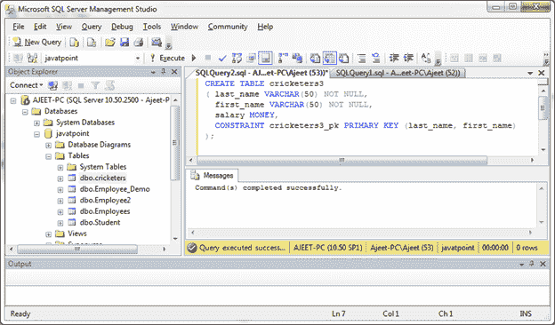
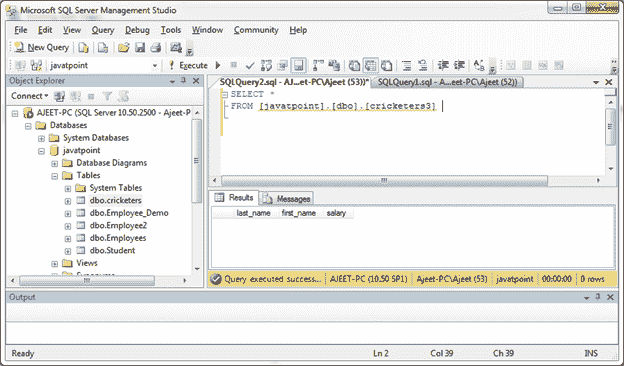
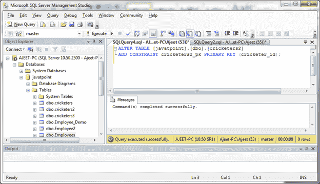

# SQL Server 主键

> 原文：<https://www.javatpoint.com/sql-server-primary-keys>

SQL Server 主键是用于唯一定义记录的单个字段或字段组合。主键的任何字段都不能包含空值。一个表只能有一个主键。

您可以在 CREATE TABLE 语句或 ALTER TABLE 语句中定义主键。

## 使用创建表语句创建主键

**语法:**

```

CREATE TABLE table_name
( 
  column1 datatype [ NULL | NOT NULL ] [ PRIMARY KEY ],
  column2 datatype [ NULL | NOT NULL ],
  ...
); 

```

**或**

```

CREATE TABLE table_name
( 
  column1 datatype [ NULL | NOT NULL ],
  column2 datatype [ NULL | NOT NULL ],
  ...
  CONSTRAINT constraint_name PRIMARY KEY (column1, column2, ... column_n)
); 

```

**示例:**

创建一个“板球运动员”表，其中“板球运动员 _id”是主键。

```

CREATE TABLE cricketers
( cricketer_id INT PRIMARY KEY,
  last_name VARCHAR(50) NOT NULL,
  first_name VARCHAR(50) NOT NULL,
  salary MONEY
); 

```

**输出:**



您可以使用 SELECT 命令验证创建表:

```

SELECT * 
FROM [javatpoint].[dbo].[cricketers]  

```

**输出:**



这里板球运动员 id 是主键。

您也可以使用第二种语法创建一个带有主键的表:

**示例:**

```

CREATE TABLE cricketers2
( cricketer_id INT,
  last_name VARCHAR(50) NOT NULL,
  first_name VARCHAR(50) NOT NULL,
  salary MONEY,
  CONSTRAINT cricketers2_pk PRIMARY KEY (cricketer_id)
); 

```

**输出:**


您可以使用 SELECT 命令验证创建表:

```

SELECT * 
FROM [javatpoint].[dbo].[cricketers2]  

```

**输出:**



## 在 SQL Server 中创建主键，其中主键是多个字段:

**示例:**

```

CREATE TABLE cricketers3
( last_name VARCHAR(50) NOT NULL,
  first_name VARCHAR(50) NOT NULL,
  salary MONEY,
  CONSTRAINT cricketers3_pk PRIMARY KEY (last_name, first_name)
);

```

**输出:**



您可以使用 SELECT 命令验证创建表:

```

SELECT * 
FROM [javatpoint].[dbo].[cricketers3]  

```

**输出:**



这里，姓和名都是主键。

## 使用 ALTER TABLE 语句创建主键

您可以使用 ALTER TABLE 语句仅在已定义为非空的一列或多列上创建主键。

如果表中的某列具有空值，则在不删除并重新创建表的情况下，无法添加主键。

**语法:**

```

ALTER TABLE table_name
ADD CONSTRAINT constraint_name PRIMARY KEY (column1, column2, ... column_n);

```

**示例:**

在表“板球运动员 2”中创建主键“板球运动员 _id”。

```

ALTER TABLE [javatpoint].[dbo].[cricketers2]
ADD CONSTRAINT cricketers2_pk PRIMARY KEY (cricketer_id);

```

**输出:**



它将在“cricketers2”表中创建一个主键“cricketer_id”。

* * *