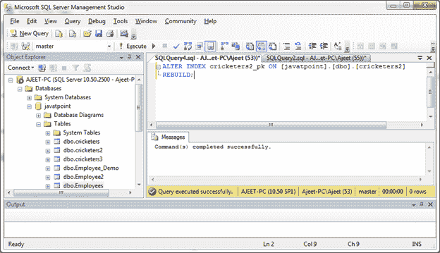

# 启用主键

> 原文：<https://www.javatpoint.com/sql-server-enable-primary-key>

ALTER INDEX 语句用于在 SQL Server 数据库中启用主键。

**语法:**

```sql

ALTER INDEX constraint_name ON table_name
REBUILD; 

```

**示例:**

在“客户”表中启用主键“customer_id”。

```sql

ALTER INDEX cricketers2_pk ON [javatpoint].[dbo].[cricketers2]
REBUILD; 

```

输出:



现在主键“customer_id”已在表“customers”中启用。