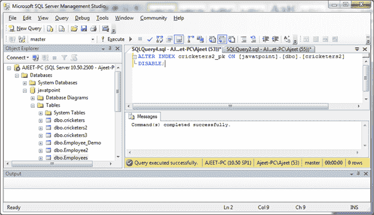

# 禁用主键

> 原文：<https://www.javatpoint.com/sql-server-disable-primary-key>

ALTER INDEX 语句用于禁用 SQL Server 数据库中的主键。

**语法:**

```sql

ALTER INDEX constraint_name ON table_name
DISABLE; 

```

**示例:**

禁用“客户”表中的主键“customer_id”。

```sql

ALTER INDEX cricketers2_pk ON [javatpoint].[dbo].[cricketers2]
DISABLE; 

```

输出:

