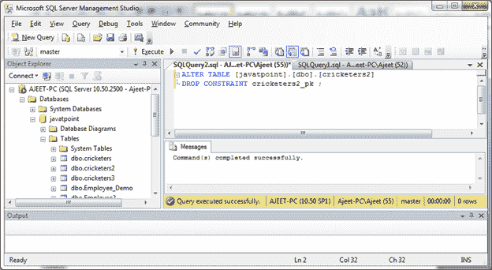

# 删除主键

> 原文：<https://www.javatpoint.com/sql-server-drop-primary-key>

ALTER TABLE 语句用于删除 SQL Server 中的主键。

**语法:**

```

ALTER TABLE table_name
DROP CONSTRAINT constraint_name;

```

**示例:**

让我们使用 SQL Server 中的 ALTER TABLE 语句删除一个主键。这里我们以“cricketer 2”表为主键，以“cricketers2 _ pk”为约束名。

```

ALTER TABLE [javatpoint].[dbo].[cricketers2]
DROP CONSTRAINT cricketers2_pk ; 

```

输出:

