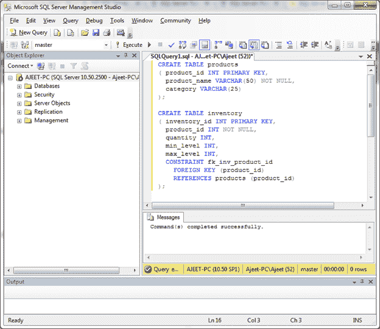
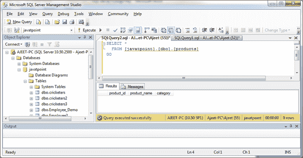
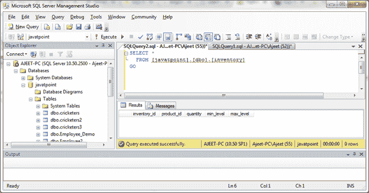
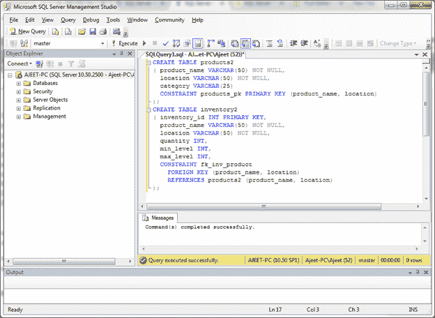

# SQL Server 外键

> 原文：<https://www.javatpoint.com/sql-server-foreign-keys>

在 SQL Server 中，外键用于在 SQL Server 数据库中实施引用完整性。它指定一个表中的值也必须出现在另一个表中。

引用的表称为父表，而具有外键的表称为子表。子表中的外键通常会引用父表中的主键。

可以使用 CREATE TABLE 语句或 ALTER TABLE 语句创建外键。

* * *

## 使用 CREATE TABLE 语句创建外键

**语法:**

```

CREATE TABLE child_table
(
  column1 datatype [ NULL | NOT NULL ],
  column2 datatype [ NULL | NOT NULL ],
  ...
  CONSTRAINT fk_name
    FOREIGN KEY (child_col1, child_col2, ... child_col_n)
    REFERENCES parent_table (parent_col1, parent_col2, ... parent_col_n)
    [ON DELETE {NO ACTION | CASCADE | SET NULL | SET DEFAULT} ]
    [ON UPDATE {NO ACTION | CASCADE | SET NULL | SET DEFAULT} ] 
);

```

## 参数说明

**子表:**指定要创建的子表的名称。

**列 1，列 2:** 指定要在表中创建的列。每列必须有一个数据类型。该列应定义为空或非空，如果该值留空，数据库将默认为空。

**fk_name:** 指定要创建的外键约束的名称。

**child_col1，child_col2，...child_col_n:** 它指定 child_table 中的列将引用 parent_table 中的主键。

**parent_table:** 指定主键将用于子 _table 的父表的名称。

**parent_col1，parent_col2，...parent_col3:** 它指定构成 parent_table 中主键的列。外键将在该数据和 child_col1、child_col2，...child_col_n 子表中的列。

**示例:**

让我们创建两个表“产品”和“库存”，其中产品表的主键是“产品 _id”，它是“库存”表中的外键。

```

CREATE TABLE products
( product_id INT PRIMARY KEY,
  product_name VARCHAR(50) NOT NULL,
  category VARCHAR(25)
);
CREATE TABLE inventory
( inventory_id INT PRIMARY KEY,
  product_id INT NOT NULL,
  quantity INT,
  min_level INT,
  max_level INT,
  CONSTRAINT fk_inv_product_id
    FOREIGN KEY (product_id)
    REFERENCES products (product_id)
);

```

输出:



“库存”表中的外键约束是 fk_inv_product_id。它将在库存表中的 product_id 列和 products 表中的 product_id 列之间建立关系。

现在，您可以检查这两个表。

 

* * *

## 创建具有多个字段的外键

在上面的例子中，我们看到了如何创建一个只有一列的外键。让我们创建具有多个字段的外键。

让我们创建两个表“产品 2”和“库存 2”。在本例中，“product 2”表有一个包含 product_name 和 location 列的主键。因此，第二个表和外键也必须引用这两列。

因此在这个例子中，我们的外键 fk_inv_product 基于两个字段引用了 products 表:product_name 和 location 字段。

```

CREATE TABLE products2
( product_name VARCHAR(50) NOT NULL,
  location VARCHAR(50) NOT NULL,
  category VARCHAR(25)
  CONSTRAINT products_pk PRIMARY KEY (product_name, location)
);
CREATE TABLE inventory2
( inventory_id INT PRIMARY KEY,
  product_name VARCHAR(50) NOT NULL,
  location VARCHAR(50) NOT NULL,
  quantity INT,
  min_level INT,
  max_level INT,
  CONSTRAINT fk_inv_product
    FOREIGN KEY (product_name, location)
    REFERENCES products2 (product_name, location)
);

```

输出:

