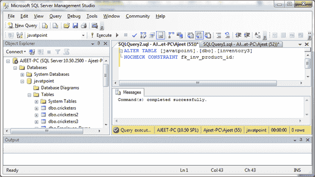

# 禁用外键

> 原文：<https://www.javatpoint.com/sql-server-disable-foreign-key>

ALTER TABLE 语句用于禁用外键。一旦在 SQL Server 中创建了外键，您可能会遇到想要禁用外键的情况，请使用以下语法。

**语法:**

```sql

ALTER TABLE table_name
NOCHECK CONSTRAINT fk_name; 

```

## 参数说明

**table_name:** 指定已创建外键的表的名称。

**fk_name:** 指定要禁用的外键的名称。

**示例:**

通过创建两个表“products3”和“inventory”表来创建外键。

```sql

CREATE TABLE products3
( product_id INT PRIMARY KEY,
  product_name VARCHAR(50) NOT NULL,
  category VARCHAR(25)
);
CREATE TABLE inventory3
( inventory_id INT PRIMARY KEY,
  product_id INT NOT NULL,
  quantity INT,
  min_level INT,
  max_level INT,
  CONSTRAINT fk_inv_product_id
    FOREIGN KEY (product_id)
    REFERENCES products3 (product_id)
);

```

现在使用以下命令禁用外键，其中外键约束为:

fk_inv_product_id。

```sql

ALTER TABLE [javatpoint].[dbo].[inventory]
NOCHECK CONSTRAINT fk_inv_product_id; 

```

输出:



现在外键被禁用。