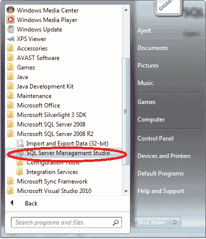
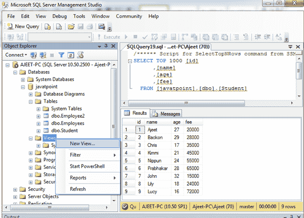
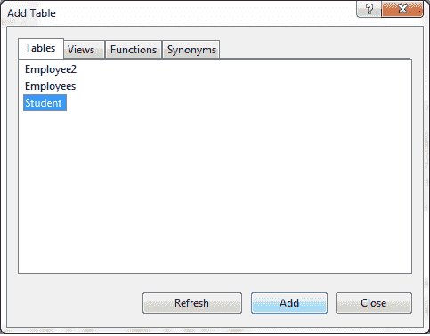
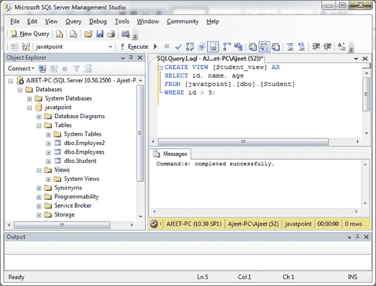
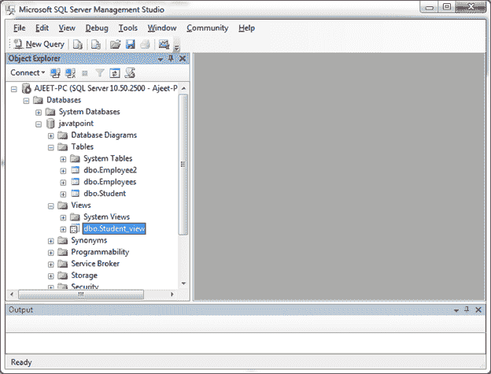
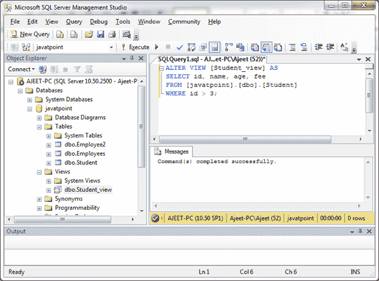
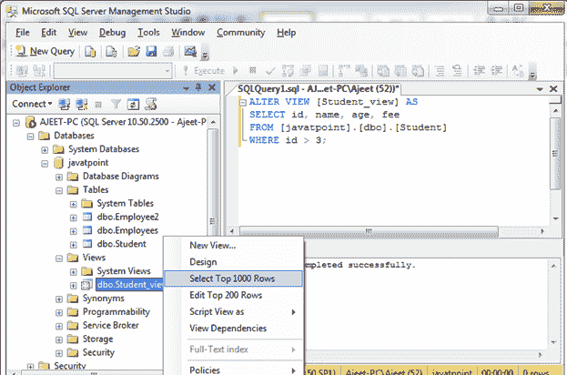
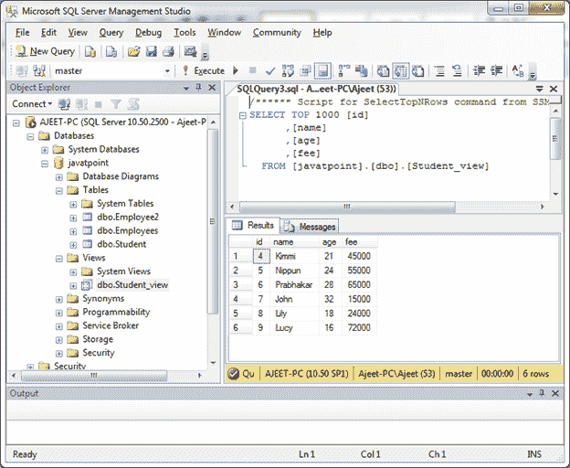
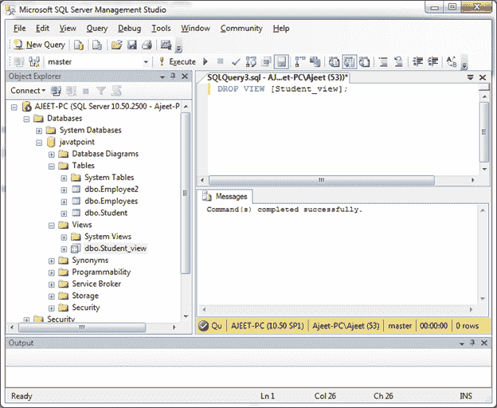

# 创建视图

> 原文：<https://www.javatpoint.com/sql-server-create-view>

视图是根据 SQL 语句的结果集创建的虚拟表。

视图包含行和列，就像一个真实的表。视图中的列是数据库中一个或多个真实表中的列。SQL 函数、WHERE 和 JOIN 语句也可以添加到视图中。

有两种方法可以在 SQL Server 中创建视图:

*   通过使用 SQL Server 管理工作室用户界面。
*   通过使用 SQL Server 查询语句。

* * *

## 通过使用 SQL Server 管理工作室用户界面

打开 SQL Server 管理工作室。



这里你可以看到风景。转到视图并单击右键。



现在你会看到这样一页。选择要在其上创建视图的表格。这里我们选择“学生”表。



点击添加按钮。

创建了一个视图。

* * *

## 通过使用 SQL Server 查询语句。

**语法:**

```
CREATE VIEW view_name AS
SELECT column1, column2, ...
FROM table_name
WHERE condition; 

```

## SQL 创建视图示例

让我们创建一个名为“Student_name”的视图，它包含表“Student”中 is > 3 的所有数据。

```
CREATE VIEW [Student_view] AS
SELECT id, name, age
FROM [javatpoint].[dbo].[Student]
WHERE id > 3;

```

输出:



视图已成功创建。

您可以验证创建视图:



**现在查询视图:**

```
SELECT * FROM [Student_view];

```

输出:


* * *

## 更新视图

您可以使用 ALTER VIEW 语句更新视图。

**语法:**

```
CREATE OR REPLACE VIEW view_name AS
SELECT column1, column2, ...
FROM table_name
WHERE condition; 

```

现在从表“学生”中为创建的视图“学生视图”添加一列“费用”。使用以下语句:

```
ALTER VIEW [Student_view] AS
SELECT id, name, age, fee
FROM [javatpoint].[dbo].[Student]
WHERE id > 3;

```

输出:



您可以看到视图更新成功。使用 SELECT 语句进行验证:



输出:



* * *

## SQL Server 删除视图

“删除视图”命令用于删除视图。

**语法:**

```
DROP VIEW view_name;

```

**示例:**

让我们删除视图“学生视图”。

```
DROP VIEW [Student_view];

```

输出:



现在，您可以看到视图已被删除。