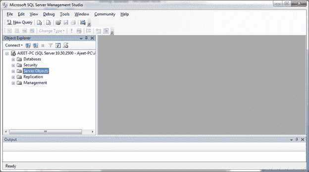
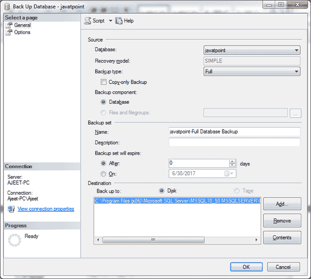
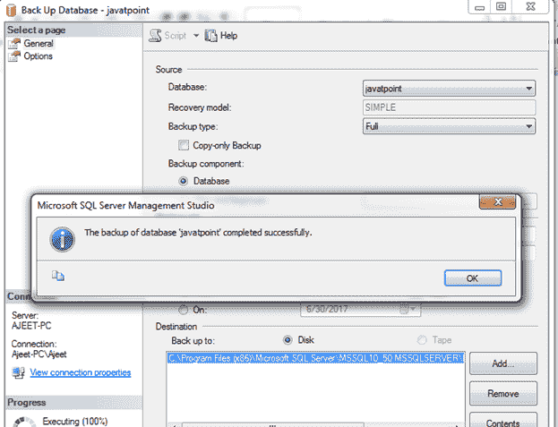

# 备份数据库

> 原文：<https://www.javatpoint.com/sql-server-backup-database>

在 SQL Server 中，您可以非常容易地创建数据库的备份。

## 创建备份

打开微软 SQL Server 管理工作室。您将看到服务器对象。(见下图)

当您单击服务器对象时，您将看到备份设备。右键单击备份设备。您将看到如下图像:

点击“备份数据库”后，您将看到以下页面:

选择要为其创建备份的数据库，然后单击“确定”按钮。这里我们为数据库“javatpoint”创建一个备份。

将出现一个新的弹出框，显示数据库备份已成功完成。