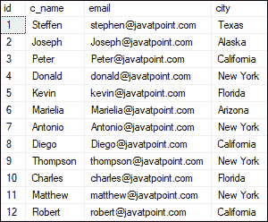
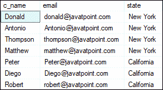
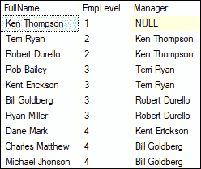

# SQL Server 中的通用表表达式(CTE)

> 原文：<https://www.javatpoint.com/common-table-expression-in-sql-server>

我们将使用 SQL Server 的通用表表达式或 CTEs 来简化复杂的连接和子查询。它还提供了一种查询分层数据的方法，例如组织层次结构。本文全面概述了 CTE、CTE 的类型、优点、缺点以及如何在 SQL Server 中使用它们。

## 什么是 SQL Server 中的 CTE？

**一个 CTE(公共表表达式)是一个一次性的结果集，它只存在于查询的持续时间**内。它允许我们在单个 SELECT、INSERT、UPDATE、DELETE、CREATE VIEW 或 MERGE 语句的执行范围内引用数据。它是临时的，因为它的结果不能存储在任何地方，并且一旦查询执行完毕就会丢失。它最初是伴随着 [SQL Server](https://www.javatpoint.com/sql-server-tutorial) 2005 版本而来的。数据库管理员总是喜欢使用 CTE 作为子查询/视图的替代。它们遵循 ANSI SQL 99 标准，并且符合 SQL 标准。

### SQL Server 中的 CTE 语法

CTE 语法包括一个 CTE 名称、一个可选的列列表和一个定义通用表表达式(CTE)的语句/查询。在定义了 CTE 之后，我们可以将其用作选择、插入、更新、删除和合并查询中的视图。

以下是 CTE 在 SQL Server 中的基本语法:

```

WITH cte_name (column_names) 
AS (query)   
SELECT * FROM cte_name;  

```

在以下语法中:

*   我们首先指定了 CTE 的名字，稍后将在查询中引用它。
*   下一步是创建逗号分隔的列列表。它确保 CTE 定义参数中的列数和查询中的列数必须相同。如果我们没有定义 CTE 参数的列，它将使用定义 CTE 的查询列。
*   之后，我们将在表达式名称后使用 AS 关键字，然后定义一个 SELECT 语句，其结果集填充 CTE。
*   最后，我们将在查询中使用 CTE 名称，如 SELECT、INSERT、UPDATE、DELETE 和 MERGE 语句。

在编写 CTE 查询定义时，应该牢记这一点；我们不能使用以下条款:

1.  排序依据，除非你也使用 TOP 子句
2.  到…里面
3.  带有查询提示的选项子句
4.  用于浏览

下图是 CTE 查询定义的表示。


这里，第一部分是一个 CTE 表达式，它包含一个可以在 SQL 中独立运行的 SQL 查询。第二部分是使用 CTE 显示结果的查询。

### 例子

让我们通过各种例子来了解 CTE 是如何在 SQL Server 中工作的。在这里，我们将使用表“**客户**”进行演示。假设该表包含以下数据:



在这个例子中，CTE 的名字是 **customers_in_newyork** ，定义 CTE 的子查询返回三列 **customer name，email，**和 **state** 。因此，纽约的 CTE 客户将退回所有居住在纽约州的客户。

在定义了纽约的 CTE 客户后，我们在 **SELECT** 语句中引用了该客户，以获取位于纽约的这些客户的详细信息。

```

WITH customers_in_NewYork
AS (SELECT * FROM customer WHERE state = 'New York')
SELECT c_name, email, state FROM customers_in_NewYork;

```

执行上述语句后，它将给出以下输出。在这里，我们可以看到结果只返回位于纽约州的客户信息。


## 多重 CTE

在某些情况下，我们需要创建多个 CTE 查询，并将它们连接在一起以查看结果。在这个场景中，我们可以使用多个 cte 概念。我们需要使用逗号操作符来创建多个 CTE 查询，并将它们合并成一个语句。“，”逗号运算符必须在 CTE 名称之前，以区分多个 CTE。

多个 cte 帮助我们简化最终连接在一起的复杂查询。每个复杂的部分都有自己的 CTE，然后可以在 wit 子句之外引用和连接。

#### 注意:多重 CTE 定义可以使用联合、联合所有、联合、交集或例外来定义。

**下面的语法解释得更清楚:**

```

WITH 
   cte_name1 (column_names) AS (query),
   cte_name2 (column_names) AS (query)
SELECT * FROM cte_name
UNION ALL
SELECT * FROM cte_name;  

```

### 例子

让我们了解多个 CTE 是如何在 SQL Server 中工作的。在这里，我们将使用上面的“**客户**”表进行演示。

在这个例子中，我们定义了两个 CTE 名字**客户 _ 在纽约**和**客户 _ 在加州**。然后这些 CTEs 的子查询的结果集填充 CTE。最后，我们将在一个查询中使用 CTE 的名字，该查询将返回位于**纽约州**和**加利福尼亚州**的所有客户。

```

WITH 
customers_in_NewYork
	AS (SELECT * FROM customer WHERE state = 'New York'),
customers_in_California
	AS (SELECT * FROM customer WHERE state = 'California')
SELECT c_name, email, state FROM customers_in_NewYork
UNION ALL
SELECT c_name, email, state FROM customers_in_California;

```

纽约州和加利福尼亚州。



## 为什么我们需要 CTE？

像数据库视图和派生表一样，CTEs 可以使复杂的查询更易读和简单，从而使其更容易编写和管理。我们可以通过将复杂的查询分解成简单的块来实现这个特性，这些块可以在重写查询时重用。

**其部分用例如下:**

*   当我们需要在单个查询中多次定义派生表时，它非常有用。
*   当我们需要在数据库中创建视图的替代视图时，它非常有用。
*   当我们需要同时对多个查询组件执行多次相同的计算时，这非常有用。
*   当我们需要使用像 ROW_NUMBER()、RANK()和 NTILE()这样的排名函数时，它非常有用。

**其部分优势如下:**

*   CTE 使代码维护变得更加容易。
*   CTE 增加了代码的可读性。
*   它提高了查询的性能。
*   CTE 使得实现递归查询变得容易。

## SQL Server 中 CTE 的类型

SQL Server 将 CTE(通用表表达式)分为两大类:

1.  递归 CTE
2.  非递归 CTE

### 递归 CTE

一种常见的表表达式称为递归 CTE，它引用自身。它的概念基于递归，递归被定义为“**递归过程或定义的反复应用**”当我们执行递归查询时，它会在数据的子集上重复迭代。它被简单地定义为一个调用自身的查询。在某一点上有一个结束条件，所以它并不无限地自称。

递归 CTE 必须有一个 **UNION ALL** 语句和引用 CTE 本身的第二个查询定义，才能递归。

**例**

让我们了解递归 CTE 在 SQL Server 中是如何工作的。考虑下面的语句，**生成一系列前五个奇数:**

```

WITH  
odd_num_cte (id, n) AS  
(  
SELECT 1, 1   
UNION ALL  
SELECT id+1, n+2 from odd_num_cte where id < 5   
)  
SELECT * FROM odd_num_cte;

```

当我们执行这个递归 CTE 时，我们将看到如下输出:


下面的例子是更高级的递归 CTE。在这里，我们将使用“ **jtp_employees** ”表进行演示，其中包含以下数据:


本示例将显示员工数据的层次结构。此表为每个员工提供了该人经理的参考。引用本身是同一表中的员工 id。

```

WITH cte_recursion (EmpID, FirstName, LastName, MgrID, EmpLevel)
  AS
  (
    SELECT EmployeeID, FirstName, LastName, ManagerID, 1
    FROM jtp_employees WHERE ManagerID IS NULL
    UNION ALL
    SELECT emp.EmployeeID, emp.FirstName, emp.LastName, emp.ManagerID, r.EmpLevel + 1
    FROM jtp_employees emp INNER JOIN cte_recursion r ON emp.ManagerID = r.EmpID
  )
SELECT
  FirstName + ' ' + LastName AS FullName, EmpLevel,
  (SELECT FirstName + ' ' + LastName FROM jtp_employees 
    WHERE EmployeeID = cte_recursion.MgrID) AS Manager 
	FROM cte_recursion ORDER BY EmpLevel, MgrID

```

这个 CTE 将给出以下输出，我们可以在其中看到员工数据的层次结构:



### 非递归 CTE

不引用自身的常见表表达式称为非递归 CTE。非递归 CTE 简单易懂，因为它不使用递归的概念。根据 CTE 语法，每个 CTE 查询将以“**”子句开头，后跟 CTE 名称和列列表，然后是带括号的 AS。**

 **## CTE 的缺点

以下是在 SQL Server 中使用 CTE 的限制:

*   CTE 成员不能使用诸如 Distinct、Group By、Having、Top、Joins 等关键字子句。
*   递归成员只能引用 CTE 一次。
*   我们不能在存储过程中使用表变量和 CTEs 作为参数。
*   我们已经知道 CTE 可以用来代替视图，但是 CTE 不能嵌套，而视图可以。
*   因为它只是查询或子查询的快捷方式，所以不能在另一个查询中重用。
*   CTE 参数中的列数和查询中的列数必须相同。

* * ***