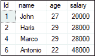
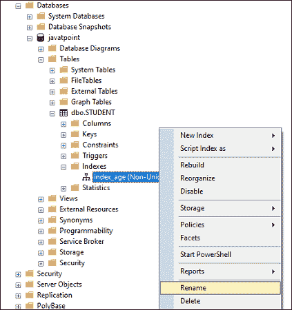
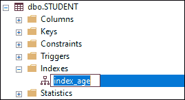

# SQL Server 中的索引

> 原文：<https://www.javatpoint.com/index-in-sql-server>

索引是提高数据库性能的重要途径之一。它通过提供对数据表中的行的简单访问，使 **查询过程变得更快**，类似于一本书的索引如何快速定位该书中的信息。如果我们没有索引，那么很难找到具体的数据。我们可以在 [SQL Server](https://www.javatpoint.com/sql-server-tutorial) 中使用 CREATE INDEX、DROP INDEX 和 ALTER INDEX [SQL](https://www.javatpoint.com/sql-tutorial) 命令来创建新索引、更新现有索引和删除索引。本文将向您概述 SQL Server 索引，包括如何在数据库中描述它们，以及它们如何加快查询速度。

**索引是由表或视图中的一列或多列组成的一组键**。它们存储在一个结构(B 树)中，帮助 SQL Server 用户快速有效地找到与键值关联的行。

## SQL Server 索引的类型

SQL Server 中主要有两种类型的索引:

### 聚合

聚集索引**使用键值对表**或视图中的数据行进行排序和存储。它们包含在索引定义中。它总是将索引值存储在 **B 树结构**中，实际数据存储在叶节点中。由于数据行存储在一个方向上，每个表只能有一个聚集索引。

只有当表具有聚集索引时，表才会按排序顺序存储行。我们可以将聚集表称为具有聚集索引的表。如果一个表没有聚集索引，它的行存储在一个**堆**中，这是一个**无序结构**。

聚集索引的主要好处是数据在物理上是按照存储系统中的聚集键值进行排序的，并且搜索一系列值会很快。它的主要缺点是最后一页插入锁存争用，只在聚集索引的末尾插入数据。

### 非聚集的

非聚集索引的结构类似于聚集索引，只是**实际数据不包含在叶节点**中。非聚集索引具有非聚集索引键值，每个键值条目都包含对实际数据的引用。根据表数据的存储方式，它可以指向聚集索引或堆结构中的数据值。如果行定位器是指向该行的指针，则它是堆结构。如果行定位器是聚集索引键，则它是聚集表。

非聚集索引的主要好处是**加快查询性能**。它的主要缺点是在 DML 操作期间维护索引需要额外的开销。

## 在 SQL Server 中创建索引

我们可以使用以下语法在 SQL Server 中创建索引:

```

CREATE [UNIQUE | CLUSTERED | NONCLUSTERED] INDEX index_name
ON table_name column_name; 

```

如果要创建**多个索引列**，请使用以下语法:

```

CREATE INDEX index_name
ON table_name (column1, column2 ...); 

```

这里， **index_name** 是一个索引的名称**，table_name** 代表在其上创建索引的表的名称， **column_name** 是应用它的列的名称。

#### 注意:唯一索引维护表中的数据完整性，并通过防止多个值输入表中来提高性能。

### 何时应该创建索引？

我们可以在以下情况下创建索引:

*   当一列有很大范围的值时
*   当列没有大量空值时
*   当在 where 或 join 子句中同时使用一列或多列时

### 什么时候应该避免索引？

在以下情况下，我们可以避免索引:

*   当桌子很小时
*   当列不用作查询条件时
*   当列不断更新时

### 例子

让我们通过一个例子来理解索引在 SQL Server 中的使用。下面的语句在数据库“ **javatpoint** 中创建了一个名为 **STUDENT** 的表，如下所示:

```

CREATE TABLE [javatpoint].[STUDENT](
	id nchar(10),
	name nchar(10),
	age nchar(10),
	salary nchar(10)
); 

```

接下来，我们需要使用如下语句插入一些记录:

```

INSERT INTO [javatpoint].[dbo].[STUDENT]  
           ([ID]  
           ,[NAME]  
           ,[AGE]  
           ,[SALARY])  
     VALUES  
           (1, 'John', 27, 20000),   
           (2, 'Harris', 29, 28000),  
           (3, 'peter', 17, 25000),
           (4, 'Marco', 29, 28000),  
           (5, 'Diego', 17, 35000),
           (6, 'Antonio', 22, 48000),  
           (7, 'Steffen', 16, 35000);

```

我们可以使用 SELECT 语句来验证表数据:

```

SELECT * FROM [javatpoint].[dbo].[STUDENT];

```

我们将看到以下输出:


如果我们想得到年龄大于 20 的**学生记录，执行以下语句:**

```

SELECT * FROM [javatpoint].[dbo].[STUDENT] WHERE age>20;

```

我们将获得以下输出。



在这里，查询扫描整个表，只返回四个年龄大于 20 的行。这个过程需要很长时间来检索数据，这使得性能变慢。我们可以通过使用索引的概念来克服这个缺点。

现在，让我们使用下面的语句为年龄列创建一个索引:

```

CREATE INDEX index_age ON STUDENT (age);  

```

执行上述语句后，索引创建成功。如果我们再次运行下面的语句，那么查询不会扫描整个表。因此，索引使查询性能更好。

```

SELECT * FROM [javatpoint].[dbo].[STUDENT] WHERE age>20;

```

### 如何重命名索引？

有时我们的索引名称没有意义，因此需要更改名称或重命名现有数据库中任何用户创建的对象，包括表、索引和列。MS SQL Server 可以**重命名或更改索引名称主要有两种方式**:

*   使用系统存储过程 sp _ 重命名
*   使用 SQL Server 管理工作室

如果我们使用系统存储过程来重命名索引，我们可以使用以下语法:

```

EXEC sp_rename 
    index_name, 
    new_index_name, 
    N'INDEX';  

```

我们也可以使用**显式参数**来重命名索引:

```

EXEC sp_rename 
    @objname = N'index_name', 
    @newname = N'new_index_name',   
    @objtype = N'INDEX';

```

更改索引名称的第二种方法是使用 SSMS。我们可以通过以下步骤做到这一点:

1.  转到数据库->表名->索引。
2.  右键单击要更改名称的索引，然后从上下文菜单中选择重命名。

下图解释得更清楚:



更改索引名称的另一种方法是单击**索引**菜单下的索引名称，键入新名称，然后按**进入**。请参见下图:



### 删除索引

我们可以使用 **DROP INDEX 命令**从当前数据库中删除单个或多个索引。

```

DROP INDEX [IF EXISTS] index_name ON table_name;

```

如果我们想同时从一个或多个表中删除多个索引，我们需要使用下面的语句定义一个以逗号分隔的索引名称列表，其中包含相应的表名:

```

DROP INDEX [IF EXISTS] 
    index_name1 ON table_name1,
    index_name2 ON table_name2,
    ...;

```

我们必须确保删除索引的 DROP ANY INDEX 权限，或者我们必须是当前数据库中索引的所有者。

### 禁用索引

我们可以使用 **ALTER INDEX** 语句禁用 SQL Server 中的索引，如下所示:

```

ALTER INDEX index_name
ON table_name
DISABLE;

```

如果我们想禁用当前数据库中表的所有索引，我们可以使用以下形式的 ALTER INDEX 语句:

```

ALTER INDEX ALL ON table_name DISABLE;

```

### 启用索引

如果我们想在 SQL Server 中启用禁用的索引，我们需要重新构建它，因为我们不能简单地启用它。我们可以使用 **ALTER INDEX** 语句或 **DBCC DBREINDEX** 命令在 SQL Server 中重建索引。

我们可以**启用或重建**表中的索引，如下所示:

```

ALTER INDEX index_name 
ON table_name  
REBUILD;

```

如果我们想使用 DBCC DBREINDEX 语句在表上启用或重建索引，将使用以下查询:

```

DBCC DBREINDEX (table_name, index_name);

```

### 确认索引

我们可以验证用户或服务器提供的特定表中的不同索引及其唯一性，如下所示:

```

SELECT * FROM USER_INDEXES;

```

该语句将向我们显示服务器的所有索引，我们也可以在其中找到自己的表。

### 过滤索引

当我们的应用程序只需要查询表的一部分行时，过滤索引的概念就开始发挥作用了。筛选索引是一种非聚集索引，它带有一个谓词，允许我们选择要包含在索引中的行。我们可以使用以下**语法来创建过滤索引**:

```

CREATE INDEX index_name
ON table_name(column_list)
WHERE predicate;

```

**过滤索引的主要好处是:**

*   筛选索引可以节省空间，尤其是当索引键列很稀疏时。具有大量空值的列被认为是稀疏的。
*   它还降低了维护成本，因为当相关表中的数据发生变化时，只有一部分数据行会发生变化，而不是全部。

* * *