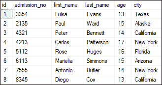
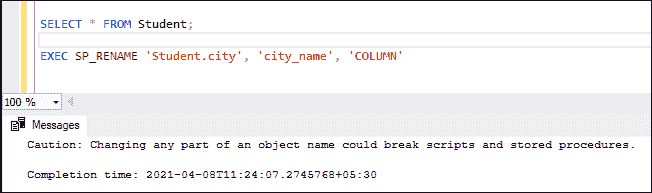
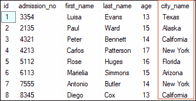
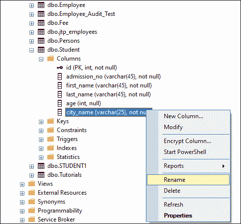
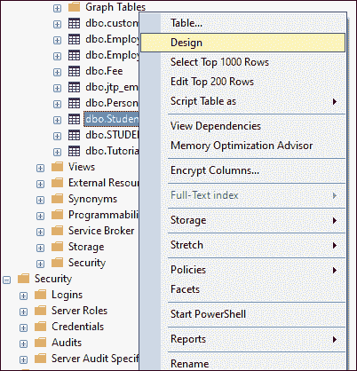
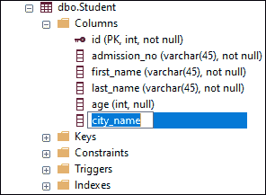

# 重命名 SQL Server 中的列

> 原文：<https://www.javatpoint.com/rename-columns-in-sql-server>

SQL Server 允许我们随时更改列。当列名没有意义或没有达到创建目的时，我们将重命名表列。在更改列名之前，它必须确保我们对该对象拥有 ALTER 权限。

## 限制和约束

SQL Server 在更改列名时有一些限制，因为当我们重命名列时，并不意味着对该列的所有引用也会被重命名。我们必须手动修改属于重命名列的所有对象。

**例如**，如果我们想改变一个表的列，而这个表在**触发器**中也被引用，那么也需要修改触发器来反映新的列名。**sys . SQL _ expression _ dependencies**可用于在更改名称之前列出对象的所有依赖关系。

**我们可以在 SQL Server 中重命名表列，主要使用两种方式:**

1.  Transact-SQL。
2.  SQL Server 管理工作室(SSMS)

## 以原则为基础的管理检视

[SQL Server](https://www.javatpoint.com/sql-server-tutorial) 提供了一个名为 **SP_RENAME** 的标准存储过程，用于更改当前数据库中用户创建的对象的名称。用户创建的对象可以是表、列、索引、别名数据类型等。

当我们更改对象名称的某个部分时，脚本和存储过程可能会被破坏。我们建议您**删除**对象，**用新名称重新创建**对象，而不是使用此语句来更改存储过程、触发器、用户定义函数或视图的名称。

**使用这种方法更改列名的语法是:**

```

EXEC SP_RENAME '[Table Name].[Old Column Name]', '[New Column Name]', COLUMN'

```

**重命名列示例**

下面的示例使用 SP_RENAME 存储过程演示了 SQL Server 重命名列。为此，我们将取一个包含以下数据的“**学生”**表:



如果我们想用这个表的新名称“**city _ name”**来更改“**city”**列，我们可以使用上面指定的 SQL Server 语法或存储过程，如下所示:

```

EXEC SP_RENAME 'Student.city', 'city_name', 'COLUMN'

```

执行此脚本后，我们将获得以下消息:



当我们验证“学生”表时，我们可以看到“城市”的列名已成功更改:



## SQL Server 管理工作室(SSMS)

SSMS 是一个 windows 软件工具，用于从图形界面而不是使用命令行连接和使用我们的 SQL Server。management studio 允许我们以下列方式重命名表列:

1.  使用对象资源管理器重命名列
2.  双击列名
3.  使用表设计器重命名列

让我们详细讨论每一个问题。

### 使用对象资源管理器重命名列

以下步骤用于使用对象资源管理器更改列名:

**步骤 1:** 转到数据库- >表格菜单并展开它。

**步骤 2:** 选择所需的表格并展开。

**步骤 3:** 选择列并展开它们。

**步骤 4:** 右键单击要更改的列名，然后选择重命名选项。

下图解释了我们选择“**学生”**表的所有上述步骤:



**步骤 5:** 为所选列键入新名称。

**步骤 6:** 刷新数据库或表，完成重命名步骤。

**步骤 7:** 执行 SELECT 语句，验证更改后的列名。

### 使用表设计器重命名列

以下步骤用于使用对象资源管理器更改列名:

**步骤 1:** 转到数据库- >表格菜单并展开它。

**步骤 2:** 选择想要更改列名的表，右键单击该表，从上下文菜单中选择“设计”选项。



**第三步:**一旦我们选择了设计选项，我们将看到如下图所示的设计模式下的表格。


**步骤 4:** 选择要更改的列，并为此列键入新名称。让我把**名字**栏改名为 **f_name** 。

**步骤 5:** 要保存您在设计窗口中所做的更改，单击**关闭**按钮，然后在显示的弹出窗口中单击**是**按钮。


我们可以通过导航到**文件**菜单，点击**保存表名**或按键盘上的 **CTRL+S** 来以另一种方式保存在设计窗口中所做的更改。


**步骤 6:** 执行 SELECT 语句，验证更改后的列名

### 双击列名

我们可以使用以下步骤通过双击重命名列:

**步骤 1:** 转到数据库- >表- >列。

**第二步:**选择要更改的列名，双击。下图更清楚地解释了这一点:



**步骤 3:** 为您选择的列键入新名称。

**步骤 4:** 刷新数据库或表，完成重命名步骤。

**步骤 5:** 执行 SELECT 语句，验证更改后的列名。

#### 注意:使用 SSMS 重命名列名不是一个好主意，因为在使用数据库表时，这会使数据库管理员的工作更加难以理解。因此，始终建议使用 T-SQL 查询对数据库进行任何更改。

* * *