# SQL 服务器连接

> 原文：<https://www.javatpoint.com/sql-server-joins>

在现实生活中，我们将数据存储在多个逻辑表中，这些逻辑表通过关系数据库中的公共键值链接在一起，如 SQL Server、 [Oracle、](https://www.javatpoint.com/oracle-tutorial) [MySQL、](https://www.javatpoint.com/mysql-tutorial)等。因此，我们经常需要根据一些条件将两个或多个表中的数据转换成所需的输出。我们可以使用 SQL JOIN 子句在 SQL Server 中快速实现这种类型的数据。本文通过一个例子给出了 JOIN 及其不同类型的完整概述。

join 子句允许我们从两个或多个相关表中检索数据到一个有意义的结果集中。我们可以使用**选择**语句和**加入条件**加入表格。它指示 SQL Server 如何使用一个表中的数据从另一个表中选择行。一般来说，表使用**外键**约束相互关联。

在 JOIN 查询中，条件指示两个表是如何相关的:

*   从每个表中选择应该在联接中使用的列。联接条件指示一个表中的外键和另一个表中的对应键。
*   指定逻辑运算符来比较像=，这样的列中的值。

## SQL Server 中联接的类型

[SQL Server](https://www.javatpoint.com/sql-server-tutorial) 主要支持**四种类型的 JOINS** ，每种 join 类型定义了一个查询中两个表是如何关联的。以下是 SQL Server 中的连接支持类型:

1.  内部连接
2.  自连接
3.  交叉连接
4.  外部连接

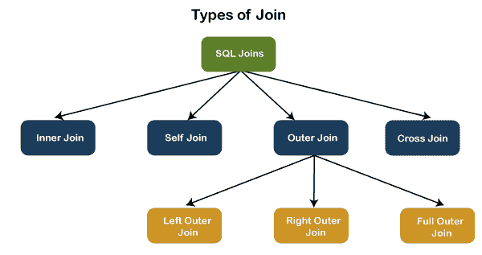

让我们详细讨论每一个连接。

## 内部连接

此 JOIN 返回满足指定连接条件的多个表中的所有记录。这是最简单和最流行的连接形式，并假定为**默认连接**。如果我们在 JOIN 查询中省略 INNER 关键字，我们将得到相同的输出。

下面的可视化表示解释了 INNER JOIN 如何从**表 1** 和**表 2:** 返回匹配的记录

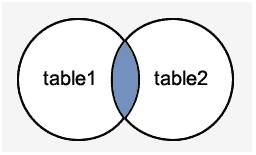

**内部连接语法**

以下语法说明了在 SQL Server 中使用内部连接:

```

SELECT columns  
FROM table1  
INNER JOIN table2 ON condition1  
INNER JOIN table3 ON condition2  

```

**内部连接示例**

让我们首先使用以下语句创建两个表“**学生**”和“**费用**”:

```

CREATE TABLE Student (    
  id int PRIMARY KEY IDENTITY,   
  admission_no varchar(45) NOT NULL,
  first_name varchar(45) NOT NULL,    
  last_name varchar(45) NOT NULL,
  age int,
  city varchar(25) NOT NULL    
);  

CREATE TABLE Fee ( 
  admission_no varchar(45) NOT NULL,
  course varchar(45) NOT NULL,    
  amount_paid int,  
);

```

接下来，我们将使用以下语句在这些表中插入一些记录:

```

INSERT INTO Student (admission_no, first_name, last_name, age, city)     
VALUES (3354,'Luisa', 'Evans', 13, 'Texas'),     
(2135, 'Paul', 'Ward', 15, 'Alaska'),     
(4321, 'Peter', 'Bennett', 14, 'California'),  
(4213,'Carlos', 'Patterson', 17, 'New York'),     
(5112, 'Rose', 'Huges', 16, 'Florida'),
(6113, 'Marielia', 'Simmons', 15, 'Arizona'),  
(7555,'Antonio', 'Butler', 14, 'New York'),     
(8345, 'Diego', 'Cox', 13, 'California');

INSERT INTO Fee (admission_no, course, amount_paid)     
VALUES (3354,'Java', 20000),     
(7555, 'Android', 22000),     
(4321, 'Python', 18000),  
(8345,'SQL', 15000),     
(5112, 'Machine Learning', 30000);

```

执行**选择**语句验证记录:

**表:学生**

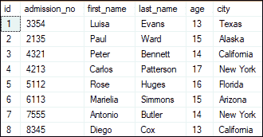

**表:费用**

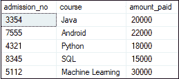

我们可以使用以下命令演示 INNER JOIN:

```

SELECT Student.admission_no, Student.first_name, Student.last_name, Fee.course, Fee.amount_paid
FROM Student
INNER JOIN Fee
ON Student.admission_no = Fee.admission_no;

```

该命令给出以下结果:

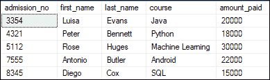

在本例中，我们使用了**accession _ no 列**作为连接条件来获取两个表中的数据。根据这张表，我们可以看到已经交费的学生的信息。

## 自连接

使用 SELF JOIN 将表连接到自身。也就是说**每一个表行与自身**以及每隔一个表行组合。SELF JOIN 可以看作是相同表的两个副本的连接。我们可以借助**表名别名**为每个表的实例指定一个特定的名称。表别名使我们能够在查询中使用**表的临时**名称。这是提取分层数据和比较单个表中的行的有用方法。

**自连接语法**

以下表达式说明了 SQL Server 中 SELF JOIN 的语法。它的工作原理与连接两个不同表的语法相同。这里，我们使用表的别名，因为两个表名是相同的。

```

SELECT T1.col_name, T2.col_name...  
FROM table1 T1, table1 T2  
WHERE join_condition;  

```

**例**

我们可以使用以下命令演示 SELF JOIN:

```

SELECT S1.first_name, S2.last_name, S2.city
FROM Student S1, Student S2
WHERE S1.id <> S2.iD AND S1.city = S2.city
ORDER BY S2.city;

```

该命令给出以下结果:

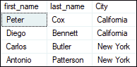

在这个例子中，我们使用了 **id 和城市列**作为连接条件来获取这两个表中的数据。

## 交叉连接

SQL Server 中的交叉连接结合了两个或多个表的所有可能性，并返回一个结果，该结果包括所有参与表中的每一行。它也被称为**笛卡尔连接**，因为它产生所有链接表的**笛卡尔乘积**。笛卡尔乘积表示第一个表中的所有行乘以第二个表中的所有行。

下图展示了交叉连接。它将给出从**表 1** 和**表 2** 的所有记录，其中每一行都是两个表的行的组合:


**交叉连接语法**

以下语法说明了交叉连接在 SQL Server 中的使用:

```

SELECT column_lists  
FROM table1  
CROSS JOIN table2;

```

**例**

我们可以使用以下命令演示 CROSS JOIN:

```

SELECT Student.admission_no, Student.first_name, Student.last_name, Fee.course, Fee.amount_paid
FROM Student
CROSS JOIN Fee
WHERE Student.admission_no = Fee.admission_no;

```

该命令给出以下结果:

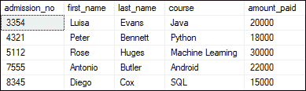

## 外部连接

SQL Server 中的外部连接**返回两个表**中满足连接条件的所有记录。换句话说，这个连接不仅返回匹配的记录，还返回一个或两个表中所有不匹配的行。

**我们可以将 OUTER JOIN 进一步分为三种类型:**

*   左外连接
*   右外连接
*   完全外部连接

### 左外连接

左外部连接**从左表中检索所有记录，从右表中检索匹配的行**。当在右侧表中没有找到匹配记录时，将返回**空值**。因为 OUTER 是一个可选的关键字，所以它也被称为 LEFT JOIN。

下图显示了左外部连接:


**左外连接语法**

以下语法说明了左外部连接在 SQL Server 中的使用:

```

SELECT column_lists
FROM table1  
LEFT [OUTER] JOIN table2  
ON table1.column = table2.column;  

```

**例**

我们可以使用以下命令演示左外部连接:

```

SELECT Student.admission_no, Student.first_name, Student.last_name, Fee.course, Fee.amount_paid
FROM Student
LEFT OUTER JOIN Fee
ON Student.admission_no = Fee.admission_no;

```

该命令给出以下结果:


此输出显示不匹配行的值在相应的列中被替换为空值。

### 右外连接

右外连接**从右表中检索所有记录，从左表中检索匹配的行**。当在左侧表中没有找到匹配的记录时，将返回**空值**。因为 OUTER 是一个可选关键字，所以它也被称为 RIGHT JOIN。

下图显示了右外部连接:

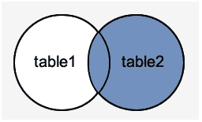

**右外连接语法**

以下语法说明了右外部连接在 SQL Server 中的使用:

```

SELECT column_lists  
FROM table1  
RIGHT [OUTER] JOIN table2  
ON table1.column = table2.column;  

```

**例**

下面的示例解释了如何使用右外部连接从两个表中获取记录:

```

SELECT Student.admission_no, Student.first_name, Student.last_name, Fee.course, Fee.amount_paid
FROM Student
RIGHT OUTER JOIN Fee
ON Student.admission_no = Fee.admission_no;

```

该命令给出以下结果:

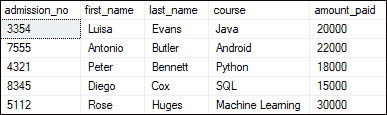

在此输出中，我们可以看到没有列具有空值，因为根据指定的条件，费用表中的所有行在学生表中都可用。

### 完全外部连接

SQL Server 中的完全外部连接**返回一个包含两个表中所有行的结果**。当在左侧表中没有找到匹配的记录时，右侧表的列返回空值。如果在右表中没有找到匹配的记录，左表列将返回空值。

下图显示了完全外部连接:

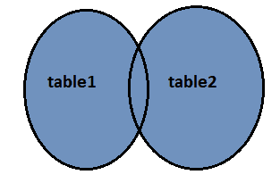

**完全外部连接语法**

以下语法说明了完全外部连接在 SQL Server 中的使用:

```

SELECT column_lists  
FROM table1  
FULL [OUTER] JOIN table2  
ON table1.column = table2.column;  

```

**例**

以下示例说明了如何使用完全外部连接从两个表中获取记录:

```

SELECT Student.admission_no, Student.first_name, Student.last_name, Fee.course, Fee.amount_paid
FROM Student
FULL OUTER JOIN Fee
ON Student.admission_no = Fee.admission_no;

```

该命令给出以下结果:

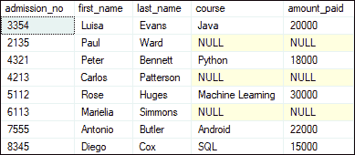

在这个输出中，我们可以看到，当根据指定的条件在左表和右表中没有找到匹配的记录时，该列具有空值。

* * *