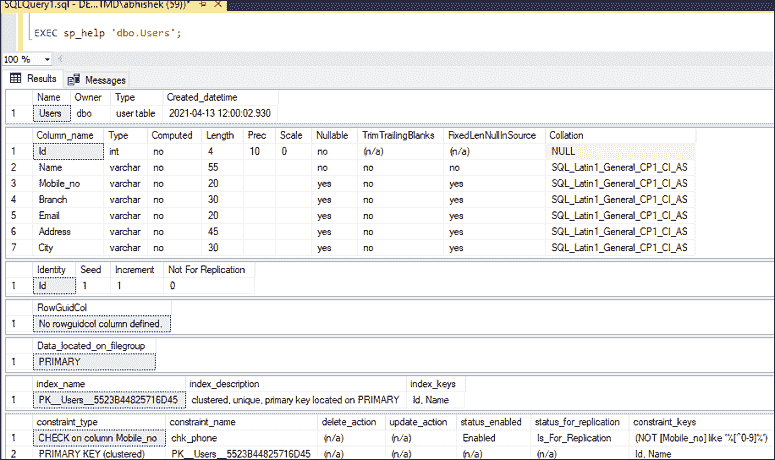
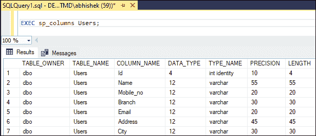
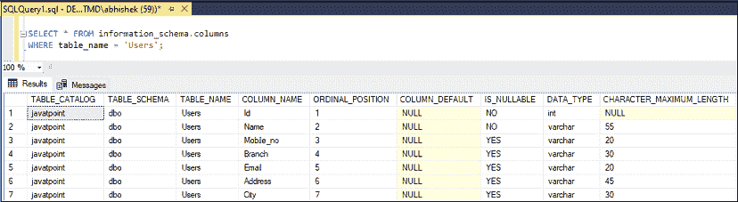
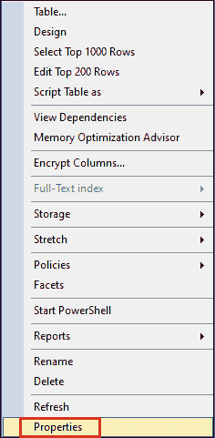

# SQL 服务器描述表

> 原文：<https://www.javatpoint.com/sql-server-describe-table>

description 是指详细显示信息。由于我们的 SQL Server 数据库中有几个表，我们将需要一个命令**来显示表的结构**，例如列名、数据类型、对列名的约束等。SQL Server 没有像 Oracle 或 MySQL 提供的 DESCription 或 desc 命令那样显示表结构的任何命令。但是我们有一些其他的方法来描述微软的 SQL Server 中的表或对象。本文给出了在 SQL Server 中显示表结构的完整概述。

### 许可

只有当我们拥有某个表或授予该表权限时，才能显示该表的表结构或属性。

**以下是在 SQL Server 中显示表的属性或结构的方法:**

*   以原则为基础的管理检视
*   SQL Server 管理工作室

### 使用 Transact-SQL

[SQL Server](https://www.javatpoint.com/sql-server-tutorial) 有极其有用的命令或内置的**系统存储过程 sp_help** 类似于**‘help’**命令。我们将使用这个命令获得关于一个对象的详细信息。此命令仅返回可在当前数据库中引用的对象的信息。我们可以如下使用它:

```

EXEC sp_help 'dbo.mytable';

```

**例**

如果我们想显示**‘用户’**表的属性，我们需要使用下面的命令:

```

EXEC sp_help 'dbo.Users';

```

它显示了以下输出:



如图所示，它显示了用户表的创建时间、列名、数据类型、长度和列约束。

SQL Server 还可以使用 **sp_columns 存储过程**来显示一个 SQL Server 表的结构。这是显示选定表的列和相关信息的最简单方法。我们可以使用如下语法:

```

EXEC sp_columns mytable;

```

**例**

要显示一个**‘用户’**表的结构，我们可以如下使用:

```

EXEC sp_columns Users;

```

它返回以下输出:



如图所示，它为表中的每一列返回一行，详细显示列信息。

如果我们**不想用存储过程来描述表结构**，那么 SQL Server 也允许一个查询来完成这个任务。以下语法可用于显示表格信息:

```

SELECT * FROM information_schema.columns 
WHERE table_name = 'object_name';

```

信息模式。COLUMNS 语句为当前数据库中的所有表生成关于所有列的信息。默认情况下，将为数据库中的每个表显示此信息。

**例**

如果我们想得到一个**‘用户’**表的表定义，我们可以如下使用:

```

SELECT * FROM information_schema.columns 
WHERE table_name = 'Users';

```

它将产生以下输出:



### 使用 SQL Server 管理工作室

如果我们使用 SSMS，以下步骤用于描述表格定义:

**步骤 1:** 连接到数据库并导航到对象资源管理器。

**步骤 2:** 选择要显示属性的表。

**步骤 3:** 右键单击显示各种选项的表格，从上下文菜单中选择**属性**。



* * *