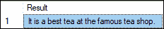
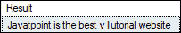
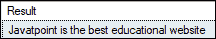
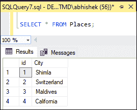
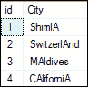
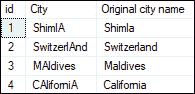

# SQL 服务器替换

> 原文：<https://www.javatpoint.com/sql-server-replace>

名称“replace”定义了它自己，这意味着它用另一个值替换了某些东西。SQL Server 中的 replace 函数用于**用新的给定字符串值替换字符串**的所有出现或字符串(子字符串)的一部分。本文提供了使用 **REPLACE()函数**用一个字符串中的一个新的子字符串替换一个字符串的全部情况的完整概述。

**让我们看看下面解释替换功能**概念的例子。

这里我们来看看一个在线订票系统。假设我们希望顾客能够预订“Shimla”的票，我们将不得不把“T2”目前的城市状态“T3”及其所有事件改为“Shimla”在这种情况下，我们将使用 replace 函数，该函数使我们能够用“Shimla”替换当前城市的每个实例

### REPLACE 函数的语法

我们可以使用以下语法用新字符串替换所提到的输入字符串的所有出现或存在:

```

REPLACE (string_expression , substring , string_replacement);

```

在这个语法中，

**string_rxpression:** 是数据将被替换的输入字符串。它可以是字符或二进制数据类型。

**子串:**是要替换的字符串。如果字符串为空(“”)，则返回时不会改变。

**string_replacement:** 替换旧字符串的是替换字符串值。

#### 注意:我们需要知道替换函数执行的替换是不区分大小写的。

## 返回类型

*   如果输入参数之一是 **nvarchar** 数据类型，该函数返回 nvarchar；否则，它将返回**瓦尔查尔**。

*   如果任何参数为空，则结果为空。

### 支持的版本

替换功能可以支持以下 [SQL Server](https://www.javatpoint.com/sql-server-tutorial) 版本:

SQL Server 2005、SQL Server 2008、SQL Server 2008 R2、SQL Server 2012、SQL Server 2014、SQL Server 2016、SQL Server 2017、SQL Server 2018 和 SQL Server 2019。

**例**

让我们通过一些例子来理解 replace()函数在 SQL Server 中是如何工作的。

**1。使用文字字符串替换功能**

假设我们有一根绳子“这是著名咖啡店最好的咖啡”并且想要将子字符串**“咖啡”**替换为**“茶”**，我们可以使用替换功能将给定字符串中的咖啡替换为茶，如下所示:

```

SELECT 
    REPLACE(
        'It is a best coffee at the famous coffee shop.', 'coffee', 'tea'
    ) AS Result;

```

执行此语句后，我们将获得以下输出:



**2。使用带有替换功能的校对功能**

replace 函数基于输入的排序规则进行比较。我们可以使用 COLLATE 对输入应用显式排序规则，并在该排序规则中执行比较。

以下示例使用**区分大小写的排序规则**函数进行比较，并在替换函数中验证它们:

```

SELECT REPLACE (
  'Javatpoint is the best vTutorial website' COLLATE Latin1_General_CS_AS, 'vtutorial', 'educational' 
) AS Result;

```

执行此语句后，我们将获得以下输出:



输出不会更改输入表达式，因为区分大小写的排序规则无法验证输入模式。

我们将使用与**不区分大小写的排序规则**函数相同的例子进行比较，并在替换函数中验证它们:

```

SELECT REPLACE (
  'Javatpoint is the best vTutorial website' COLLATE Latin1_General_CI_AS, 'vtutorial', 'educational' 
) AS Result;

```

执行此语句后，我们将获得以下输出:



输出显示值是匹配的，因为不区分大小写的排序规则验证输入模式而不考虑大小写。

**3。使用表格列替换功能**

现在，我们将看到 replace()函数如何处理表列。首先，我们将使用以下语句创建一个名为**‘Places’**的表:

```

CREATE TABLE Places (
    id INT PRIMARY KEY,
    City VARCHAR (55) NOT NULL
);

```

接下来，我们将使用 INSERT 语句添加数据:

```

INSERT INTO Places (id, City)
VALUES (1, 'Shimla'),
    (2, 'Switzerland'),
	(3, 'Maldives'),
    (4, 'California');

```

我们将使用 SELECT 语句来验证该表:



假设我们想在**“城市”**列中用**“A”**替换所有出现的字符**“A”**。我们可以通过将下面的语句与 replace 函数一起使用来实现这一点。这里我们还提供了数据值“**城市**”作为**非空**来替换有值的城市列。

```

UPDATE Places SET City = REPLACE(City,'a','A')
WHERE City IS NOT NULL;

```

执行此语句后，我们将获得以下输出:



下面的语句是解释表中替换函数的另一个例子:

```

SELECT *, REPLACE (City,'A','a') AS "Original city name" FROM Places;

```

执行此语句后，我们可以观察到“A”被“A”替换。



* * *