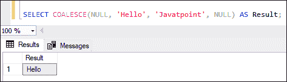
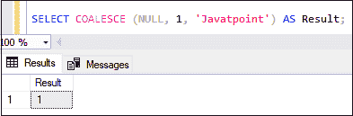
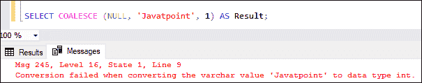
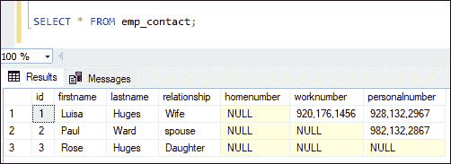
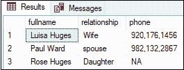

# SQL Server 联合

> 原文：<https://www.javatpoint.com/sql-server-coalesce>

SQL Server 中的聚结()函数计算**序列中的参数，并在指定数量的表达式中给出第一个非空值**。如果它将所有列表值评估为空或未找到任何非空值，它将返回空值。

### 句法

以下是说明 function()函数的语法:

```sql

COALESCE(value1, value2, value3....., valueN); 

```

### 参数说明

该函数只接受一个参数，即具有不同值的列表。

**值 1，值 2，…..，valueN:** 它指定列表的值以返回输出中的**非空或空**值。它可以是任何类型，但对于所有表达式应该是相同的。

**我们可以通过下图**更清楚的了解它:

**案例 1:** 聚结(空，空)；

**案例 2:** 聚结(0，空)；

这里我们可以看到，该函数可以接受许多参数并返回第一个非空值。当列表的所有值都为空时，该函数返回空值。因此，案例 1 和案例 2 总是返回空值，因为它们找不到任何非空值。

### SQL Server 合并示例

让我们用多个例子来理解 COMPETE()函数。请注意，我们可以直接在 SELECT 语句中使用 COMPETE()函数。

**1。以表达式作为字符串数据的聚结函数**

本示例使用具有多个值的聚结函数，并返回字符串**‘Hello’**，因为它是第一个非空表达式:

```sql

SELECT COALESCE(NULL, 'Hello', 'Javatpoint', NULL) AS Result;

```

执行后，我们将看到以下输出:



**2。表达式为数值的聚结函数**

本示例使用具有多个值的聚结函数来计算参数列表，并返回第一个数字**，该数字非空:**

```sql

SELECT COALESCE(NULL, 150, NULL, 250) AS Result;

```

执行后，我们将看到以下输出:


**3。聚结函数总是首先计算一个整数**

本示例使用聚结函数，值为整数，后跟字符表达式，并返回一个整数作为输出:

```sql

SELECT COALESCE (NULL, 1, 'Javatpoint') AS Result;

```

执行后，我们将看到以下输出:



如果我们改变整数和字符串的顺序(先字符串后整数)， [SQL Server](https://www.javatpoint.com/sql-server-tutorial) 会通过一个错误来**。请参见以下输出:**



**4。带有表格的聚结功能**

在这个例子中，我们将看到如何联合()函数来处理这个表。首先，我们将使用以下语句创建一个名为**‘EMP _ contacts’**的表:

```sql

CREATE TABLE emp_contact  (
    id int,
    firstname   VARCHAR(50) NOT NULL,
    lastname    VARCHAR(50) NOT NULL,
    relationship VARCHAR(60),
    homenumber   VARCHAR(25),
    worknumber   VARCHAR(25),
    personalnumber   VARCHAR(25)
  );

```

接下来，我们将如下所示向该表中添加数据:

```sql

INSERT INTO emp_contact (id, firstname, lastname, relationship, homenumber, worknumber, personalnumber)
VALUES (1, 'Luisa', 'Huges', 'Wife', NULL, '920,176,1456', '928,132,2967'),
(2, 'Paul', 'Ward', 'spouse', NULL, NULL, '982,132,2867'),
(3, 'Rose', 'Huges', 'Daughter', NULL, NULL, NULL)

```

我们可以使用下面的 SELECT 语句来验证该表:



现在，我们将使用联合功能选择列**家庭号码、工作号码、**和**个人号码**。如果列中有空值，它将返回值' **NA'** (不适用)。请参见下面的代码:

```sql

SELECT firstname+' '+lastname AS fullname, relationship,
  COALESCE(homenumber, worknumber, personalnumber, 'NA') AS phone
FROM emp_contact

```

执行后，我们将看到以下输出:


## 联合和案例表达

聚结函数用作 CASE 表达式的语法快捷方式。查询优化器将在 CASE 表达式中编写如下的聚结(表达式):

```sql

CASE  
 WHEN (exp1 IS NOT NULL) THEN exp1  
 WHEN (exp2 IS NOT NULL) THEN exp2  
 ? 
 ?
 ELSE expN  
END

```

让我们举一个前面的凝聚函数的例子，它从 **emp_contact** 表中选择 homenumber、worknumber 和 personalnumber 列。如果列有空值，它将返回值“不适用”。我们可以在 CASE 表达式中编写这个合并函数，如下所示:

```sql

SELECT firstname+ ' ' +lastname AS fullname, relationship,
  CASE 
	WHEN homenumber is NOT NULL THEN homenumber
	WHEN worknumber is NOT NULL THEN worknumber
	WHEN personalnumber is NOT NULL THEN personalnumber
   ELSE 'NA'
   END
   phone
FROM emp_contact 

```

执行后，我们将获得与使用联合函数相同的输出:



## 聚结与 ISNULL

我们经常会混淆 ISNULL 函数和聚结表达式之间的区别，因为两者具有相似的目的，但行为可能不同。下面讨论的一些主要差异:

*   函数的作用是:依次计算参数，并从给定的列表中返回第一个非空值。相反，ISNULL()函数测试输入表达式是否为空。如果表达式为空，则返回传递给参数列表的值；否则返回表达式。
*   聚结()函数可以多次计算输入值，而 ISNULL()函数只能计算一次。
*   聚结()函数的工作原理与 CASE 表达式规则相同，返回优先级最高的值的数据类型，而 ISNULL 返回第一个参数的数据类型。
*   ISNULL 和聚结函数返回结果表达式的不同可空性**。因此，表达式**为空(空，1)** 和**聚结(空，1)** 相等，但给出不同的可空性。下面的例子解释得更清楚:**

```sql

CREATE TABLE #DemoTable1   
(   
  column1 INTEGER NULL,   
  column2 AS COALESCE(col1, 0) PRIMARY KEY,   
  column3 AS ISNULL(col1, 0)   
);   

CREATE TABLE #DemoTable2 
(   
  column1 INTEGER NULL,   
  column2 AS COALESCE(col1, 0),   
  column3 AS ISNULL(col1, 0) PRIMARY KEY   
);

```

由于**主键**不允许空值，并且**列**的聚结表达式的可空性可以返回空值，因此无法创建 **#DempTable1** 。

可以创建 **#DempTable2** ，因为 ISNULL 函数的可空性评估为非空。

*   聚结()函数可以接受可变数量的参数，而 ISNULL()函数只接受两个参数。

* * *****