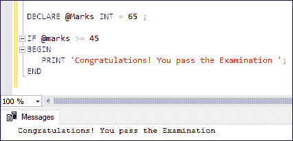
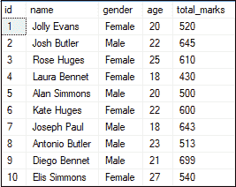
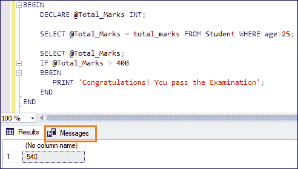
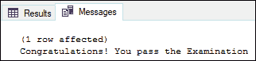
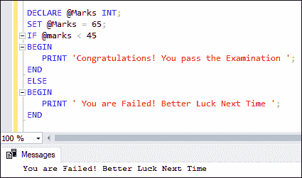
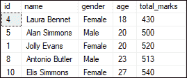
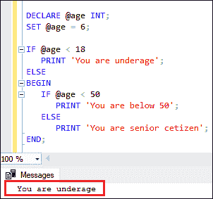

# 如果没有的话

> 原文：<https://www.javatpoint.com/sql-server-if-else>

IF 语句是 SQL Server 中控制流函数的一部分。通常，**是各种编程语言中的决策语句，根据给定的条件**返回值。当给定条件评估为真时，此语句执行在 IF 块中编写的代码，当条件评估为假时，将执行 ELSE 语句。

## 综合框架声明

以下是说明该语句在 [SQL Server](https://www.javatpoint.com/sql-server-tutorial) 中使用的语法:

```

IF boolean_expression   
 BEGIN
     { statement_block }
 END

```

在上面的语法中， **BEGIN 中的**语句块**...当**布尔表达式**满足条件时，执行结束**块。否则跳过该块，程序控制移到 **END** 关键字后的语句。我们应该知道，如果表达式包含 **SELECT** 语句，我们需要**将它们括在括号**中。

### 例子

让我们看看这个例子来理解不带 ELSE 块的 IF 语句。以下示例将显示满足条件时的结果。否则，程序控制移动到 END 关键字之后的语句(如果有)。

```

DECLARE @Marks INT = 65 ;

IF @marks >= 45
BEGIN
   PRINT 'Congratulations! You pass the Examination';
END

```

执行该语句将产生以下输出:



现在，我们将在下面的“**学生”**表格中演示它，该表格具有以下数据:



下面是另一个示例，该示例从样本数据库中的“**学生”**表中获取所选学生的**总分**，如果大于 400 ，则打印一条**消息**。

```

BEGIN
	DECLARE @Total_Marks INT;

	SELECT @Total_Marks = total_marks FROM Student WHERE age>25;

	SELECT @Total_Marks;

	IF @Total_Marks > 400
	BEGIN
	   PRINT 'Congratulations! You pass the Examination';
	END
END

```

我们将获得以下输出:



如果我们想看到上面的输出消息，我们应该点击**消息**选项卡:



## IF-ELSE 语句

在现实场景中，只要 IF 语句中的条件为真或假，我们就需要执行一些操作。在这种情况下，IF…ELSE 语句是有用的。当 IF 子句中的条件被评估为 FALSE 时，该语句执行 ELSE 语句块。

**以下是说明在 SQL Server** 中使用 IF ELSE 语句的语法:

```

IF expression
 BEGIN
     Statement block -- It executes when the IF clause expression is TRUE.
 END
ELSE
 BEGIN
    Statement block -- It executes when the IF clause expression is FALSE.
 END

```

### 例子

让我们看一下用 ELSE 块理解 IF 语句的例子。以下示例将显示消息“**恭喜！当满足中频条件时，您通过了**考试。否则，显示“**你是失败的！下次好运**”。

```

DECLARE @Marks INT;
SET @Marks = 65;
IF @marks < 45
BEGIN
   PRINT 'Congratulations! You pass the Examination';
END
ELSE
BEGIN
   PRINT 'You are Failed! Better Luck Next Time';
END

```

执行该语句将得到下面的输出。这里**标记**变量为 **65** ，不满足**条件(65 < 45)** 。因此，将显示 ELSE 块中的消息:



我们会得到这个输出，因为满足条件 **(65 > 45)** 。因此，将显示中频模块中的信息:


现在，我们将在上面的“**学生”**表中演示 IF ELSE 语句。在本例中，我们将如下检查学生**总成绩**是否大于等于**400**:

*   当条件为真时，我们将获得总分大于或等于 550 的学生记录。
*   如果条件为 FALSE，我们将获得总分低于 550 的学生记录。

程序如下:

```

DECLARE @Marks INT;
SET @Marks = 600 ;

IF @Marks >= 550
BEGIN
  SELECT id, name, gender, age, total_marks
  FROM Student WHERE total_marks >= 550
  ORDER BY age ASC
END
ELSE
BEGIN
  SELECT id, name, gender, age, total_marks
  FROM Student WHERE total_marks < 550
  ORDER BY age ASC
END

```

在本代码中，我们将 **@Marks** 变量指定为 **600** ，满足条件(600 > = 550)。因此，我们将获得显示总分大于或等于 550 的学生记录的输出。


如果我们将 **@Marks** 变量改为 **500** ，条件(500 > = 550)变为假。因此，我们将获得显示总分小于 550 的学生记录的输出。



## 嵌套的 IF ELSE 语句

与其他编程语言不同，我们可以嵌套一个 IF...另一个 IF 中的 ELSE 语句...SQL Server 中的 ELSE 语句。让我们用下面的例子来演示一下:

```

DECLARE @age INT;
SET @age = 6;

IF @age < 18
   PRINT 'You are underage';
ELSE
BEGIN
   IF @age < 50
      PRINT 'You are below 50';
   ELSE
      PRINT 'You are senior cetizen';
END;

```

在本例中，我们将检查**年龄是未成年人、50 岁以下还是老年人**，如下所示:

*   如果**@年龄**变量的值低于 **18** ，则会打印此人是**未成年**。
*   如果条件为假，将执行包含嵌套 IF…ELSE 的 ELSE 部分。
*   如果 **@age** 变量的值在 **50** 以下，则打印**在 50** 以下。最后如果不满足条件，打印**老年公民**。

结果如下:



本文全面概述了如何使用 SQL Server IF ELSE 语句。在这里我们学到了:

*   变量是用作占位符的对象。
*   关键字 BEGIN 将用于启动语句块，而 END 关键字必须用于关闭语句块。
*   否则在 IF 中的使用...ELSE 语句是可选的。
*   也有可能嵌套一个 IF...另一个 IF 中的 ELSE 语句...ELSE 语句。然而，将一个 IF 语句嵌套在另一个语句中是不好的做法，因为这会使代码难以阅读和维护。

* * *