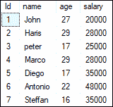
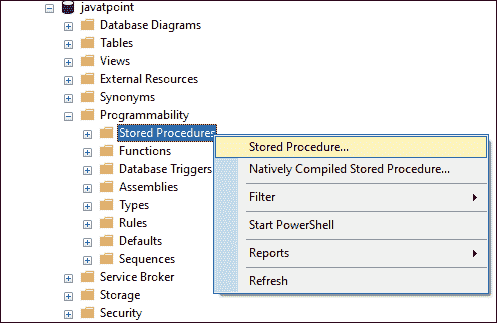
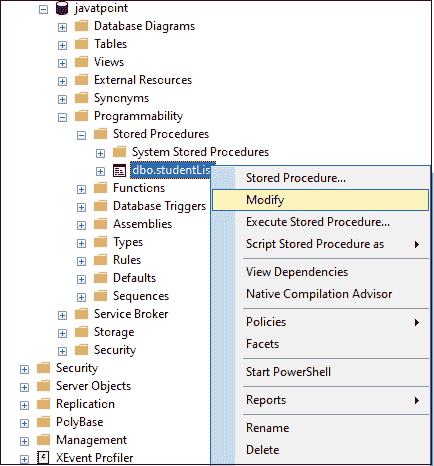
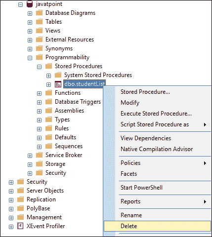
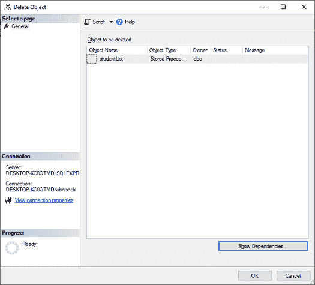
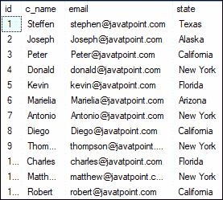
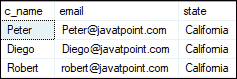

# SQL Server 中的存储过程

> 原文：<https://www.javatpoint.com/stored-procedure-in-sql-server>

存储过程是一组由一个或多个预编译的 SQL 语句组成的逻辑单元。它作为一个对象存储在数据库服务器中。它是在数据库中创建和存储的通用计算语言的子程序。SQL Server 中的每个过程总是**包含一个名称、参数列表和 Transact-SQL 语句**。SQL 数据库服务器将存储过程存储为**命名对象**。我们可以通过使用触发器、其他过程和应用程序来调用过程，如 [Java](https://www.javatpoint.com/java-tutorial) 、 [Python](https://www.javatpoint.com/python-tutorial) 、 [PHP](https://www.javatpoint.com/php-tutorial) 等。它可以支持几乎所有的关系数据库系统。

[SQL Server](https://www.javatpoint.com/sql-server-tutorial) 在第一次调用存储过程时构建执行计划，并将其存储在缓存中。该计划由 SQL Server 在存储过程的后续执行中重用，使其能够快速有效地运行。

## SQL Server 中存储过程的特性

以下是 sql server 中存储持久性的功能:

*   **流量减少:**存储过程减少了应用程序和数据库服务器之间的网络流量，从而提高了性能。这是因为应用程序只需要发送存储过程的名称及其参数，而不是发送几条 [SQL](https://www.javatpoint.com/sql-tutorial) 语句。
*   **更强的安全性:**程序总是安全的，因为它管理我们可以执行哪些流程和活动。它消除了在数据库对象级别授予权限的需要，并简化了安全层。
*   **可重用:**存储过程是可重用的。它减少了代码的不一致性，防止了对相同代码的不必要的重写，并使代码对所有应用程序或用户透明。
*   **易于维护:**无需重启或部署应用程序，程序更易于维护。
*   **提高性能:**存储过程提高应用程序性能。一旦我们创建了存储过程并第一次编译它们，它就会创建一个执行计划，供后续执行重用。该过程通常处理得更快，因为查询处理器不必创建新计划。

## 存储过程的类型

SQL Server 主要将存储过程分为两种类型:

1.  用户定义的存储过程
2.  系统存储过程

### 用户定义的存储过程

**数据库开发人员或数据库管理员构建用户定义的存储过程**。这些过程提供一个或多个 SQL 语句，用于从数据库表中选择、更新或删除数据。用户指定的存储过程接受输入参数并返回输出参数。DDL 和 DML 命令在用户定义的过程中一起使用。

**我们可以进一步把这个程序分为两种:**

*   **T-SQL 存储过程:** Transact-SQL 过程是最流行的 SQL Server 过程类型之一。它接受参数并返回它们。这些过程处理带或不带参数的 INSERT、UPDATE 和 DELETE 语句，并输出行数据。
*   **CLR 存储过程:**SQL Server 过程是一组 SQL 命令，CLR 表示公共语言运行库。CLR 存储过程由 CLR 和存储过程组成，存储过程是用基于 CLR 的语言编写的，如 based 或 C#。CLR 程序是。在 SQL Server 数据库内存中运行的. Net 对象。

### 系统存储过程

服务器的管理任务主要依赖于系统存储过程。安装 SQL Server 时，它会创建系统过程。系统存储过程防止管理员直接查询或修改系统和数据库目录表。开发人员经常忽略系统存储过程。

## SQL Server 存储过程语法

以下是在 SQL Server 中创建存储过程的基本语法:

```

CREATE PROCEDURE [schema_name].procedure_name
                @parameter_name data_type, 
                .... 
                parameter_name data_type
AS
   BEGIN
      -- SQL statements
      -- SELECT, INSERT, UPDATE, or DELETE statement
   END

```

### 参数说明

存储过程语法具有以下参数:

**Schema_name:** 它是您的数据库或模式的名称。默认情况下，一个过程与当前数据库相关联，但是我们也可以通过指定数据库名称将其创建到另一个数据库中。

**Procedure_Name:** 它代表您的存储过程的名称，这些名称应该是有意义的名称，以便您可以快速识别它们。它不能是系统保留的关键字。

**参数 _ 名称:**表示参数个数。根据用户要求，它可以为零或更多。我们必须确保使用了适当的数据类型。**例如**、@姓名 VARCHAR(50)。

### 在存储过程中设置无计数

在某些情况下，我们在存储过程中使用 SET NOCOUNT ON 语句。此语句阻止显示显示受 SQL 查询影响的行数的消息。NOCOUNT 表示计数已关闭。这意味着，如果将“设置无计数开”设置为“开”，则不会出现任何消息来指示受影响的行数。

## 如何执行/调用存储过程？

我们可以使用 **EXEC 命令**来调用/执行 SQL Server 中的存储过程。以下语法说明了存储过程的执行:

```

EXEC procedure_name;
Or,
EXECUTE procedure_name;

```

如果我们使用 SSMS，我们需要使用以下步骤来执行存储过程:

1.  导航至**可编程性** - > **存储过程**。
2.  接下来，选择存储过程菜单并展开它。您将看到可用的存储过程。
3.  右键单击要执行的存储过程，选择**执行** **存储** **过程**
4.  将出现“执行程序”窗口。如果程序有任何参数，我们必须在点击**确定**执行之前分配/传递它们。如果未定义参数，请单击“确定”运行该过程。

## 存储过程简单示例

我们可以通过两种方式在 SQL Server 中创建存储过程:

*   使用测试-SQL 查询
*   使用 SQL Server 管理工作室

我们将以一个**学生表**来演示存储过程示例。此表包含以下数据:



下面的示例使用 **CREATE PROCEDURE SQL 语句**来创建一个存储过程，该存储过程从所选数据库中的 student 表以工资递增的顺序显示学生列表:

```

CREATE PROCEDURE studentList
AS
BEGIN
    SELECT name, age, salary
    FROM STUDENT
    ORDER BY salary;
END; 

```

在这个语法中， **studentList** 是存储过程的名称， **AS** 关键字区分存储过程的标题和正文。存储过程中单个语句附带的 **BEGIN** 和 **END** 关键字是可选的。然而，包含它们是一个好主意，可以使代码更容易理解。

当我们运行这个语句，一切正常时，会出现如下消息:“**命令成功完成**”它表示存储过程已成功编译并保存到数据库系统。

我们可以使用下面的命令来执行这个过程:

```

EXEC studentList;

```

它将返回如下输出:


**如果我们正在使用 SSMS，请使用以下步骤创建存储过程:**

**步骤 1:** 选择数据库- >可编程- >存储过程。


**步骤 2:** 右键单击存储过程文件夹打开菜单，然后选择新建- >存储过程选项，如下所示:



**步骤 3:** 当我们选择新建存储过程选项时，我们将获得包含默认存储过程模板的新查询窗口。在这里，我们可以添加过程名、参数(如果有的话)以及我们想要使用的 SQL 查询。

## 如何在 SQL Server 中重命名存储过程？

SQL Server 不允许我们更改存储过程的名称。因为重命名存储过程不会修改 **sys.sql_modules** 中相应对象的名称。因此，如果我们需要更改现有的存储过程，只需删除并用新的名称重新创建它。

## 如何在 SQL Server 中修改存储过程？

我们需要在一段时间内更新或修改存储过程。SQL Server 允许我们以两种方式更新或修改现有存储过程:

*   使用测试-SQL 查询
*   使用 SQL Server 管理工作室

### 使用 SSMS 修改存储过程

以下步骤有助于了解如何修改或更改存储过程:

**步骤 1:** 导航到数据库- >可编程性- >存储过程。

**步骤 2:** 展开存储过程文件夹，右键单击要修改的存储过程，然后选择修改选项，如下所示:



**第三步:**一旦我们点击修改选项，我们将获得一个自动生成的**变更程序**代码的新查询窗口。在这里我们可以根据自己的需要做出改变。

### 使用 T-SQL 查询修改存储过程

SQL Server 提供了一个 ALTER PROCEDURE 语句来修改现有的存储过程。如果我们想要修改上面创建的存储过程，我们可以编写如下的 ALTER PROCEDURE 语句:

```

ALTER PROCEDURE [dbo].[studentList]
AS
BEGIN
    SET NOCOUNT ON;
    SELECT name, salary
    FROM STUDENT
    ORDER BY salary;
END; 

```

让我们运行程序来检查我们是否成功更新了**学生列表**程序。使用 EXECUTE 语句，我们将获得下面的输出，在这里我们可以看到我们的存储过程被成功修改。


## 如何列出 SQL Server 中的所有存储过程？

当我们有几个程序时，列出所有程序是非常重要的。因为在许多数据库中，有时过程名是相同的。在这种情况下，这个查询非常有用。我们可以列出当前数据库中的所有存储过程，如下所示:

```

SELECT * FROM sys.procedures;

```

在数据库中列出所有用户定义的存储过程的最佳方式是使用如下的**例程**信息模式视图:

```

SELECT ROUTINE_SCHEMA, ROUTINE_NAME
FROM INFORMATION_SCHEMA.ROUTINES
WHERE ROUTINE_TYPE = 'PROCEDURE';

```

或者，

```

SELECT * 
 FROM db_name.INFORMATION_SCHEMA.ROUTINES
 WHERE ROUTINE_TYPE = 'PROCEDURE'

```

返回存储过程列表的另一种方法是查询 **sys.objects** 系统目录视图。

```

SELECT 
  SCHEMA_NAME(schema_id) AS [Schema],
  name
FROM sys.objects
WHERE type = 'P';

```

## 如何删除/删除 SQL Server 中的存储过程？

我们可以永久删除 SQL Server 中的存储过程。SQL Server 通过两种方式删除存储过程:

*   使用测试-SQL 查询
*   使用 SQL Server 管理工作室

### 使用 SSMS 删除存储过程

以下步骤有助于了解如何删除存储过程:

**步骤 1:** 转到数据库- >可编程性- >存储过程。

**步骤 2:** 展开存储过程文件夹，右键单击要删除的存储过程，然后选择删除选项，如下所示:



**第三步:**一旦我们点击删除选项，我们将得到一个删除对象窗口。我们可以通过单击“显示依赖项”按钮来检查依赖项，然后单击“确定”来删除存储过程。



### 使用 T-SQL 查询删除存储过程

SQL Server 提供了一个删除过程语句来删除现有的存储过程。我们可以按如下方式编写 DROP PROCEDURE 语句:

```

IF OBJECT_ID ('procedure_name', 'P') IS NOT NULL   
    DROP PROCEDURE procedure_name;  

```

#### 注意:最好使用 IF 对象标识(“过程名”，“P”)不为空来查看数据库中是否存在该存储过程。

## 存储过程中的输入参数

SQL Server 允许我们创建输入参数存储过程。这种类型的存储过程可以让我们传递一个或多个参数来获得过滤后的结果。让我们借助一个例子来理解它。考虑以下“**客户”**表:



下面的语句创建一个带有输入参数的存储过程:

```

CREATE PROCEDURE getEmployeeDetails (@States VARCHAR(50))
AS
BEGIN
  SET NOCOUNT ON;
  SELECT c_name, email, state
  FROM customer
  WHERE state = @States
END

```

如果我们想执行这个存储过程，我们需要传递 **@States** 参数的值。我们可以通过以下任何方式传递参数值:

```

EXEC [dbo].[getEmployeeDetails] 'California';

--OR we can write

EXEC [dbo].[getEmployeeDetails] @States = 'New York';

```

我们将获得如下输出:




## 存储过程中的输出参数

SQL Server 使我们能够在存储过程中提供许多输出参数。这些输出参数可以是任何有效的数据类型，如整数、日期或字符。我们可以使用以下语法在存储过程中创建一个输出参数:

```

parameter_name data_type OUTPUT

```

借助一个示例，让我们了解如何在存储过程中使用输出参数。下面的语句将创建一个名为 **countStudent** 的过程，其中我们将声明一个名为 **@StudentCount** 的整数类型变量，并使用 **OUTPUT** 关键字。该过程使用 **COUNT** 函数来查找 STUDENT 表中的学生人数，然后将该值分配给输出参数。

```

CREATE PROCEDURE countStudent (@StudentCount INT OUTPUT)
AS
BEGIN
    SELECT @StudentCount = COUNT(Id)FROM STUDENT;
END;

```

现在，我们将执行存储过程。这里我们需要传递输出参数**@ studentcouns**如下:

```

-- Declare an Int Variable that corresponds to the Output parameter in SP
DECLARE	@TotalStudents INT 

-- Don't forget to use the keyword OUTPUT
EXEC  [dbo].[countStudent] @TotalStudents OUTPUT

-- Print the result
PRINT @TotalStudents 

```

我们将获得以下输出:


## 临时存储过程

我们可以像创建临时表一样创建临时过程。tempdb 数据库用于创建这些过程。我们可以将临时过程分为两种类型:

*   本地临时存储过程
*   全球临时程序。

**本地临时存储过程:**我们可以使用#作为前缀创建这种类型的过程，并且只能在创建它们的会话中访问。当连接关闭时，该过程会立即终止。

下面是一个如何创建本地临时过程的示例:

```

CREATE PROCEDURE #Temp
AS
BEGIN
PRINT 'Local temp procedure'
END

```

**全局临时存储过程:**我们可以通过使用##作为前缀来创建这种类型的过程，并且可以从任何会话中访问。当用于创建过程的连接关闭时，该过程将自动终止。

以下是如何创建全局临时过程的示例:

```

CREATE PROCEDURE ##TEMP
AS
BEGIN
PRINT 'Global temp procedure'
END

```

## 存储过程的缺点

以下是 SQL Server 中存储过程的限制:

**调试:**由于调试存储过程从来都不简单，所以不建议使用它们编写和执行复杂的业务逻辑。因此，如果我们处理不当，就会导致失败。

**依赖关系:**众所周知，专业的数据库管理员和数据库开发人员在大型组织中处理大量的数据集。应用程序开发人员必须依赖它们，因为任何微小的更改都必须提交给数据库管理员，他们可以修复现有过程中的错误或构建新的过程。

**昂贵:**就数据库管理员而言，存储过程的管理成本很高，因为组织必须为专业数据库管理员支付额外的成本。数据库管理员更有资格处理复杂的数据库过程。

**特定于供应商:**在一个平台上编写的存储过程不能在另一个平台上运行。由于用 Oracle 编写的过程更加复杂，我们需要为 SQL Server 重写整个过程。

* * *