# SQL Server 中的触发器

> 原文：<https://www.javatpoint.com/triggers-in-sql-server>

触发器是驻留在系统内存中的一组具有唯一名称的 SQL 语句。它是存储过程的一个专门类别，在数据库服务器事件发生时自动调用。每个触发器总是与一个表相关联。

一个**触发器被称为特殊过程**，因为它不能像存储过程一样被直接调用。触发器和过程之间的主要区别在于，当对表发生数据修改事件时，会自动调用触发器。另一方面，存储过程必须直接调用。

以下是区分触发器和存储过程的主要特征:

*   我们不能手动执行/调用触发器。
*   触发器没有机会接收参数。
*   事务不能在触发器内提交或回滚。

## 触发器的语法

我们可以在 [SQL Server](https://www.javatpoint.com/sql-server-tutorial) 中使用 **CREATE TRIGGER** 语句创建一个触发器，如下所示:

```sql

CREATE TRIGGER schema.trigger_name
ON table_name
AFTER  {INSERT, UPDATE, DELETE}
[NOT FOR REPLICATION]
AS
{SQL_Statements}

```

该语法的参数描述如下所示:

**模式:**这是一个可选参数，用于定义新触发器属于哪个模式。

**trigger_name:** 是定义新触发器名称的必选参数。

**表名:**是定义触发器适用的表名的必选参数。在表名的旁边，我们需要写 AFTER 子句，其中可以列出任何事件，如 INSERT、UPDATE 或 DELETE。

**不用于复制:**该选项告知 [SQL](https://www.javatpoint.com/sql-tutorial) 服务器在复制过程中修改数据时不执行触发器。

**SQL_Statements:** 它包含一个或多个 SQL 语句，用于响应发生的事件执行操作。

### 当我们使用触发器时。

当我们需要在某些期望的场景中自动执行一些事件时，触发器会很有帮助。**例如**，我们有一个不断变化的表，需要知道变化的发生以及这些变化发生的时间。如果主表在这种情况下做了任何更改，我们可以创建一个触发器，将所需的数据插入到一个单独的表中。

## SQL Server 中的触发器示例

让我们了解如何在 SQL Server 中使用触发器。我们可以这样做，首先使用下面的语句创建一个名为“**Employee”**的表:

```sql

CREATE TABLE Employee
(
  Id INT PRIMARY KEY,
  Name VARCHAR(45),
  Salary INT,
  Gender VARCHAR(12),
  DepartmentId INT
)

```

接下来，我们将在该表中插入一些记录，如下所示:

```sql

INSERT INTO Employee VALUES (1,'Steffan', 82000, 'Male', 3),
(2,'Amelie', 52000, 'Female', 2),
(3,'Antonio', 25000, 'male', 1),
(4,'Marco', 47000, 'Male', 2),
(5,'Eliana', 46000, 'Female', 3)

```

我们可以使用 SELECT 语句来验证插入操作。我们将获得以下输出:

```sql

SELECT * FROM Employee;

```

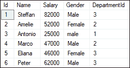

我们还将创建另一个名为“**Employee _ Audit _ Test”**的表，以自动存储每个操作的事务记录，如 Employee 表中的 INSERT、UPDATE 或 DELETE:

```sql

CREATE TABLE Employee_Audit_Test
(  
Id int IDENTITY, 
Audit_Action text 
)

```

现在，我们将**创建一个触发器，将 Employee 表中每个插入操作**的事务记录存储到 Employee_Audit_Test 表中。这里我们将使用下面的语句创建插入触发器:

```sql

CREATE TRIGGER trInsertEmployee 
ON Employee
FOR INSERT
AS
BEGIN
  Declare @Id int
  SELECT @Id = Id from inserted
  INSERT INTO Employee_Audit_Test
  VALUES ('New employee with Id = ' + CAST(@Id AS VARCHAR(10)) + ' is added at ' + CAST(Getdate() AS VARCHAR(22)))
END

```

创建触发器后，我们将尝试向表中添加以下记录:

```sql

INSERT INTO Employee VALUES (6,'Peter', 62000, 'Male', 3)

```

如果没有发现错误，执行 SELECT 语句检查审计记录。我们将获得如下输出:

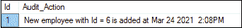

我们将**创建另一个触发器，将 Employee 表中每个删除操作**的事务记录存储到 Employee_Audit_Test 表中。我们可以使用下面的语句创建删除触发器:

```sql

CREATE TRIGGER trDeleteEmployee 
ON Employee
FOR DELETE
AS
BEGIN
  Declare @Id int
  SELECT @Id = Id from deleted
  INSERT INTO Employee_Audit_Test
  VALUES ('An existing employee with Id = ' + CAST(@Id AS VARCHAR(10)) + ' is deleted at ' + CAST(Getdate() AS VARCHAR(22)))
END

```

创建触发器后，我们将从员工表中删除一条记录:

```sql

DELETE FROM Employee WHERE Id = 2;

```

如果没有发现错误，它会给出如下消息:

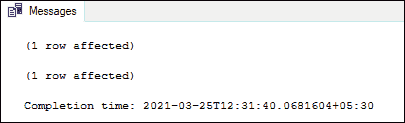

最后，执行 SELECT 语句来检查审计记录:

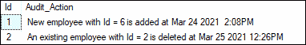

在这两个触发器代码中，您会注意到以下几行:

```sql

SELECT @Id = Id from inserted
SELECT @Id = Id from deleted

```

这里插入和删除的是 SQL Server 使用的特殊表。当您在实际表格中插入新行时，插入的表格会保留该行的副本。并且删除的表保留了您刚刚从实际表中删除的行的副本。

## SQL Server 触发器的类型

我们可以将 SQL Server 中的触发器分为三种类型:

1.  数据定义语言触发器
2.  数据操作语言触发器
3.  登录触发器

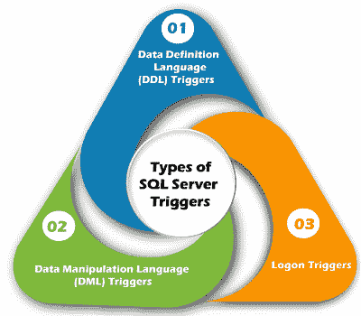

### ddl 触发器

DDL 触发器是为了响应 DDL 事件而触发的，例如 CREATE、ALTER 和 DROP 语句。根据 DDL 事件的类型，我们可以在数据库级别或服务器级别创建这些触发器。它也可以响应某些执行类似 DDL 操作的系统定义存储过程而执行。

**DDL 触发器在以下场景中很有用:**

*   当我们需要防止数据库模式改变时
*   当我们需要审核数据库模式中所做的更改时
*   当我们需要响应数据库模式中的更改时

### dml 触发器

DML 触发器是为了响应用户表或视图中的 INSERT、UPDATE 和 DELETE 语句等 DML 事件而触发的。它也可以响应由系统定义的存储过程执行的类似于 DML 的操作来执行。

**DML 触发器可分为两种类型:**

*   触发后
*   而不是触发器

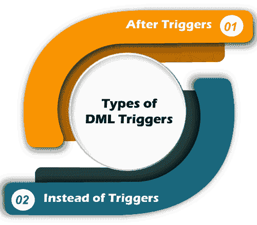

### 触发后

触发器触发后，当 SQL Server 成功完成触发操作时，即触发了它。通常，该触发器在表完成插入、更新或删除操作时执行。视图中不支持它。有时它被称为 FOR 触发器。

**我们可以将这个触发器进一步分为三种类型:**

1.  插入触发器后
2.  更新触发后
3.  删除触发器后

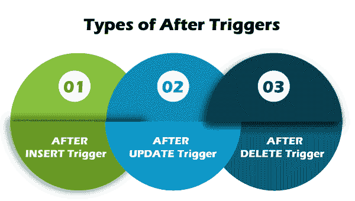

**示例:**当我们向表中插入数据时，在该行通过所有约束(如主键约束)之前，与该表上的插入操作相关联的触发器不会触发。当数据插入失败时，SQL Server 无法触发 AFTER 触发器。

**以下是 SQL Server 中后触发器语法的说明:**

```sql

CREATE TRIGGER schema_name.trigger_name
ON table_name
AFTER {INSERT | UPDATE | DELETE}
AS
   BEGIN
      -- Trigger Statements
      -- Insert, Update, Or Delete Statements
   END

```

### 而不是触发器

而不是在 SQL Server 开始执行触发触发器的触发操作之前触发触发器。这意味着在触发器运行之前不需要条件约束检查。因此，即使约束检查失败，该触发器也会触发。它与 AFTER 触发器相反。我们可以在成功执行但不包含表的实际插入、更新或删除操作的表上创建 INSTEAD OF 触发器。

**我们可以将这个触发器进一步分为三种类型:**

1.  代替插入触发器
2.  而不是更新触发器
3.  而不是删除触发器

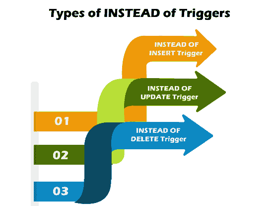

**示例:**当我们向表中插入数据时，与该表上的插入操作相关联的触发器将在数据通过所有约束(如主键约束)之前触发。如果数据插入失败，SQL Server 还会触发“替代触发器”。

**以下是 SQL Server 中的替代触发器语法示例:**

```sql

CREATE TRIGGER schema_name.trigger_name
ON table_name
INSTEAD OF {INSERT | UPDATE | DELETE}
AS
   BEGIN
      -- trigger statements
      -- Insert, Update, or Delete commands
   END

```

### 登录触发器

登录触发器是响应**登录事件**而触发的。当使用 SQL Server 实例生成用户会话时，会发生 LOGON 事件，这是在日志记录的身份验证过程完成之后但在建立用户会话之前进行的。因此，SQL Server 错误日志将显示触发器创建的所有消息，包括错误消息和 PRINT 语句消息。如果身份验证失败，登录触发器不会执行。这些触发器可用于审核和控制服务器会话，例如跟踪登录活动或限制特定登录的会话数量。

## 如何在 SQL Server 中显示触发器？

当我们有许多带有多个表的数据库时，show 或 list 触发器就派上了用场。当多个数据库中的表名相同时，这个查询非常有用。使用以下命令，我们可以看到 SQL Server 中所有可用触发器的列表:

```sql

SELECT name, is_instead_of_trigger
FROM sys.triggers  
WHERE type = 'TR';

```

如果我们使用的是 **SQL Server 管理工作室**，那么在任何特定的表中显示或列出所有可用的触发器都是非常容易的。我们可以通过以下步骤做到这一点:

*   进入**数据库**菜单，选择需要的数据库，然后展开。
*   选择**表格**菜单并展开。
*   选择任何特定的表并展开它。

我们将在这里得到各种选择。当我们选择**触发器**选项时，它会显示该表中所有可用的触发器。

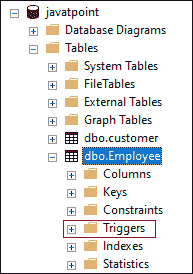

## 如何在 SQL Server 中更新触发器？

存储在表中的数据可以在一段时间内更改。在这种情况下，我们还需要更改触发器。我们可以通过两种方式在 SQL Server 中实现这一点。第一个是使用 SQL Server 管理工作室，第二个是 Transact-SQL 查询。

### 使用 SSMS 修改触发器

首先，打开管理工作室修改触发器。接下来，转到数据库，然后转到存储触发器的表。现在，右键单击要更改或更新的触发器。它将打开上下文菜单，您将在其中选择**修改**选项:

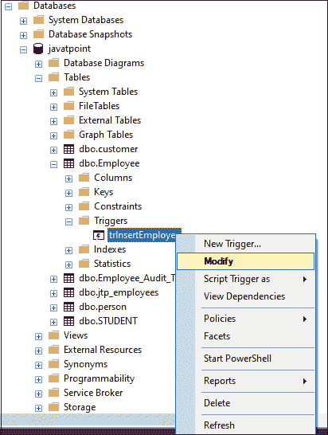

当您选择“修改”选项时，您将看到一个带有自动生成的 ALTER TRIGGER 代码的新查询窗口。我们可以根据需要改变它。

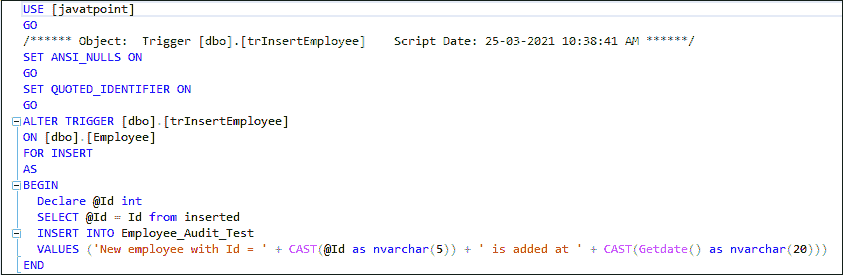

### 使用 SQL 命令修改触发器

我们可以使用 **ALTER TRIGGER** 语句来修改 MS SQL 中的触发器。下面的语句允许我们修改触发器:

```sql

ALTER TRIGGER [dbo].[triggers_in_sql] 
   ON  [dbo].[EmployeeTable] 
   AFTER INSERT
AS 
BEGIN
 -- Modify as per your needs
END 

```

## 如何在 SQL Server 中删除触发器？

我们可以使用 **DROP TRIGGER** 语句删除 SQL Server 中的现有触发器。从桌子上取下扳机时，我们必须非常小心。因为一旦我们删除了触发器，它就无法恢复。如果找不到触发器，DROP TRIGGER 语句将引发错误。

**以下语法删除了 DML 触发器:**

```sql

DROP TRIGGER [IF EXISTS] schema_name.trigger_name;

```

如果我们想一次删除多个触发器，我们必须使用逗号运算符分隔触发器:

```sql

DROP TRIGGER schema_name.trigger_name1, trigger_name2.....n;

```

我们可以使用下面格式的 DROP TRIGGER 语句来删除一个或多个 LOGON 触发器:

```sql

DROP TRIGGER [ IF EXISTS ] trigger_name1, trigger_name2.....n
ON { DATABASE | ALL SERVER };

```

我们可以使用下面格式的 DROP TRIGGER 语句来删除一个或多个 DDL 触发器:

```sql

DROP TRIGGER [ IF EXISTS ] trigger_name1, trigger_name2.....n  
ON ALL SERVER;

```

如果我们使用的是 SQL Server Management Studio，那么从表中删除触发器将变得非常容易。我们可以通过以下步骤做到这一点:

*   转到**数据库** - > **表格**菜单并展开它。
*   选择任何特定的表格，将其展开，然后选择**触发器**选项

此选项显示此表中所有可用的触发器。现在，右键单击您想要移除的任何特定触发器，并从下拉菜单中选择**删除**选项。

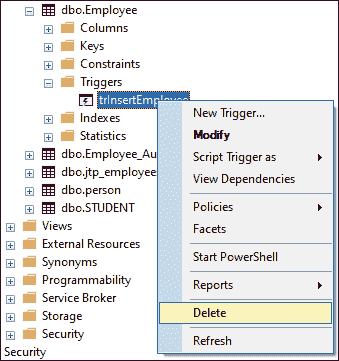

## 触发器的优势

以下是在 SQL Server 中使用触发器的优点:

*   触发器设置数据库对象规则，如果任何更改不满足这些规则，则回滚。触发器将检查数据，并在必要时进行更改。
*   触发器帮助我们加强数据完整性。
*   触发器帮助我们在插入或更新之前验证数据。
*   触发器帮助我们记录日志。
*   触发器提高了 SQL 查询的性能，因为它们不需要在每次执行时进行编译。
*   触发器减少了客户端代码，从而节省了时间和精力。
*   触发器易于维护。

## 触发器的缺点

以下是在 SQL Server 中使用触发器的缺点:

*   触发器只允许使用扩展验证。
*   触发器被自动调用，用户看不到它们的执行。因此，对数据库层发生的情况进行故障排除并不容易。
*   触发器可能会增加数据库服务器的开销。
*   我们可以在同一个 CREATE TRIGGER 语句中为多个用户操作(如 INSERT 和 UPDATE)定义同一个触发器操作。
*   我们只能在当前数据库中创建触发器，但是它可以引用当前数据库之外的对象。

* * *