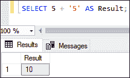
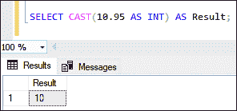
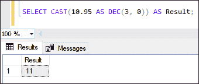
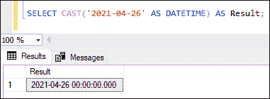
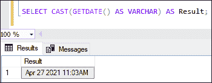
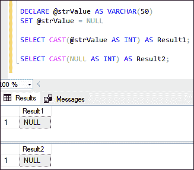
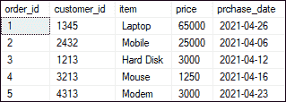
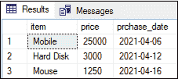
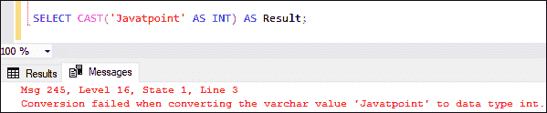

# SQL Server CAST

> 原文：<https://www.javatpoint.com/sql-server-cast>

数据类型转换是使用**将一个值的数据类型更改为另一个类型**的方法。SQL Server 可以通过两种方式转换值的数据类型:**隐式或显式**。SQL Server 为他们的内部需求执行隐式转换。**例如，**下面的查询会将字符串数据类型隐式转换为 [SQL Server](https://www.javatpoint.com/sql-server-tutorial) 中的数字类型:

```sql

SELECT 5 + '5' AS Result

```

以下是输出:



SQL Server 返回整数值，因为当使用两个具有不同数据类型的值时，它会将较低的数据类型转换为较高的数据类型。这个过程表示数据类型的隐式转换。

与隐式转换相反，我们有由数据库管理员或程序员在数据转换函数的帮助下执行的显式转换。本文将主要关注我们如何在 SQL Server 中使用 CAST 函数。

CAST 函数使用户能够将一个值从一种数据类型显式转换为表达式中指定的另一种类型。以下语法说明了 SQL Server 中的 CAST 函数:

```sql

CAST (expression AS data_type ( length ))

```

在语法中，我们使用了以下参数:

*   **表达式:**它指定了我们要转换成另一种类型的文字值或有效表达式。
*   **data_type:** 定义我们要转换表达式的目标数据类型。它可以包含以下数据类型作为输入:bigint、int、smallint、tinyint、bit、Decimal、numeric、money、float、datetime、char、nchar、varchar、nvarchar、text、ntext、binary、image 等。我们确保输入类型不应该是别名数据类型。
*   **长度:**为可选参数，用于指定目标数据类型的长度。默认情况下，其值为 30。

### 返回值

CAST 函数将返回一个我们想要转换的数据类型的值。

### SQL Server CAST 函数示例

借助各种示例，让我们了解 CAST 函数在 SQL Server 中是如何工作的。我们可以直接在 SELECT 语句中使用 CAST 函数。

**1。将十进制转换为整数的 CAST 函数**

以下示例将使用 CAST()函数将**十进制数 10.95 转换为整数**:

```sql

SELECT CAST(10.95 AS INT) AS Result;

```

CAST 函数返回以下输出:



**2。将十进制转换成不同长度的另一个十进制的 CAST 函数**

本示例将在 CAST 函数的帮助下，将十进制数转换为另一个零刻度的十进制数:

```sql

SELECT CAST(10.95 AS DEC(3, 0)) AS Result;

```

CAST 函数返回以下输出:



当我们转换不同位置的数据类型值时，SQL Server 会根据以下规则给出截断或舍入的结果:

| 来自数据类型 | 至数据类型 | 结果 |
| 数字的 | 数字的 | 全面的 |
| 数字的 | （同 Internationalorganizations）国际组织 | 缩短了的 |
| 数字的 | 金钱 | 全面的 |
| 浮动 | （同 Internationalorganizations）国际组织 | 缩短了的 |
| 浮动 | 数字的 | 全面的 |
| 浮动 | DATETIME | 全面的 |
| DATETIME | （同 Internationalorganizations）国际组织 | 全面的 |
| 金钱 | （同 Internationalorganizations）国际组织 | 全面的 |
| 金钱 | 数字的 | 全面的 |
| 非数字(char、nchar、varchar 或 nvarchar) | 整数、浮点、数字或十进制 | messageerror message 讯息错误 |
| 空字符串 | 数字或小数 | 出错信息 |

**3。将字符串转换为日期时间的 CAST 函数**

本示例将借助 CAST 函数将字符串 **'2021-04-26'** 转换为 **DATETIME** 值。

```sql

SELECT CAST('2021-04-26' AS DATETIME) AS Result;

```

CAST 函数返回以下输出:



**4。将日期时间转换为变量的 CAST 函数**

本例将借助 CAST 功能将**当前日期和时间**转换为**字符串**。

```sql

SELECT CAST(GETDATE() AS VARCHAR) AS Result;

```

CAST 函数返回以下输出:



**5。带有空值的 CAST 函数**

这个例子将说明空值如何与 CAST 函数一起工作。

```sql

DECLARE @strValue AS VARCHAR(50)
SET @strValue = NULL
SELECT CAST(@strValue AS INT) AS Result1;
SELECT CAST(NULL AS INT) AS Result2;

```

以下是输出:



**6。带表的 CAST 功能**

这里我们将看到如何在表中使用 CAST 函数来过滤记录。假设我们有一个名为**“orders”**的表，其中包含以下数据:



在该表中，我们可以看到 **prchase_date** 列包含了物品的购买日期。如果我们想让**获得所选日期范围之间的项目列表**，我们可以使用下面的语句。在这里，在评估 **WHERE** 条件之前，文本字符串被转换为时间戳值。

```sql

SELECT item, price, prchase_date FROM orders   
WHERE prchase_date   
BETWEEN CAST('2021-04-01' AS DATETIME) AND CAST('2021-04-20' AS DATETIME);  

```

此语句返回以下结果:



### TRY_CAST 函数

它是 SQL Server 中 CAST 函数的高级形式。在数据转换过程中**有助于防止在查询执行**时出现数据转换错误。假设我们要将字符串数据类型转换为整数。我们可能会使用 CAST 函数获得错误消息。当我们从各种数据源进行数据分析时，我们可能会在源数据中得到这样类型的值。在这种情况下，我们需要使用 TRY_CAST 函数来处理这些错误。CAST 和 TRY_CAST 函数的语法没有区别。当数据转换产生错误时，如果我们使用 TRY_CAST 函数，我们将得到**空**结果。

让我们看看如果我们尝试使用 CAST 函数将字符串值**转换为整数数据类型**会发生什么:

```sql

SELECT CAST('Javatpoint' AS INT) AS Result;

```

该语句将不执行，SQL Server 将引发以下**错误消息:**



但是，如果我们使用 **TRY_CAST 函数，**我们将不会得到任何错误，并在结果中看到 **NULL** 值。请参见下面的查询:

```sql

SELECT TRY_CAST('Javatpoint' AS INT) AS Result;

```

当我们执行此查询时，SQL Server 返回空值，而不是引发错误:


* * *