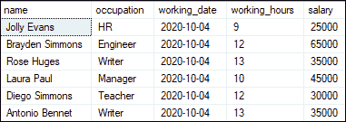
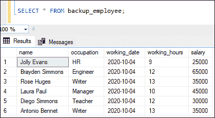
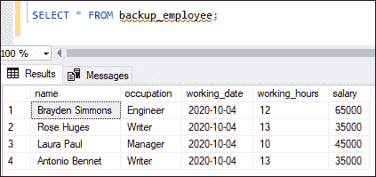
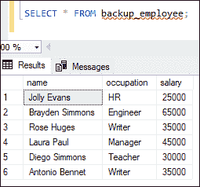
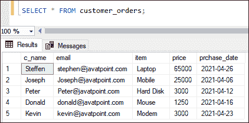
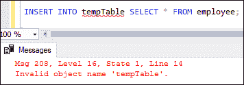

# 选择进入

> 原文：<https://www.javatpoint.com/sql-server-select-into>

本文将解释 SQL Server 中 SELECT INTO 语句的完整概述。我们将使用该语句向表中添加数据。当我们使用此语句时，它将首先在默认文件组中创建新表，然后将 SELECT 语句选择的记录插入该新表。请注意，源表中的约束不会复制到目标表中。

### 语法:

以下是解释 SELECT INTO 语句的语法:

```sql

SELECT columns_list
INTO new_table_name
FROM source_table_name
[Where conditions];

```

### 因素

该语句的参数解释如下:

*   **columns_list:** 表示我们要从源表中检索并插入到新表中的列名。
*   **new_table_name:** 表示必须唯一的新表名。此语句使用 columns_list 中的指定列创建一个新表。
*   **source_table_name:** 表示我们要从中获取记录的表的名称。在这里，我们还可以用适当的 JOIN 子句指定几个表。
*   **WHERE 条件:**它是一个可选子句，用于从源表中复制部分数据。

### 选择进入示例

让我们通过一些例子来理解 SELECT INTO 语句在 [SQL Server](https://www.javatpoint.com/sql-server-tutorial) 中是如何工作的。假设我们有一个表**“员工”**，其中包含以下数据:



1.如果我们想将雇员表的所有记录复制到 backup_employee 表中，我们需要使用 SELECT INTO 语句，如下所示:

```sql

SELECT * INTO backup_employee FROM employee;

```

我们可以验证员工数据是否成功插入 backup_employee 表，如下所示:

```sql

SELECT * FROM backup_employee;

```

以下是输出:



2.如果我们只想将雇员表的某些行复制到 backup_employee 表中，我们需要使用带有 **WHERE** 子句的 SELECT INTO 语句，如下所示:

```sql

SELECT * INTO backup_employee FROM employee WHERE salary>30000;

```

我们可以使用 SELECT 语句验证员工数据是否成功插入到 backup_employee 表中。以下是输出:



3.如果我们只想将雇员表的某些列复制到 backup_employee 表中，我们需要在 SELECT INTO 语句中指定所需的列名，如下所示:

```sql

SELECT name, occupation, salary 
INTO backup_employee FROM employee;

```

我们可以使用 SELECT 语句验证员工数据是否成功插入到 backup_employee 表中。以下是输出:



**从多个表中选择插入数据**

SQL Server 使我们能够在 SELECT INTO 语句中使用 **JOIN** 子句。它帮助我们从多个表中检索记录，然后将它们插入到新表中。这里，我们使用 INNER JOIN 来连接两个使用 **id 列的表。**

考虑以下表格名称**客户**和**订单**具有以下数据:


假设我们想将**客户和订单表**中的**名称、电子邮件、商品、价格和购买日期**等列复制到**客户 _ 订单**表中。为此，我们可以在 SELECT INTO 语句中用 JOIN 子句指定列名，如下所示:

```sql

SELECT cust.c_name, cust.email, O.item, O.price, O.prchase_date
INTO customer_orders FROM customer AS cust 
Inner JOIN orders AS O ON cust.id = O.order_id;

```

我们可以使用 SELECT 语句验证客户和订单表数据是否成功插入到 **customer_order** 表中。以下是输出:



### 选择进入与插入进入选择

这两个语句都可以用来将数据从一个表移动到另一个表中。由于它们提供了相似的功能，这两个语句有一些共同的差异，这可能会影响我们选择哪一个的决定。

**以下几点说明了它们之间的区别:**

1.在将数据从源表复制到目标表之前，只有当目标表存在于数据库中时，我们才能使用 INSERT INTO select 语句。另一方面，在从源表复制数据之前，SELECT INTO 语句不要求目标表存在于我们的数据库中。无论何时执行，它都会自动创建一个目标表。

请参见以下声明:

```sql

INSERT INTO tempTable SELECT * FROM employee;

```

由于数据库中不存在临时表，此语句导致错误。以下是输出:



2.区分它们的另一个区别与目标表的结构有关。由于 SELECT INTO 语句自动创建了表结构，这将是与源表相同的结构。插入数据时可能会导致问题。下面的例子说明了这一点。

**示例:**

上面创建的 customer_order 表包含一个长度为 8 的价格列。SELECT INTO 语句将生成具有与源表完全相同的列定义的目标表。当我们试图在价格列中插入超过其大小的数据时，我们会得到一个错误，或者二进制数据会被截断。

* * *