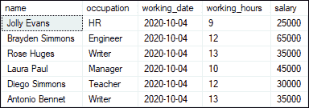
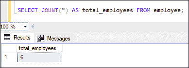
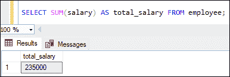
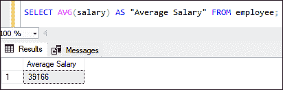
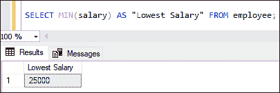
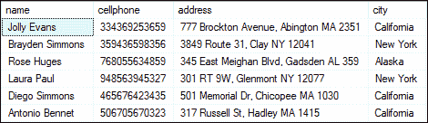
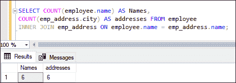

# SQL Server 聚合函数

> 原文：<https://www.javatpoint.com/sql-server-aggregate-functions>

SQL Server 中的聚合函数用于**对一个或多个值执行计算，并以单个值**返回结果。在 SQL Server 中，除了 COUNT(*)，所有聚合函数都是避免空值的内置函数。我们主要将这些函数用于数据库查询语言中 SELECT 语句的 GROUP BY 和 HAVING 子句。

数据库管理员通常使用这些函数来汇总他们的数据。当用一组特定的输入值多次调用聚合函数时，它们总是返回相同的值。因此，它们也被称为**确定性函数**。请注意，聚合函数不能嵌套，表达式不能是子查询。

### 语法:

以下是在 MySQL 中使用聚合函数的语法:

```

aggregate_function_name(DISTINCT | ALL exp)

```

在这个语法中，我们可以看到以下参数:

**aggregate_function_name:** 表示我们要使用的聚合函数的名称。

**DISTINCT | ALL:** 当我们想要在计算中考虑 DISTINCT 值时，使用 DISTINCT 修饰符。当我们想要计算所有值(包括重复值)时，使用“全部”修饰符。如果我们指定了任何修饰符，默认情况下，所有聚合函数都使用 all 修饰符。

**exp:** 表示表的列或包含多个带算术运算符的列的表达式。

[SQL Server](https://www.javatpoint.com/sql-server-tutorial) 提供各种聚合函数，**最常用的聚合函数**如下表所示:

| 聚合函数 | 描述 |
| [COUNT()](https://www.javatpoint.com/sql-server-count-function) | 此函数计算元素或行的数量，包括定义集中的空值。 |
| [SUM()](https://www.javatpoint.com/sql-server-sum-function) | 该函数计算给定集合中所有非空值的总和。 |
| [AVG()](https://www.javatpoint.com/sql-server-avg-function) | 此函数对非空值执行计算，以获得它们在定义集中的平均值。 |
| [MIN()](https://www.javatpoint.com/sql-server-min-function) | 此函数返回集合中的最小(最低)值。 |
| [MAX()](https://www.javatpoint.com/sql-server-max-function) | 该函数返回集合中的最大值。 |

此表显示了 SQL Server 中使用的一些其他**聚合函数**:

| 聚合函数 | 描述 |
| CHECKSUM_AGG | 它计算定义集中值的校验和。 |
| COUNT_BIG() | 它计算元素的数量，包括定义集中的空值。该函数与 COUNT()函数相同，但它返回一个 BIG INT 数据类型，而 COUNT 返回一个 INT 数据类型。 |
| STDEV() | 它根据样本数据总体计算定义表达式中每个值的统计标准偏差。 |
| STDEVP（） | 它根据整个数据总体计算给定表达式中每个值的标准偏差。 |
| 风险值() | 它根据样本数据总体计算定义表达式中每个元素的统计方差。 |
| 麻雀行动() | 它根据整个数据总体计算定义表达式中每个元素的统计方差。 |
| 分组() | 它表示 GROUP BY 列表指定的列表达式是否被聚合。如果结果集显示为 1，则表示结果集已聚合，否则返回 0。 |
| 分组标识() | 它用于计算分组级别。 |

### 为什么我们使用聚合函数？

聚合函数主要用于生成经济和金融中的汇总数据，以表示经济健康状况或股票和行业表现。在商业环境中，不同的组织层次需要不同的信息，比如高层管理者感兴趣的是了解整体数字，而不是个人细节。

### 聚合函数示例

让我们了解最常用的聚合函数是如何在数据库上工作的。这里我们将首先创建一个**员工表**来演示所有的聚合函数。

执行以下语句创建员工表:

```

CREATE TABLE employee(  
    name varchar(45) NOT NULL,    
    occupation varchar(35) NOT NULL,    
    working_date date,  
    working_hours varchar(10),
    salary INT
);

```

接下来，我们将向该表中插入一些数据，如下所示:

```

INSERT INTO employee VALUES    
('Jolly Evans', 'HR', '2020-10-04', 9, 25000),  
('Brayden Simmons', 'Engineer', '2020-10-04', 12, 65000),  
('Rose Huges', 'Writer', '2020-10-04', 13, 35000),  
('Laura Paul', 'Manager', '2020-10-04', 10, 45000),  
('Diego Simmons', 'Teacher', '2020-10-04', 12, 30000),  
('Antonio Bennet', 'Writer', '2020-10-04', 13, 35000);

```

我们可以看到使用 SELECT 语句的表记录:



### 计数()函数

此函数返回总行数，包括给定表达式中的空值。它还可以根据指定的条件对所有记录进行计数，如果没有找到任何匹配的记录，则返回**零**。它可以处理**数字**和**非数字**数据类型。

**例**

以下示例使用 COUNT()函数，并返回雇员表中存储的雇员总数数据:

```

SELECT COUNT(*) AS total_employees FROM employee;

```

**输出:**



要阅读更多信息，[点击此处](https://www.javatpoint.com/sql-server-count-function)。

### SUM()函数

该函数计算给定集合中非空值的**总和。如果结果集没有任何记录，它将返回空值。SUM 函数只能用于**数字**数据类型。**

**例**

以下示例使用 SUM 函数，并计算存储在员工表中的所有员工的总薪资总和:

```

SELECT SUM(salary) AS total_salary FROM employee;

```

**输出:**

执行后，我们可以在表中看到所有员工的工资总额:



要阅读更多信息，[点击此处](https://www.javatpoint.com/sql-server-sum-function)。

### AVG()函数

该函数计算列中指定的非空值的**平均值。AVG 函数只能使用**数字**数据类型。**

**例**

以下示例使用 AVG 函数，并计算员工表中存储的员工平均工资:

```

SELECT AVG(salary) AS "Average Salary" FROM employee;

```

**输出:**

执行后，我们可以在表中看到员工的平均工资:



要阅读更多信息，[点击此处](https://www.javatpoint.com/sql-server-avg-function)。

### 最小()函数

该函数给出指定列的**最小(最低)值**。它也只适用于数字数据类型。

**例**

以下示例使用 MIN 函数，并返回员工表中存储的员工最低工资:

```

SELECT MIN(salary) AS "Lowest Salary" FROM employee;

```

**输出:**

在这里我们可以看到，一个员工的最低工资可用表格:



要阅读更多信息，[点击此处](https://www.javatpoint.com/sql-server-min-function)。

### 最大()函数

该功能给出指定列的**最大(最高)值**。它也只适用于数字数据类型。

**例**

以下示例使用 MAX 函数，并返回员工表中存储的员工最高工资:

```

SELECT MAX(salary) AS "Highest Salary" FROM employee;  

```

**输出:**

在这里我们可以看到，一个员工的最低工资可用表格:


要阅读更多信息，[点击此处](https://www.javatpoint.com/sql-server-max-function)。

### 聚合函数和连接

SQL Server 可以让我们使用聚合函数从多个表中检索结果数据。为了理解这个概念，我们将创建另一个名为“ **emp_address** ”的表，该表存储每个员工的地址。以下是创建表的查询:

```

CREATE TABLE emp_address(  
    name varchar(45),    
    cellphone varchar(25),    
    address varchar(90),
    city varchar(35)
);

INSERT INTO emp_address(name, cellphone, address, city) VALUES 
('Jolly Evans', '334369253659', '777 Brockton Avenue, Abington MA 2351', 'California'),  
('Brayden Simmons', '359436598356', '3849 Route 31, Clay NY 12041', 'New York'),  
('Rose Huges', '768055634859', '345 East Meighan Blvd, Gadsden AL 359', 'Alaska'),  
('Laura Paul', '948563945327', '301 RT 9W, Glenmont NY 12077', 'New York'),  
('Diego Simmons', '465676423435', '501 Memorial Dr, Chicopee MA 1030', 'California'),  
('Antonio Bennet', '506705670323', '317 Russell St, Hadley MA 1415', 'California');

```

我们可以按如下方式验证该表:



假设我们希望**从两个不同的表**中计算员工的总数和他们的地址。我们可以通过使用下面的语句来做到这一点:

```

SELECT COUNT(employee.name) AS Names, 
COUNT(emp_address.city) AS addresses FROM employee
INNER JOIN emp_address ON employee.name = emp_address.name;

```

我们将得到结果输出:



在本文中，我们了解了流行的 SQL Server 聚合函数，以及如何使用它们来计算聚合。

* * *