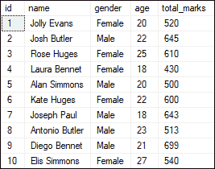
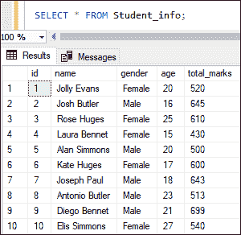
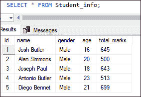
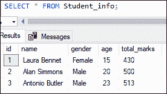
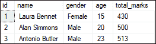
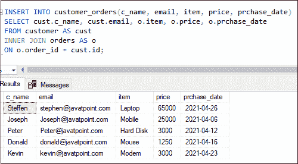

# 在选择中插入

> 原文：<https://www.javatpoint.com/sql-server-insert-into-select>

使用 insert 查询手动将一个表的数据插入到相同或不同数据库中的另一个表中并不容易。但是，SQL Server 提供了一个 INSERT INTO SELECT 语句来优化这个过程。INSERT INTO 语句可以快速填充表。在本节中，我们将学习 INSERT INTO SELECT 命令、语法及其用例。

INSERT INTO SELECT 语句用于**将数据插入到一个表中，该表中的数据来自 SELECT 查询**。换句话说，这个查询从一个表中复制数据，并将它们插入另一个表中。我们应该**记住以下几点**再使用这个语句:

*   我们要插入数据的数据库中必须存在一个表。
*   源表和目标表必须具有相同的数据类型。
*   目标表中的现有记录应该不受影响。

当我们需要将数据从一个表复制到另一个表或者将几个表中的数据汇总到一个表中时，这个命令就派上了用场。

### 句法

通常，我们使用 INSERT 命令将一条或多条记录添加到带有 VALUES 子句的表中，以列出列值。请参见以下语法:

```sql

INSERT INTO table_name (column_list) VALUES (value_list);  

```

要将一个表数据复制到另一个表数据中，我们需要在 [SQL Server](https://www.javatpoint.com/sql-server-tutorial) 中使用 INSERT INTO SELECT 语句，如下所示:

```sql

INSERT [ TOP ( expression ) [ PERCENT ] ] 
INTO destination_table [column_lists]
SELECT column_lists
FROM source_table
WHERE Condition

```

这里，我们使用了 **SELECT** 语句，而不是使用从一个或多个表中获取数据的 **VALUES** 子句。

### 参数说明

我们可以在 INSERT INTO SELECT 语句中看到以下参数:

*   **destination_table:** 此参数表示我们要在其中插入数据的表的名称。
*   **source_table:** 此参数指示我们要从中获取数据的源表的名称。
*   **column_list:** 表示表的列名。
*   **条件:**可选参数，用于过滤表格数据。
*   **TOP:** 这是一个可选子句，指定查询中有多少行应该插入到目标表中。
*   **PERCENT:** 是插入行的百分比的可选子句。

### 插入选择示例

借助一个例子，让我们了解如何在 SQL Server 中使用插入到选择命令。为此，我们首先需要使用下面给出的语句在指定的数据库中创建一个名为“**Student”**的表:

```sql

CREATE TABLE Student
(
    id INT IDENTITY PRIMARY KEY,
    name VARCHAR(50) NOT NULL,
    gender VARCHAR(20) NOT NULL,
    age INT NOT NULL,
    total_marks INT NOT NULL
 ) 

```

接下来，我们将向该表中添加一些值，如下所示:

```sql

INSERT INTO Student 
VALUES ('Jolly Evans', 'Female', 20, 520), 
('Josh Butler', 'Male', 22, 645), 
('Rose Huges', 'Female', 25, 610), 
('Laura Bennet', 'Female', 18, 430), 
('Alan Simmons', 'Male', 20, 500), 
('Kate Huges', 'Female', 22, 600), 
('Joseph Paul', 'Male', 18, 643), 
('Antonio Butler', 'Male', 23, 513), 
('Diego Bennet', 'Male', 21, 699), 
('Elis Simmons', 'Female', 27, 540);

```

我们可以使用 SELECT 语句来显示该表。我们将在表格中看到以下数据:



现在，我们将创建一个名为 **student_info** 的表来演示目标表:

```sql

CREATE TABLE Student_info
(
    id INT IDENTITY PRIMARY KEY,
    name VARCHAR(50) NOT NULL,
    gender VARCHAR(20) NOT NULL,
    age INT NOT NULL,
    total_marks INT NOT NULL
 )

```

**1:将一个表中的所有数据插入到另一个表中**

假设我们要**将学生表的所有数据插入到 student_info** 表中。我们可以通过使用以下语法来做到这一点:

```sql

INSERT INTO Student_info(name, gender, age, total_marks)
SELECT name, gender, age, total_marks FROM Student;

```

我们可以使用 SELECT 语句来验证插入操作。我们将获得以下输出:



**2。将一些数据从一个表插入到另一个表中**

有时候，我们只需要**将一些记录插入到另一个表**中。我们可以通过在 **WHERE 子句**的帮助下过滤查询返回的行数来做到这一点。

以下语句从“**学生”**表中获取男学生，并将他们插入到**学生 _ 信息**表中:

```sql

INSERT INTO Student_info(name, gender, age, total_marks)
SELECT name, gender, age, total_marks FROM Student
WHERE gender = 'male';

```

使用 SELECT 语句，我们可以看到 student_info 表只有男性记录:



**3:插入行的前 N 位**

TOP 子句指定查询中有多少行应该插入到目标表中。我们可以这样做，首先使用以下语句截断 **student_info** 表中的所有行:

```sql

TRUNCATE TABLE Student_info;

```

其次，我们将使用下面的语句**插入按总分排序的前 3 名学生**:

```sql

INSERT TOP (3) INTO Student_info(name, gender, age, total_marks)
SELECT name, gender, age, total_marks FROM Student
ORDER BY total_marks;

```

使用 SELECT 语句，我们可以看到 student_info 表只有三条记录:



**4:插入行的顶部百分比**

当我们不想使用绝对行数时，百分比用于在表中插入行的百分比。它的值应该在 0 到 100 之间。**例如**，如果我们将这个值设置为 50，它将允许我们检索一个表中的一半行。我们可以这样做，首先使用以下语句截断**学生信息**表中的所有行:

```sql

TRUNCATE TABLE Student_info;

```

其次，我们将使用下面的语句**在表格中插入 30%的行**，学生根据他们的总分排序:

```sql

INSERT TOP (30) PERCENT INTO Student_info(name, gender, age, total_marks)
SELECT name, gender, age, total_marks FROM Student
ORDER BY total_marks; 

```

使用 SELECT 语句，我们可以看到 student_info 表只有三条记录:



**5。插入带有连接的选择语句**

SQL Server 还使我们能够使用 INSERT INTO SELECT 语句从多个表中检索数据。假设我们想要从**客户**和**订单**表中检索数据到另一个表**客户订单 _ 订单**中。我们可以这样做:选择两个表中的列，然后使用 INSERT INTO SELECT 语句插入到另一个表中。这里我们将使用 **INNER JOIN** 来使用 id 列连接两个表。

```sql

INSERT INTO customer_orders(c_name, email, item, price, prchase_date)
SELECT cust.c_name, cust.email, o.item, o.price, o.prchase_date 
FROM customer AS cust 
INNER JOIN orders AS o
ON o.order_id = cust.id;

```

我们将执行 SELECT 命令来验证数据是否将所选数据插入到目标表中。以下是输出:



* * *