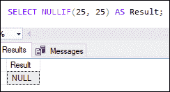
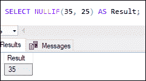
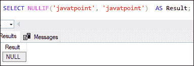
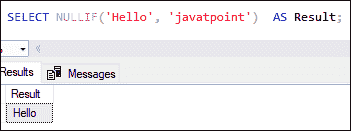
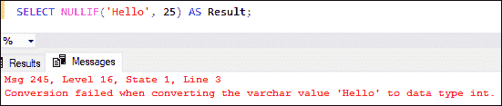
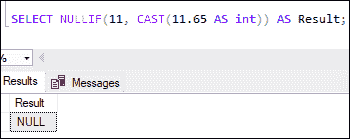
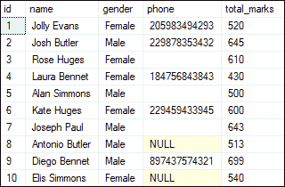
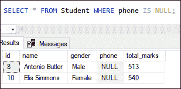
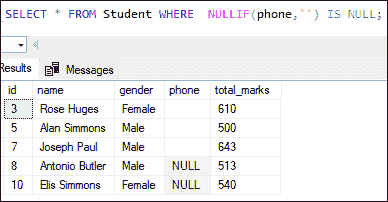
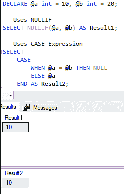

# SQL Server NULLIF

> 原文：<https://www.javatpoint.com/sql-server-nullif>

SQL Server 中的 NULLIF 函数**接受两个参数，并对它们进行比较，以确定它们是相同的还是不同的**。如果两个参数**相等**，它将返回一个**空值**。如果参数**不相同**，则返回**第一个参数**。我们可以直接对 SELECT、WHERE 和 [GROUP BY](https://www.javatpoint.com/sql-server-group-by-clause) 这样的子句使用这个函数。

该函数使用户能够对显式定义或表达式返回的数值和字符串值进行比较。这是一个更高级的功能，有一些基本的用例。最常见的是比较两个单独列的值，并检测和说明列中的空数据或不完整数据(即空或' ')。

### 句法

以下是 [SQL Server](https://www.javatpoint.com/sql-server-tutorial) 中的 NULLIF 函数语法:

```sql

SELECT NULLIF (expression1, expression2);

```

在上面的语法中，我们可以看到两个参数**表达式 1** 和**表达式 2** 。它们是标量表达式，用于比较标量值。它可以是数字、字符串或任何东西，即列、参数、变量、子查询、数学运算或返回单个数字或字符串值的函数。

NULLIF 函数不能像 SQL Server 中的 RAND()函数那样与**时间相关函数**一起工作。当我们使用依赖于时间的函数时，该函数可以被求值两次，从两次调用中产生不同的结果。

#### 注意:NULLIF 表达式必须具有相同的数据类型，或者数值表达式必须在字符串表达式之前。否则，查询将失败，并返回一个转换错误。它返回一个转换错误，因为数值表达式通常首先由 NULLIF 处理。

### 无效函数示例

让我们通过一些例子来了解如何使用 NULLIF 函数。

**1。带数字数据的无效值**

这里我们将看到 NULLIF 如何处理数值。本示例使用 NULLIF 函数并返回空值，因为两个参数相同:

```sql

SELECT NULLIF(25, 25) AS Result; 

```

以下是输出:



本示例使用 NULLIF 函数并返回第一个参数值，因为两个参数不相同:

```sql

SELECT NULLIF(35, 25) AS Result;

```

以下是输出:



**2。带字符串数据的 NULLIF**

这里我们将看到 NULLIF 如何使用字符串表达式。本示例使用 NULLIF 函数并返回空值，因为两个字符串是相同的:

```sql

SELECT NULLIF('javatpoint', 'javatpoint')  AS Result;

```

以下是输出:



本示例使用 NULLIF 函数并返回第一个参数值，因为两个字符串不相同:

```sql

SELECT NULLIF('Hello', 'javatpoint')  AS Result;

```

以下是输出:



本例使用了 NULLIF 函数，**抛出一个转换错误**，因为当字符串前面没有数字时，NULLIF 逻辑失败:

```sql

SELECT NULLIF('Hello', 25) AS Result;

```

以下是输出:



**3。带 CAST 功能的 NULLIF**

这里我们将看到 NULLIF 如何与 CAST 函数一起工作。本示例使用 NULLIF 和 CAST 函数，并返回空值:

```sql

SELECT NULLIF(11, CAST(11.65 AS int)) AS Result;

```

以下是输出:



我们将得到一个空结果，因为 CAST 函数首先返回一个整数值 11。然后，第一个参数和第二个参数变得相等，并显示空输出。

### 带表的零函数

本节将解释使用 NULLIF 函数的实际情况。NULLIF 表达式在处理遗留数据(包括列中的空字符串和空字符串的混合)时很有优势。请参见以下示例进行演示:

为此，我们首先需要使用下面给出的语句在指定的数据库中创建一个名为**‘Student’**的表:

```sql

 CREATE TABLE Student
(
    id INT IDENTITY PRIMARY KEY,
    name VARCHAR(50) NOT NULL,
    gender VARCHAR(20) NOT NULL,
    phone VARCHAR(20), 
    total_marks INT NOT NULL
 )

```

接下来，我们将向该表中添加一些值，如下所示:

```sql

INSERT INTO Student 
VALUES ('Jolly Evans', 'Female', '205983494293', 520), 
('Josh Butler', 'Male', '229878353432', 645), 
('Rose Huges', 'Female', '', 610), 
('Laura Bennet', 'Female', '184756843843', 430), 
('Alan Simmons', 'Male', '', 500), 
('Kate Huges', 'Female', '229459433945', 600), 
('Joseph Paul', 'Male', '', 643), 
('Antonio Butler', 'Male', NULL, 513), 
('Diego Bennet', 'Male', '897437574321', 699), 
('Elis Simmons', 'Female', NULL, 540);

```

我们可以使用 SELECT 语句来显示该表。我们将在表格中看到以下数据:



在表格中，我们可以看到一些**电话列字段是可空的**和**为空的**。它包含空值，因为在存储数据时电话是未知的。并且由于数据输入错误而有一个空字段。在处理遗留数据库时，这种情况经常出现。

如果我们想要**获取没有电话号码**的学生详细信息，我们可以使用以下查询:

```sql

SELECT * FROM Student WHERE phone IS NULL;

```

它将显示包含没有电话号码的学生详细信息的结果:



假设我们希望**也用电话列**中的空字符串得到结果。我们可以通过使用 NULLIF 表达式来实现这一点:

```sql

SELECT * FROM Student WHERE  NULLIF(phone,'') IS NULL;

```

它将显示结果，其中包含在电话号码列中为空字符串的学生详细信息:



### 无效函数和案例表达式

SQL Server 中的 NULLIF 表达式类似于 CASE 表达式。请参见下面使用 NULLIF 表达式的表达式:

```sql

NULLIF(V1, V2)

```

上述表达式可以在 CASE 表达式中改写如下:

```sql

CASE 
  WHEN V1=V2 THEN NULL 
  ELSE V1 
END

```

我们可以通过下面的例子来理解它:

```sql

DECLARE @a int = 10, @b int = 20;

-- Uses NULLIF
SELECT NULLIF(@a, @b) AS Result;

-- Uses CASE Expression
SELECT
    CASE
        WHEN @a = @b THEN NULL
        ELSE @a
    END AS Result;

```

它将显示下面的结果，我们可以看到两个表达式给出了相同的结果。



* * *